# 阅痕 ReadTrace — 个人精神文化印记与 3D 虚拟展厅

> **Android 原生开发 · OpenGL ES 3D 展厅 · 陀螺仪全息视差 · 极光流体着色器 · 3D 拟真翻书 · Glance 桌面小组件 · 纯本地数据掌控**

[](https://github.com/liuGuanYi-hub/ReadTrace/actions/workflows/ci.yml)
[](https://github.com/liuGuanYi-hub/ReadTrace/releases)
[](https://developer.android.com)
[](https://kotlinlang.org)
[](LICENSE)

《阅痕 ReadTrace》是一个专为爱书人、影迷、ACGN 爱好者与深度思考者打造的 **个人精神文化印记空间与先锋美学虚拟展厅**。它打破了传统记录工具的扁平刻板，融合了 **美术馆策展级 Bento Grid 布局、3D 陀螺仪全息光影、电影级破壁连续转场、GPU 硬件加速极光流体着色器与 Glance 桌面微缩视窗**，让每一次翻阅、追番、观影与通关都成为一场触手可及的艺术漫游。

---

## 📸 运行效果画卷（真机实测截图）

### 1. 🏛️ v4.0 美术馆策展级 Bento Grid 与极光流体光影
| 🏛️ 策展焦点大卡与双副卡 | 🍱 四大多元媒介长廊 | 📚 精神藏库多维筛选流 | 🎟️ 纪念创享工坊大厅 |
|:---:|:---:|:---:|:---:|
| 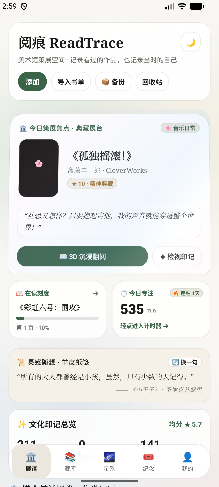 | 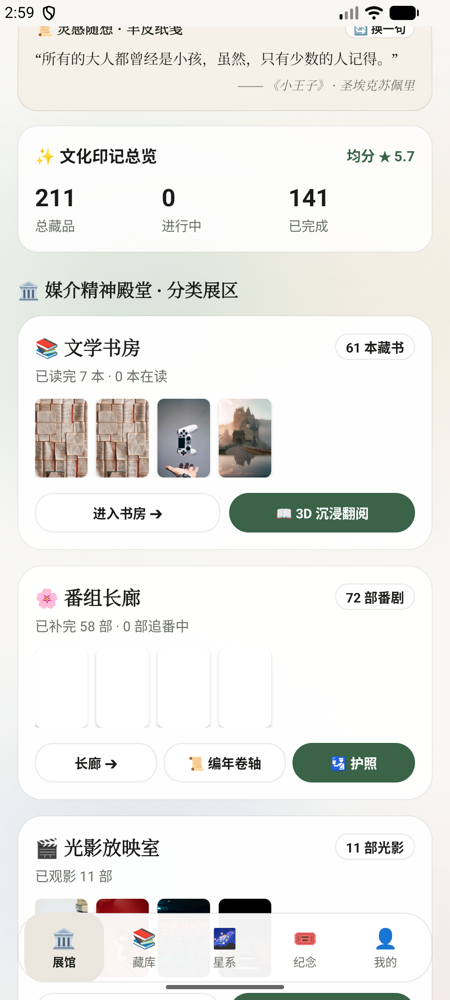 | 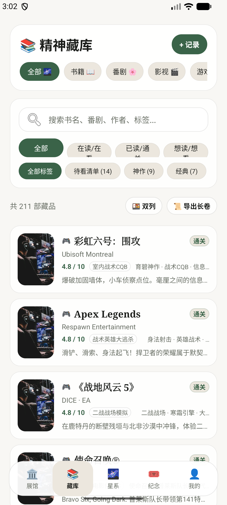 |  |

### 2. 🎴 3D 陀螺仪全息视差、文化护照与实体纪念物
| 🛂 精神巡礼护照盖章簿 | 🎟️ 复古电影透光撕票票根 | 🕹️ 游戏白金全息实体卡带 | 📖 共享元素转场书籍详情 |
|:---:|:---:|:---:|:---:|
|  | 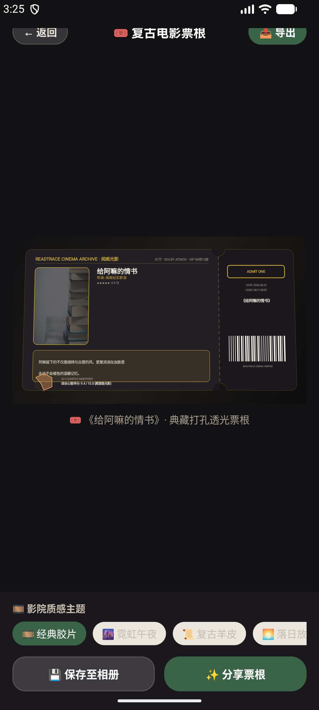 | 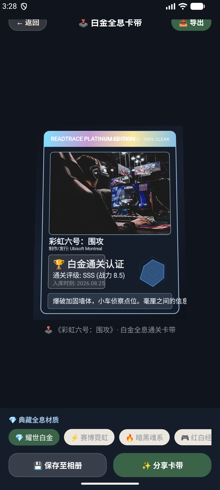 | 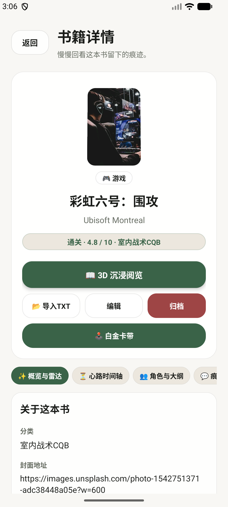 |

### 3. 🌌 心智认知星系与微缩思想宇宙
| 🌌 211 颗认知星辰全景 | 🔍 星辰锚定与共鸣档案 | 🏛️ 3D 私人展厅漫游 | 🔄 360° 惯性环视与对焦 |
|:---:|:---:|:---:|:---:|
| 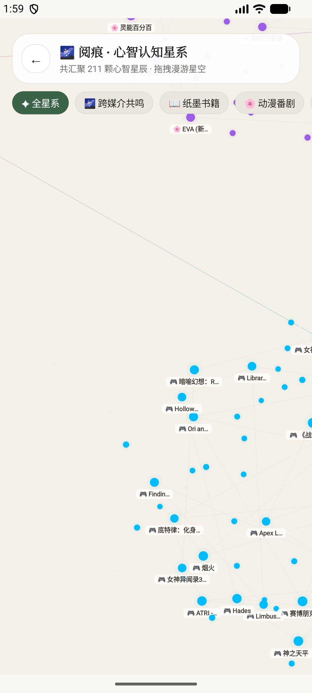 | 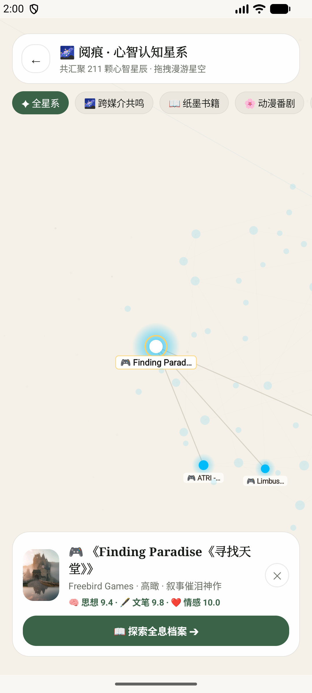 | 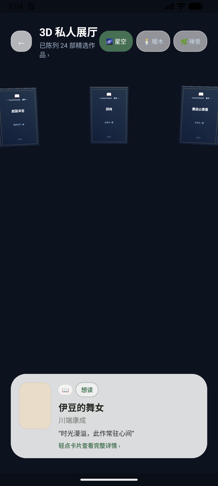 | 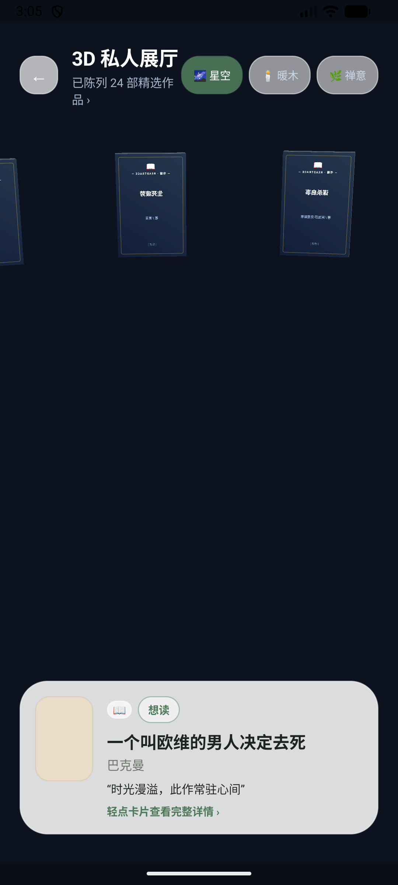 |

### 4. 📖 3D 拟真纸张翻书阅读器与云端展览社区
| 📜 3D 拟真排版 (小王子) | 🌌 暗夜漫想深色主题 | 🌐 阅痕社区广场互访 | 🚀 策展与发布我的展厅 |
|:---:|:---:|:---:|:---:|
| 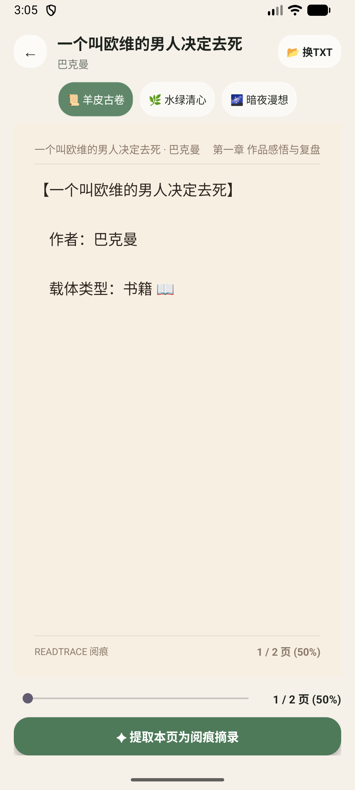 | 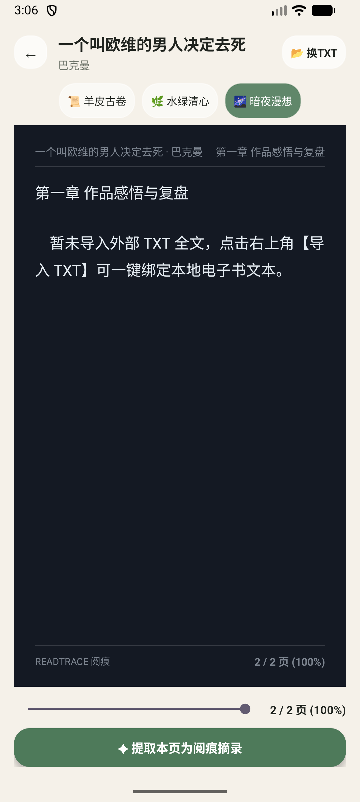 |  | 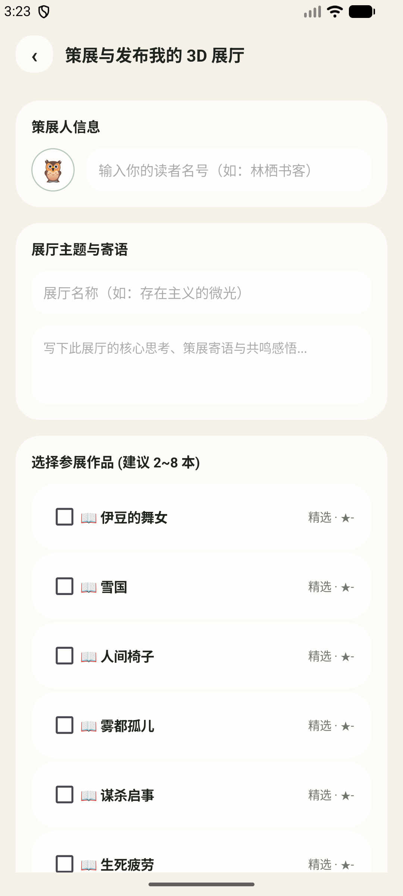 |

---

## ✨ 核心特性矩阵

### 1. 🎨 先锋美学与顶级动效系统 (v4.0)
- **美术馆策展级 Bento Grid 布局**：26sp 衬线大标、今日焦点大画幅浮雕展位、在读/专注非对称双副卡与羊皮纸灵感金句横幅。
- **陀螺仪重力感应全息高光掠影 (Gyroscope Hologram)**：基于 `Sensor.TYPE_ROTATION_VECTOR` 融合算法与低通滤波，实现倾斜手机时 3D 空间倾角透视与紫霞/冰蓝/纯白/金曜全息彩虹漫反射。
- **电影级空间连续破壁转场 (Shared Element Transitions)**：点对点封面流光展开，配合 `(0.2, 0.0, 0.0, 1.0)` 物理阻尼曲线与返回手势倒放收拢。
- **硬件加速极光流体着色器背景 (Dynamic Liquid Aurora Mesh)**：多核心正弦液体轨迹与 Android 12+ `RenderEffect.createBlurEffect` 深度交融，支持日/夜间自适应莫兰迪色盘与 0 冗余能耗管理。

### 2. 📱 Glance 桌面微缩视窗小部件 (v3.5)
- **⏱️「今日阅读计时打卡」组件**：实时统计今日阅读分钟数与连胜天数，支持桌面一键「▶ 开始专注」。
- **📜「每日金句/灵感摘录」桌面便签**：羊皮纸拟真纹理，支持桌面「🔄 换一句」即时换签。
- **📖「在读作品进度」直达卡片**：直观展示书籍封面、阅读百分比与页码刻度，轻触直达阅读器。

### 3. 🌌 心智认知星系与跨媒介共鸣引力场 (v3.3)
- **多维力导向星图**：200+ 精神藏品转化为星空中的脉动星辰，根据类型、情感共鸣与标签自动聚集为星系旋臂。
- **引力连线与档案探索**：点击任一星辰触发引力对焦动画，探索全息思想档案。

### 4. 🎟️ 实体感纪念物与典藏工坊 (v3.2)
- **🛂 精神巡礼护照**：盖印各部番剧、游戏白金入境签戳。
- **🎟️ 复古电影透光票根**：16:9 双联撕票打孔票根、影史评分与 6D 心智雷达。
- **🕹️ 游戏白金实体卡带**：3:4 实体卡带盒、白金通关印记与 4 种典藏材质。

### 5. 🏛️ OpenGL ES 3D 私人展厅 (v2.2)
- 原生 OpenGL ES 3.0/2.0 构建，零臃肿依赖、内存占用 <20MB、稳定 60fps/120fps 高刷。
- 3D 立体书盒建模、法线光照与 360° 惯性环视手势。

### 6. 📖 3D 拟真立体翻书阅读器 (v2.3)
- 内置 11 部经典名著纯净文本库（《小王子》《活着》《月亮与六便士》《1984》等）。
- 3D 纸张卷曲光影动画、羊皮古卷/水绿清心/暗夜漫想三大质感主题。

### 7. 📦 数据掌控中心与多格式导出 (v2.1)
- **JSON 全量备份包**：一键导出/恢复全部作品、元数据、评分与关联笔记。
- **Obsidian 风格 Markdown 文集**：自动排版为高颜值个人精神文集。
- **RFC 4180 CSV 数据分析表格**：兼容 Excel / Notion / 飞书多维表格。

---

## 🛠️ 技术架构

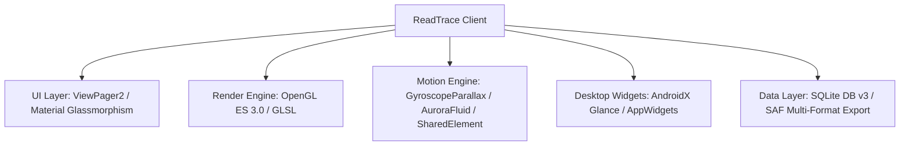

- **UI 架构**：AndroidX ViewPager2 + OpenGL ES 3.0 + Glance AppWidgets + Material & Glassmorphism Design
- **动效引擎**：`GyroscopeParallaxHelper` + `HolographicSpecularOverlayView` + `AuroraFluidBackgroundView` + `TransitionHelper`
- **数据存储**：Android SQLite 数据库 (DB v3) + SAF 存储访问框架
- **开发语言**：Kotlin 100%
- **构建系统**：Android Gradle Plugin 9.1.1 + Gradle 9.3.1 (compileSdk: 37 / minSdk: 31)

---

## 🚀 快速开始与构建

1. 使用 Android Studio 打开项目根目录。
2. 连接 Android 手机或启动模拟器（推荐 API 31+）。
3. 终端执行编译打包：
   ```bash
   ./gradlew.bat assembleDebug
   ```
4. 安装包路径：`app/build/outputs/apk/debug/app-debug.apk`。

---

## 🗺️ 未来演进路线图与先锋创意开发计划 (Roadmap)

| 优先级 | 核心先锋模块 | 视觉震撼度 | 计划周期 | 状态 | 核心价值与交互体验 |
|:---:|:---|:---:|:---:|:---:|:---|
| **P1** | **💽 3D 黑胶唱机与磁带卡座播放器** | 🌟🌟🌟🌟🌟 | 1~2 阶段 | ✅ **已完成** | **补齐播客与声音影视的极致拟真媒介体验**<br>· 3D 唱针对焦与黑胶唱片同心圆反射光泽<br>· 复古磁带 A/B 面翻转与齿轮转动动效<br>· 音轨波形与歌词金句同步流淌 |
| **P2** | **🎧 触觉马达振动引擎与空间音频联动** | 🌟🌟🌟🌟 | 1 阶段 | ✅ **已完成** | **赋予每次撕票、盖章、翻书灵魂般的触感**<br>· 盖印章时重沉打击感 + 线性马达高频微颤 (`HapticFeedbackEngine`)<br>· 撕开电影票打孔处的清脆齿轮顿挫反馈<br>· 陀螺仪自适应双耳立体空间声场 (`SpatialAudioEngine`) |
| **P3** | **🌌 3D 时空穿梭隧道与心智流光胶囊** | 🌟🌟🌟🌟🌟 | 2 阶段 | ✅ **已完成** | **彻底颠覆传统扁平历史记录与时间轴**<br>· 景深虚化与无限延伸的 3D 透视时空虫洞 (`TimeWarpTunnelView`)<br>· 发光记忆胶囊悬停裂变与心境释放 (`TimeWarpTunnelActivity`)<br>· 1x 慢速漫游 / 5x 曲速跳跃 / 10x 光速折跃巡航 |
| **P4** | **🗺️ 3D 情绪拓扑与等高线心智地形图** | 🌟🌟🌟🌟 | 2 阶段 | ✅ **已完成** | **知识库与数据分析维度的降维打击**<br>· 基于多维心智复合高斯势能的 3D 地貌 (`MindprintTopologyView`)<br>· 3D 等高线 / 立体线框网格 / 能量热力图三维渲染<br>· 单指/双指 3D 俯仰旋转、海拔等高切片与巅峰信标聚焦 (`MindprintTopologyActivity`) |

---

## 📄 开源许可证

本项目基于 [Apache License 2.0](LICENSE) 协议开源。

