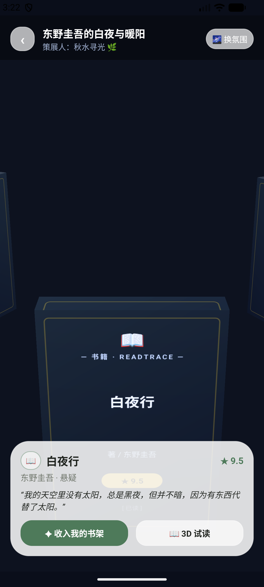
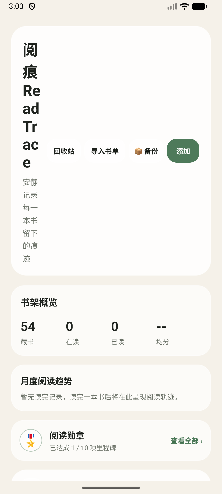
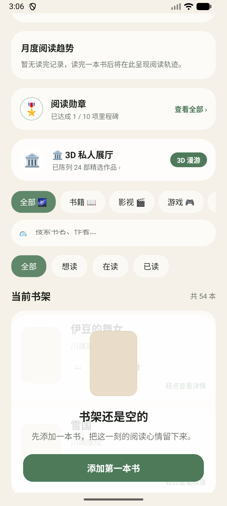
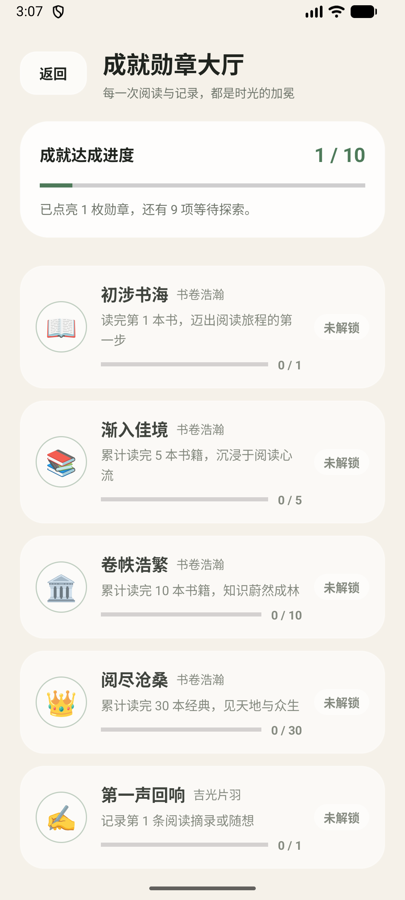
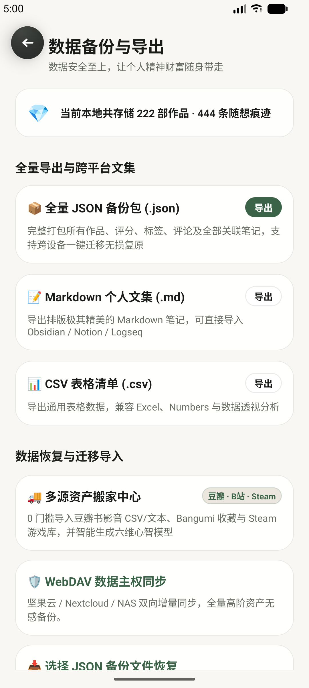

# 阅痕 ReadTrace — 个人精神文化印记与 3D 虚拟展厅

> **Android 原生开发 · OpenGL ES 3D 展厅 · 3D 拟真翻书阅读 · 精神印记展览社区 · 纯本地数据掌控**

《阅痕 ReadTrace》是一个专为爱书人、影迷与深度思考者打造的 **个人精神文化印记空间与 3D 展览纪念馆**。它将扁平的书籍记录升华为立体艺术展台与思想长廊，支持 3D 私人展厅漫游、经典名著拟真翻阅、多维数据分析与全网展厅互访共鸣。

---

## 📸 运行效果画卷（真机实测截图）

### 1. 🌐 阅痕社区广场与 3D 跨用户展厅探访
| 🌐 阅痕社区广场 | 🏛️ 3D 他人展厅漫游探访 | 📝 展览详情与长评共鸣 | 🚀 策展与发布我的展厅 |
|:---:|:---:|:---:|:---:|
|  |  |  |  |

### 2. 🏛️ OpenGL ES 3D 私人展厅与拟真阅读器
| 🏛️ 3D 私人展厅初始视角 | 🔄 360° 惯性环视与对焦 | 📜 3D 拟真纸张排版 (小王子) | 🌌 暗夜漫想深色主题 |
|:---:|:---:|:---:|:---:|
|  |  |  |  |

### 3. 🪟 玻璃冥想风动态书架、勋章大厅与数据备份
| 📊 书架概览与统计图谱 | 🏷️ 多维标签横向过滤卡片流 | 🎖️ 阅读成就勋章大厅 | 📦 数据备份中心 (JSON/MD/CSV) |
|:---:|:---:|:---:|:---:|
|  |  |  |  |

---

## ✨ 核心特性矩阵

### 1. 🌐 阅痕云端展览社区 (v3.0)
- **3D 跨用户展厅漫游**：像逛艺术博物馆一样探访全网书友的 3D 私人展台，360° 旋转品读他人的精神珍藏。
- **✦ 一键「收入我的书架」**：在他人展览中发现心动佳作，点击一键转存至本地 SQLite「想读」列表。
- **策展发布向导**：从本地藏书勾选作品、填写主题寄语，随时发布属于自己的专题展厅。

### 2. 🏛️ OpenGL ES 3D 私人展厅 (v2.2)
- **原生 3D 渲染引擎**：基于 Android 原生 OpenGL ES 3.0/2.0 构建，零臃肿依赖、内存占用 <20MB、稳定 60fps/120fps 高刷。
- **3D 立体书盒建模**：真实长宽高比例、法线光照与动态 Canvas 艺术封面纹理贴图生成。
- **360° 惯性环视手势**：支持阻尼滑行、沙盘俯仰视角调整与平滑最短角位移对焦拾取。

### 3. 📖 3D 拟真立体翻书阅读器 (v2.3)
- **内置 11 部经典名著纯净文本库**：《小王子》《老人与海》《局外人》《1984》《月亮与六便士》《活着》《动物农场》《鼠疫》《人间失格》《白夜行》《解忧杂货店》。
- **智能排版引擎**：自适应断页、正则章节目录解析、智能 UTF-8 / GBK 编码自动探测。
- **拟真纸张翻折**：3D 纸张卷曲光影动画、📜 羊皮古卷 / 🌿 水绿清心 / 🌌 暗夜漫想 三大质感主题、进度记忆与「一键提炼阅痕摘录」。

### 4. 🎬 多媒介精神印记扩展 (v2.0)
- 全面支持 **书籍 📖、影视 🎬、游戏 🎮、播客 🎙️** 四大多元文化媒介。
- 创作者字段（作者/导演/制作人/主播）与状态胶囊（想读/想看/通关/听完）全流程情境化自适应。

### 5. 📦 数据掌控中心与多格式导出 (v2.1)
- **JSON 全量备份包**：一键导出/恢复全部作品、元数据、评分与关联笔记。
- **Obsidian 风格 Markdown 文集**：自动排版为高颜值个人精神文集。
- **RFC 4180 CSV 数据分析表格**：兼容 Excel / Notion / 飞书多维表格。

---

## 🛠️ 技术架构

- **UI 架构**：AndroidX ViewPager2 + OpenGL ES 3.0 (GLSurfaceView & GLSL) + Material & Glassmorphism Design
- **数据存储**：Android SQLite 数据库 (DB v3) + SAF 存储访问框架
- **开发语言**：Kotlin 100%
- **构建系统**：Android Gradle Plugin 9.1.1 + Gradle 9.3.1 (compileSdk: 37 / minSdk: 31)

---

## 🚀 快速开始与构建

1. 使用 Android Studio 打开项目根目录。
2. 连接 Android 手机或启动模拟器（推荐 API 31+）。
3. 终端执行编译打包：
   ```bash
   ./gradlew.bat assembleDebug
   ```
4. 安装包路径：`app/build/outputs/apk/debug/app-debug.apk`。
