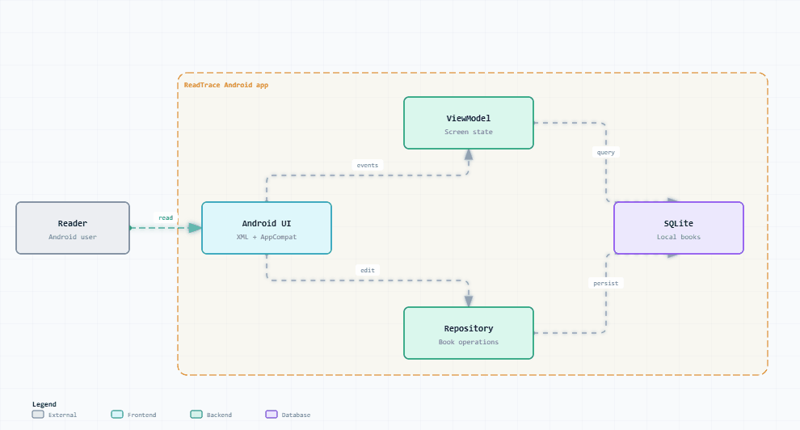

# 阅痕 ReadTrace — Android 本地书籍记录 App

> **纯本地 SQLite · 阅读状态管理 · 评分标签读后感 · 软删除数据保护**

阅痕 ReadTrace 是一个 Android 本地书籍记录 App，在手机上记录书籍、阅读状态、评分、标签、简短评价和读后感，数据全部保存在设备本地。

---

## ✨ 核心特性

- 📚 **本地书籍管理**：添加书籍并保存到设备本地 SQLite，首页展示未归档书籍。
- 📊 **阅读概览**：首页展示藏书、在读、已读和均分概览。
- 🔍 **状态筛选**：按全部、想读、在读、已读筛选。
- 🃏 **信息丰富的书籍卡片**：展示状态、评分、分类、标签和简短评价预览；可查看完整详情并编辑原记录。
- ⭐ **阅读记录**：保存评分、标签、简短评价、读后感和阅读日期；标签以 JSON 字符串写入数据库。
- 🗄️ **软删除数据保护**：经确认后软归档书籍；数据层默认排除软删除记录，不提供物理删除入口。

---

## 🚀 快速开始

当前 Android 工程位于仓库根目录，主模块为 `:app`，使用 Android Studio 打开仓库根目录即可构建运行。

当前 Android 配置：

- project name：`readtrace`
- namespace / applicationId：`com.example.readtrace`
- compileSdk：37 / minSdk：31 / targetSdk：37
- Android Gradle Plugin：9.1.1
- 当前 UI：XML layout + AppCompat

---

## 📂 项目结构

```text
ReadTrace/
├── app/                  # Android 主模块（:app）
├── docs/                 # 开发文档、安卓开发文档、开发进度
│   └── architecture/     # 动态系统架构图
├── archive/              # 早期 Web/FastAPI 原型归档（仅参考，不属于 v1.0 安卓主线）
│   ├── web-react-vite/
│   └── fastapi-backend/
├── settings.gradle.kts
├── build.gradle.kts
└── gradle.properties
```

---

## 🛠️ 技术栈

- Android（XML layout + AppCompat）
- 原生 SQLite 本地存储
- Android Gradle Plugin 9.1.1

---

## ⚠️ 数据原则与边界

- 不允许物理删除用户数据；删除默认使用软删除 / 归档。
- v1.0 使用原生 SQLite 本地保存。
- v1.0 不做登录、云同步、AI、摘录和笔记。
- 任何可能减少 C 盘容量的操作，都必须先说明预计增加量，并等待确认。

---

## 📚 文档

- [安卓开发文档](docs/安卓开发文档.md)
- [开发文档](docs/开发文档.md)
- [开发进度](docs/开发进度.md)

---

## 🏗️ 动态系统架构图



- [打开交互式动态架构图](docs/architecture/dynamic-archify-architecture.html)
- [查看架构源数据](docs/architecture/dynamic-archify-architecture.json)
