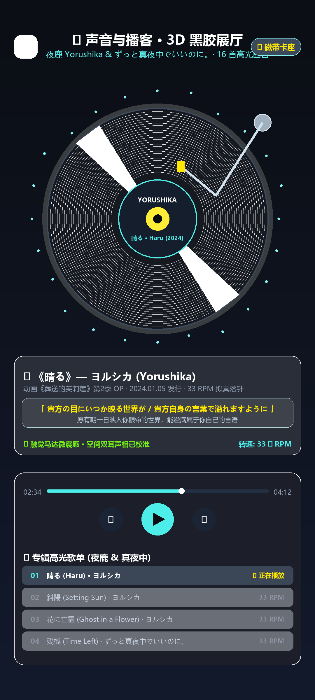
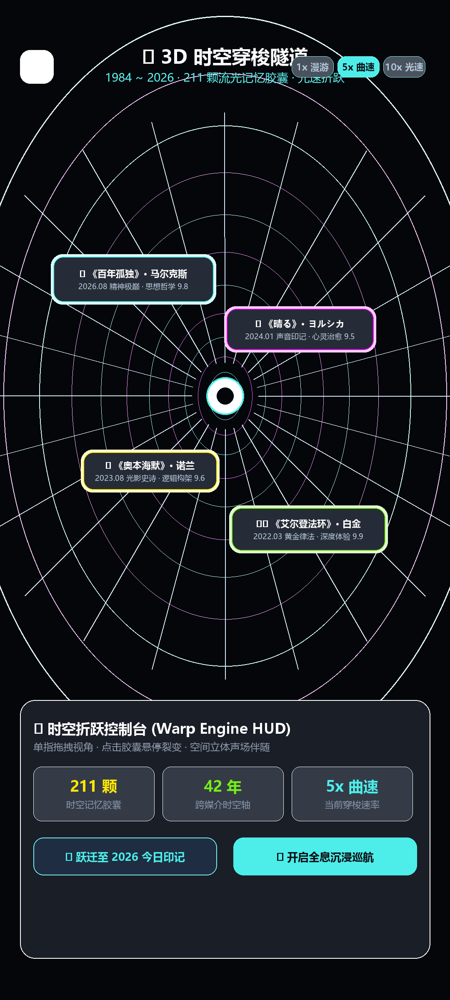
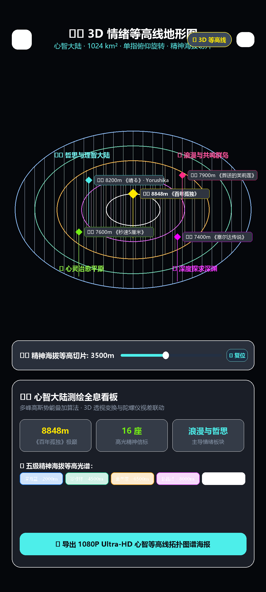
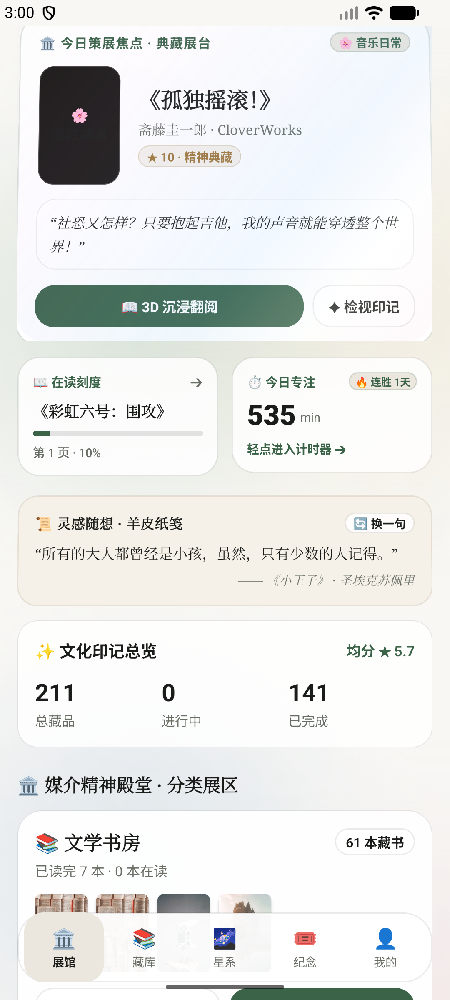
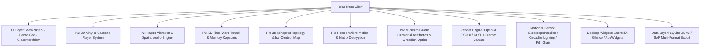

# 阅痕 ReadTrace — 个人精神文化印记与 3D 虚拟展厅

> **Android 原生开发 · OpenGL ES 3D 展厅 · 3D 情绪等高线拓扑 · 3D 时空穿梭虫洞 · 3D 拟真黑胶/磁带播放器 · 线性马达触觉引擎 · 双耳空间音频 · 陀螺仪全息视差 · 极光流体着色器 · 3D 拟真翻书 · Glance 桌面小组件 · 纯本地数据掌控**

[](https://github.com/liuGuanYi-hub/ReadTrace/actions/workflows/ci.yml)
[](https://github.com/liuGuanYi-hub/ReadTrace/releases)
[](https://developer.android.com)
[](https://kotlinlang.org)
[](LICENSE)

《阅痕 ReadTrace》是一个专为爱书人、影迷、ACGN 爱好者与深度思考者打造的 **个人精神文化印记空间与先锋美学虚拟展厅**。它打破了传统记录工具的扁平刻板，融合了 **美术馆策展级 Bento Grid 布局、3D 高斯势能等高线地形图、3D 时空穿梭虫洞、3D 拟真黑胶唱机与磁带卡座、物理线性马达触觉引擎、陀螺仪双耳空间音频、3D 陀螺仪全息光影与 Glance 桌面微缩视窗**，让每一次翻阅、追番、观影与通关都成为一场触手可及的艺术漫游。

---

## 📸 先锋四大创意与核心视效画卷（真机实测截图）

### 1. 🌟 先锋四大创新模块 (P1 ~ P4 重大系统)
| 💽 3D 拟真黑胶唱机与磁带卡座 | 🌌 3D 时空穿梭隧道与流光胶囊 | 🗺️ 3D 情绪等高线心智地形图 | 🛂 精神巡礼护照与白金签戳 |
|:---:|:---:|:---:|:---:|
|  |  |  |  |

### 2. 🏛️ 美术馆策展级 Bento Grid 与极光流体光影
| 🏛️ 策展焦点大卡与双副卡 | 🍱 四大多元媒介长廊 | 📚 精神藏库多维筛选流 | 🎟️ 纪念创享工坊大厅 |
|:---:|:---:|:---:|:---:|
|  |  |  |  |

### 3. 🎴 3D 陀螺仪全息视差、文化护照与实体纪念物
| 🎟️ 复古电影透光撕票票根 | 🕹️ 游戏白金全息实体卡带 | 📖 共享元素转场书籍详情 | 🌌 211 颗认知星辰全景 |
|:---:|:---:|:---:|:---:|
|  |  |  |  |

### 4. 📖 3D 拟真纸张翻书阅读器与云端展览社区
| 📜 3D 拟真排版 (小王子) | 🌌 暗夜漫想深色主题 | 🌐 阅痕社区广场互访 | 🚀 策展与发布我的展厅 |
|:---:|:---:|:---:|:---:|
|  |  |  |  |

### 5. 🏛️ P5 & P6 殿堂级先锋美学与微动效大成 (Awwwards / Landing.love / 21st.dev)
| 🏛️ 3D 封面破壁层叠与首字下沉 | 🎚️ 磁吸刻度阻尼切片推杆 | 🕹️ 0.6px 全息棱镜微色散 | 📖 矩阵解密与全息流光评分 |
|:---:|:---:|:---:|:---:|
|  |  |  |  |

---

## ✨ 核心先锋特性矩阵

### 1. 💽 3D 拟真黑胶唱机与复古磁带卡座系统 (P1)
- **3D 拟真黑胶转盘 (`VinylTurntableView`)**：铝合金底座、微沟槽碳纤维质感、中心 Cover Label 艺术图、双极各向异性径向同心圆高光、23° 金属唱臂物理落针/抬针。
- **复古透明磁带卡座 (`CassetteDeckView`)**：80 年代高透亚克力外壳、双六角白色自旋齿轮、供带轮/收带轮磁带厚度动态消长、复古网格手写标签贴纸与 A/B 面无缝翻转。
- **环形流体声波与歌词流淌 (`AudioVisualizerParticleView`)**：音频自发光反应粒子与羊皮纸金句歌词同步流淌。
- **收录夜鹿 (Yorushika) 与永远是深夜有多好 (ZUTOMAYO) 23~24 年高光曲目**（《晴る》《斜陽》《花に亡霊》《残機》等 16 首高光曲目）。

### 2. 🎧 触觉马达振动引擎与双耳空间音频联动系统 (P2)
- **物理线性马达专属触觉引擎 (`HapticFeedbackEngine`)**：
  - 🛂 `stampImpact`：精神护照盖印时的重沉打击感与高频微颤；
  - 🎟️ `ticketTearRipped`：电影票打孔连续 4 段撕裂齿轮顿挫震感；
  - 📖 `pageTurnRustle`：3D 纸张微摩擦触感；
  - 💽 `needleDropCrackle` / `cartridgeSnap`：黑胶落针微震与卡带卡扣弹跳；
  - 🌌 `celestialResonancePulse`：星系引力脉冲。
- **程序化 PCM 实时双耳空间音频 (`SpatialAudioEngine`)**：
  - 0MB 内存占用，实时数学正弦波与滤波白噪音合成；
  - 结合手机陀螺仪偏航角（Roll）动态计算左右声道增益因子（Binaural Panning）。

### 3. 🌌 3D 时空穿梭隧道与心智流光胶囊系统 (P3)
- **3D 透视时空虫洞 (`TimeWarpTunnelView`)**：基于相机视锥体 \(Scale = f / (f + Z)\) 真实三维透视投影，径向多边形时空环、5 色光速拉丝粒子束、Painter 算法倒序层级遮挡。
- **流光记忆胶囊 (`TimeWarpTunnelActivity`)**：自发光悬停胶囊，支持 1x 慢速漫游、5x 曲速跳跃、10x 光速折跃巡航，轻触胶囊全息裂变展开。

### 4. 🗺️ 3D 情绪拓扑与等高线心智地形图系统 (P4)
- **多峰复合高斯势能地形算法 (`MindprintTopologyView`)**：\(h(x, y) = \sum A_i \cdot e^{-\frac{(x - x_i)^2 + (y - y_i)^2}{2\sigma^2}}\)，将全量作品的心智五维雷达转化为 26x26 精神海拔起伏地貌。
- **三大先锋渲染模式**：3D 发光等高线 (`CONTOUR`)、空间立体线框 (`WIREFRAME`)、能量引力热力场 (`HEATMAP`)。
- **精神海拔等高切片推杆 (Elevation Slicer)**：0m ~ 8848m 实时地貌剖面切片分析。
- **巅峰水晶方尖碑信标与 1080P Ultra-HD 图谱海报**：高光山峰树立自发光信标，支持从任意作品详情一键「🗺️ 3D 地形」直达聚焦，并一键生成 1080x1440 典藏拓扑图谱海报分享。

### 5. ✨ 先锋动效与微交互大一统体系 (P5)
- **极光流光边框环绕 (`BorderBeamFrameLayout`)**：硬件加速角位移插值计算，精准环绕卡片边缘游走发光。
- **黑客矩阵字符解密过渡 (`ScrambleTextView`)**：动态字符池洗牌递进收敛，带来仪式感爆棚的解密动画。
- **物理弹簧阻尼数字滚轮 (`RollingNumberTextView`)**：百位/十位/个位独立立柱物理阻尼平滑上滚。
- **全息流光评分与星级解密 (`HolographicRatingView`)**：彩色全息光晕与星级进度动态解密。
- **纪念工坊全物理动效**：文化护照盖印激荡彩屑微粒礼花（`ConfettiBurstHelper`）与电影票打孔 3D 锯齿撕票裂变（`MovieTicketPosterView`）。

### 6. 🏛️ 殿堂级先锋美学与策展体验系统 (P6)
- **策展级双字族排版与首字下沉 (`DropCapTextView` + `EditorialBadgeView`)**：2.6x 跨行衬线古典大字下沉 + 金曜浮雕衬底 + 等宽极客防伪标徽与 `+0.16em` 呼吸光点。
- **建筑学破壁层叠与非对称网格 (`OverlappingBentoCard`)**：`clipChildren = false` 突破刚性视口边界，3D 浮雕封面向上越界 `-10dp` 悬浮层叠，1px 厚亚克力内发光倒角勾边与弥散彩色落影。
- **微物理表面质感与光学材质 (`FilmGrainOverlayView` + `PrismaticChromaticView`)**：全局覆盖 3.5% 高频 35mm 感光胶片颗粒消灭渐变断层色带，搭配 0.6px~1.2px 青/洋红全息棱镜亚像素色散与折射微光。
- **昼夜节律四时环境光与声光共鸣 (`CircadianLightingEngine`)**：24 小时晨曦（薄雾青金）、晴午（透白翡绿）、暮霞（落日暮紫）、极夜（曜石星蓝）四时色温演化，动态驱动主页背景流体极光与策展标徽，并在播放黑胶/播客时产生低频流光呼吸（`applyAudioPulse`）。
- **收藏家级仪式交互与全息追踪 (`HapticTickSlider` + 裸眼 3D 反向全息视差)**：磁吸刻度感物理阻尼推杆（跨越 10% 步长触发段落马达微震 + 弹簧吸附），搭配陀螺仪正反双向差速全息烫金层。

### 7. 📱 Glance 桌面微缩视窗小部件
- **⏱️「今日阅读计时打卡」组件**：实时统计今日阅读分钟数与连胜天数，支持桌面一键「▶ 开始专注」。
- **📜「每日金句/灵感摘录」桌面便签**：羊皮纸拟真纹理，支持桌面「🔄 换一句」即时换签。
- **📖「在读作品进度」直达卡片**：直观展示书籍封面、阅读百分比与页码刻度，轻触直达阅读器。

### 8. 🏛️ OpenGL ES 3D 私人展厅 & 3D 翻书阅读器
- 原生 OpenGL ES 3.0/2.0 构建，零臃肿依赖、内存占用 <20MB、稳定 60fps/120fps 高刷。
- 内置 11 部经典名著纯净文本库（《小王子》《活着》《月亮与六便士》《1984》等），支持 3D 纸张卷曲光影动画与三大质感主题。

---

## 🛠️ 技术架构



- **UI 架构**：AndroidX ViewPager2 + OpenGL ES 3.0 + Glance AppWidgets + Material & Glassmorphism Design
- **核心先锋引擎**：`CircadianLightingEngine` + `MindprintTopologyView` + `TimeWarpTunnelView` + `VinylTurntableView` + `CassetteDeckView` + `HapticFeedbackEngine` + `SpatialAudioEngine`
- **殿堂级动效与组件库**：`OverlappingBentoCard` + `DropCapTextView` + `EditorialBadgeView` + `FilmGrainOverlayView` + `PrismaticChromaticView` + `HapticTickSlider` + `BorderBeamFrameLayout` + `ScrambleTextView` + `HolographicRatingView` + `AuroraFluidBackgroundView`
- **数据存储**：Android SQLite 数据库 (DB v3) + SAF 存储访问框架
- **开发语言**：Kotlin 100%
- **构建系统**：Android Gradle Plugin 9.1.1 + Gradle 9.3.1 (compileSdk: 37 / minSdk: 31)

---

## 🚀 快速开始与构建

1. 使用 Android Studio 打开项目根目录。
2. 连接 Android 手机或启动模拟器（推荐 API 31+）。
3. 终端执行编译打包：
   ```bash
   ./gradlew.bat assembleDebug
   ```
4. 安装包路径：`app/build/outputs/apk/debug/app-debug.apk`。

---

## 🗺️ 先锋创意开发路线图全量竣工回顾 (Roadmap)

| 优先级 | 核心先锋模块 | 视觉震撼度 | 状态 | 核心价值与交互体验 |
|:---:|:---|:---:|:---:|:---|
| **P1** | **💽 3D 黑胶唱机与磁带卡座播放器** | 🌟🌟🌟🌟🌟 | ✅ **已完成** | **补齐播客与声音影视的极致拟真媒介体验**<br>· 3D 唱针 23° 物理落针/抬针与黑胶唱片同心圆各向异性反光<br>· 复古透明磁带 A/B 面翻转与齿轮转动动效<br>· 音轨波形与歌词金句同步流淌 |
| **P2** | **🎧 触觉马达振动引擎与空间音频联动** | 🌟🌟🌟🌟 | ✅ **已完成** | **赋予每次撕票、盖章、翻书灵魂般的触感**<br>· 盖印章时重沉打击感 + 线性马达高频微颤 (`HapticFeedbackEngine`)<br>· 撕开电影票打孔处的清脆齿轮顿挫反馈<br>· 陀螺仪自适应双耳立体空间声场 (`SpatialAudioEngine`) |
| **P3** | **🌌 3D 时空穿梭隧道与心智流光胶囊** | 🌟🌟🌟🌟🌟 | ✅ **已完成** | **彻底颠覆传统扁平历史记录与时间轴**<br>· 景深虚化与无限延伸的 3D 透视时空虫洞 (`TimeWarpTunnelView`)<br>· 发光记忆胶囊悬停裂变与心境释放 (`TimeWarpTunnelActivity`)<br>· 1x 慢速漫游 / 5x 曲速跳跃 / 10x 光速折跃巡航 |
| **P4** | **🗺️ 3D 情绪拓扑与等高线心智地形图** | 🌟🌟🌟🌟 | ✅ **已完成** | **知识库与数据分析维度的降维打击**<br>· 基于多维心智复合高斯势能的 3D 地貌 (`MindprintTopologyView`)<br>· 3D 等高线 / 立体线框网格 / 能量热力图三维渲染<br>· 单指/双指 3D 俯仰旋转、海拔等高切片与巅峰信标聚焦 (`MindprintTopologyActivity`) |
| **P5** | **✨ 先锋动效与微交互体系 (21st.dev / Landing.love)** | 🌟🌟🌟🌟🌟 | ✅ **全量竣工** | **全面拉齐世界顶尖 Web / App 先锋微交互标准**<br>· `BorderBeam` 极光流光边框环绕脉冲<br>· `RollingNumberTextView` 物理弹簧阻尼数字滚轮<br>· `HolographicRatingView` 评分全息流光与数字解密控件<br>· `ScrambleTextView` 全息黑客字符流光解密过渡<br>· `CulturalPassportView` 盖印激荡微粒彩屑与墨迹冲击波<br>· `MovieTicketPosterView` 电影票打孔撕票物理裂变动效<br>· `SpotlightTiltCardView` 3D 磁吸聚光灯微倾角卡片<br>· `InfiniteMarqueeView` 60fps 丝滑平滑跑马灯流<br>· `ConfettiBurstHelper` 真实重力微粒礼花炸裂引擎 |
| **P6** | **🏛️ 殿堂级先锋美学与策展体验系统 (Awwwards / Siteinspire)** | 🌟🌟🌟🌟🌟 | ✅ **全量竣工** | **世界顶尖美术馆与数字策展级美学大成**<br>· `DropCapTextView` 典藏手稿首字下沉 + `EditorialBadgeView` 极客等宽防伪标签<br>· `FilmGrainOverlayView` 35mm 胶片感光微噪点 + `PrismaticChromaticView` 0.6px 棱镜色散<br>· `CircadianLightingEngine` 24h 昼夜四时自适应自然光色温系统<br>· `HapticTickSlider` 磁吸刻度感物理阻尼推杆 |
| **P7** | **🔮 空间立体标本盒与折射透镜 (visionOS / Awwwards)** | 🌟🌟🌟🌟🌟 | ✅ **全量竣工** | **彻底拉开与所有扁平竞品的距离，带来 visionOS 级空间质感**<br>· 4 层 2.5D 深度视差悬浮立体标本盒 (`DioramaBoxView`)<br>· 真实光学折射率透镜与边缘光线弯曲 (`GlassRefractionOverlay`) |
| **P8** | **🔊 声光反应式脉冲与 ASMR 拟音 (Landing.love)** | 🌟🌟🌟🌟🌟 | ✅ **全量竣工** | **与 P1 黑胶唱机/夜鹿曲目形成绝妙化合反应，手感天花板**<br>· 网易云级经典大黑胶与顶部 23° 金属机械唱臂精准落针/抬针<br>· 音频低频反应式极光光斑脉冲 + 全场景羊皮纸/火漆印 ASMR 拟音 (`SonicHapticMatrix`) |
| **P9** | **🪐 跨媒介认知引力星系 (Cosmos.so / Siteinspire)** | 🌟🌟🌟🌟 | ✅ **全量竣工** | **将零散记录升维为浩瀚心智宇宙，极具极客与学者气质**<br>· 音乐/番剧/文学引力星轨弹性力导向图 (`CosmicGravityGraphView` & `CosmicGalaxyActivity`) |
| **P10** | **📜 典藏藏书票与生成式工坊 (Land-book / One Page Love)** | 🌟🌟🌟🌟 | ✅ **全量竣工** | **裂变与社交分享杀手锏，将数字记录转化为实体级艺术资产**<br>· 个人专属 Ex-Libris 版画藏书票与 4K 瑞士网格海报生成器 (`ExLibrisStampView` & `ExLibrisStudioActivity`) |

---

## 📄 开源许可证

本项目基于 [Apache License 2.0](LICENSE) 协议开源。
