# 阅痕 ReadTrace v1.0.8 — 个人精神文化印记与先锋美学策展空间

> **Android 原生开发 · 3D 情绪等高线拓扑 · 3D 拟真黑胶/磁带播放器 · 线性马达触觉引擎 · 双耳空间音频 · 陀螺仪全息视差 · 极光流体着色器 · 年鉴画册与云端展览社区 · 桌面小组件 · 纯本地数据掌控**

[](https://github.com/liuGuanYi-hub/ReadTrace/actions/workflows/ci.yml)
[](https://github.com/liuGuanYi-hub/ReadTrace/releases)
[](docs/RELEASE_NOTES_v1.0.8.md)
[](docs/readtrace-architecture.html)
[](https://developer.android.com)
[](https://kotlinlang.org)
[](LICENSE)

《阅痕 ReadTrace》是一个专为爱书人、影迷、ACGN 爱好者与深度思考者打造的 **个人精神文化印记空间与先锋美学策展空间**。它打破了传统记录工具的扁平刻板，融合了 **美术馆策展级杂志排版、3D 高斯势能等高线地形图、3D 拟真黑胶唱机与磁带卡座、物理线性马达触觉引擎、陀螺仪双耳空间音频、陀螺仪全息视差与桌面微缩视窗**，让每一次翻阅、追番、观影、通关与聆听都成为一场触手可及的艺术漫游。

> 📢 **v1.0.8 正式版本**：📦 全量存档一次导入与账号数据主权（Sovereign Backup）、🎨 富内容 JSON 应用内本地导入（缺失作品自动建库）、🗑️ 账号数据物理清空、🌐 219 部预设作品富内容全量补全（角色谱 / 语录 / 章节大纲随 APK assets 自动生效）。详见 [v1.0.8 官方发布说明](docs/RELEASE_NOTES_v1.0.8.md) 与 [系统架构交互全景图](docs/readtrace-architecture.html)。

---

## ✨ 核心先锋特性矩阵

### 1. 🏛️ 策展级记录台与五媒介藏库
- **杂志封面式记录台首屏**：PERSONAL ARCHIVE 眉标、五媒介统计网格、一键添加 / 导入 / 备份 / 回收站，探索内容自然下沉第二页，首屏永远清爽。
- **第二页探索长廊**：StandBy 禅意桌面、番剧 / 全媒介时间轴、灵感翻页便签（`FlipNotesActivity`）等探索模块自然下探，随滚动渐次进场。
- **精神藏库多维筛选流**：书籍 / 番剧 / 影视 / 游戏 / 音乐五媒介分表，全文拼音首字母模糊秒搜（`PinyinSearchHelper`），状态分段 + 动态标签白名单过滤，双列长卷与导出长卷一键切换。
- **策展主位与羊皮纸金句**：主页自动推举镇馆之作，跑马灯流光播报、灵感随想羊皮纸笺即时换签。

### 2. 💽 3D 拟真黑胶唱机与复古磁带卡座系统
- **3D 拟真黑胶转盘 (`VinylTurntableView`)**：铝合金底座、微沟槽碳纤维质感、中心 Cover Label 艺术图、双极各向异性径向同心圆高光、23° 金属唱臂物理落针/抬针。
- **复古透明磁带卡座 (`CassetteDeckView`)**：80 年代高透亚克力外壳、双六角白色自旋齿轮、供带轮/收带轮磁带厚度动态消长、复古网格手写标签贴纸与 A/B 面无缝翻转。
- **环形流体声波与歌词流淌 (`AudioVisualizerParticleView`)**：音频自发光反应粒子与羊皮纸金句歌词同步流淌。
- **网易云音源接入**：内置夜鹿 (Yorushika)、永远是深夜有多好 (ZUTOMAYO) 等 16 首高光曲目歌单，支持歌单切换与会员曲目 30 秒试听。

### 3. 🎧 触觉马达振动引擎与双耳空间音频联动系统
- **物理线性马达专属触觉引擎 (`HapticFeedbackEngine`)**：
  - 🛂 `stampImpact`：精神护照盖印时的重沉打击感与高频微颤；
  - 🎟️ `ticketTearRipped`：电影票打孔连续 4 段撕裂齿轮顿挫震感；
  - 💽 `needleDropCrackle` / `cartridgeSnap`：黑胶落针微震与卡带卡扣弹跳；
  - 🌌 `celestialResonancePulse`：星系引力脉冲。
- **程序化 PCM 实时双耳空间音频 (`SpatialAudioEngine`)**：0MB 内存占用，实时数学正弦波与滤波白噪音合成；结合手机陀螺仪偏航角（Roll）动态计算左右声道增益因子（Binaural Panning）。

### 4. 🗺️ 3D 情绪拓扑与等高线心智地形图系统
- **多峰复合高斯势能地形算法 (`MindprintTopologyView`)**：\(h(x, y) = \sum A_i \cdot e^{-\frac{(x - x_i)^2 + (y - y_i)^2}{2\sigma^2}}\)，将全量作品的心智五维雷达转化为 26x26 精神海拔起伏地貌。
- **三大先锋渲染模式**：3D 发光等高线 (`CONTOUR`)、空间立体线框 (`WIREFRAME`)、能量引力热力场 (`HEATMAP`)。
- **精神海拔等高切片推杆 (Elevation Slicer)**：0m ~ 8848m 实时地貌剖面切片分析。
- **巅峰水晶方尖碑信标与 1080P Ultra-HD 图谱海报**：高光山峰树立自发光信标，支持从任意作品详情一键「🗺️ 3D 地形」直达聚焦，并一键生成 1080x1440 典藏拓扑图谱海报分享。

### 5. 🪐 跨媒介认知星系与心智星图
- **认知引力星系 (`CosmicGravityGraphView` & `CosmicGalaxyActivity`)**：音乐/番剧/文学引力星轨弹性力导向图，将零散记录升维为浩瀚心智宇宙。
- **心智星图 (`MindprintConstellationActivity`)**：以星辰罗盘呼应每一条记录的心智印记，支持星座级聚焦巡游。

### 6. 🎴 纪念创享工坊与实体级艺术资产
- **🛂 精神巡礼护照**：作品盖印集结白金签戳，盖印激荡彩屑微粒礼花（`ConfettiBurstHelper`）与墨迹冲击波。
- **🎟️ 复古电影透光撕票票根 (`MovieTicketPosterView`)**：电影票打孔 3D 锯齿撕票物理裂变动效，透光纹理致敬实体票根。
- **🕹️ 游戏白金全息实体卡带**：通关神作自动铸入全息卡带墙，卡扣弹跳触感反馈。
- **📜 典藏藏书票与生成式工坊 (`ExLibrisStampView` & `ExLibrisStudioActivity`)**：个人专属 Ex-Libris 版画藏书票与 4K 瑞士网格海报生成器，社交分享杀手锏。
- **🖼️ 金句印记海报与共鸣海报 (`QuotePosterActivity` & `ResonancePosterActivity`)**：一键把作品金句与双生共鸣铸成可分享的艺术海报。
- **🕰️ 那年今日与时光印记**：时光深处的记忆自动回访，让每一条记录都拥有重见天日的仪式感。

### 7. ✨ 先锋动效与微交互大一统体系
- **极光流光边框环绕 (`BorderBeamFrameLayout`)**：硬件加速角位移插值计算，精准环绕卡片边缘游走发光。
- **黑客矩阵字符解密过渡 (`ScrambleTextView`)**：动态字符池洗牌递进收敛，带来仪式感爆棚的解密动画。
- **物理弹簧阻尼数字滚轮 (`RollingNumberTextView`)**：百位/十位/个位独立立柱物理阻尼平滑上滚。
- **全息流光评分与星级解密 (`HolographicRatingView`)**：彩色全息光晕与星级进度动态解密。
- **策展级双字族排版与首字下沉 (`DropCapTextView` + `EditorialBadgeView`)**：2.6x 跨行衬线古典大字下沉 + 金曜浮雕衬底 + 等宽极客防伪标徽。
- **微物理表面质感与光学材质 (`FilmGrainOverlayView` + `PrismaticChromaticView`)**：全局覆盖 3.5% 高频 35mm 感光胶片颗粒，搭配 0.6px~1.2px 青/洋红全息棱镜亚像素色散。
- **昼夜节律四时环境光 (`CircadianLightingEngine`)**：24 小时晨曦（薄雾青金）、晴午（透白翡绿）、暮霞（落日暮紫）、极夜（曜石星蓝）四时色温演化，动态驱动主页背景流体极光。

### 8. 📱 桌面微缩视窗小部件 (AppWidget)
- **📖「在读作品进度」直达卡片 (`CurrentlyReadingWidgetProvider`)**：直观展示在读作品封面、阅读百分比与页码刻度，轻触直达详情。
- **📜「每日金句/灵感摘录」桌面便签 (`DailyQuoteWidgetProvider`)**：羊皮纸拟真纹理，支持桌面「🔄 换一句」即时换签。
- **🧠「心智雷达仪表盘」组件 (`MindprintDashboardWidgetProvider`)**：六维心智雷达常驻桌面，精神印记一览无余。

### 9. 📜 年鉴画册与云端展览社区
- **年度精神年鉴画册 (`AnnualChronicleStudioActivity`)**：全年记录自动排版成策展级画册，深底恒定配色支持导出长图典藏。
- **🌐 云端展览社区**：策展人认证 (`CuratorAuthActivity`)、阅痕社区广场互访 (`CommunityActivity`)、展厅画廊与展览详情 (`CommunityGalleryActivity` & `ExhibitionDetailActivity`)、一键策展发布我的展厅 (`PublishExhibitionActivity`)。
- **🖼️ 封面画廊 (`CoverGalleryActivity`)**：藏库封面艺术墙，封面资产尽收眼底。

### 10. 🔐 账号认证正式化与数据主权
- **手机验证码登录**：阿里云短信 (Dysmsapi) 直连通道 + 60s 倒计时防抖，游客模式无缝降级。
- **微信登录与分享**：微信开放平台接入，支持微信账号绑定与鉴权。
- **WebDAV 双向增量同步**：坚果云 / NAS / Nextcloud 12h 静默自动校验，Local-First 数据主权尽在掌握。
- **🗑️ 清空账号数据**：打字验证「我确定删除账号数据」二次确认，物理清空全部作品与关联维度，方便从零重导。

---

## 📦 数据资产：导入即恢复，一个账号 = 一份存档

- **全量存档合并包 (Sovereign Backup)**：219 部作品连同角色谱/语录/章节大纲合成一个 JSON，「一个账号 = 一个 JSON」一次导入全部恢复，全程幂等不覆盖已有内容。
- **富内容 JSON 本地导入**：缺失作品按条目内嵌媒介标记 / 文件名自动建库（动漫/书籍/游戏/影视/音乐），导入一次即作品 + 富内容。
- **多源资产搬家中心**：0 门槛导入豆瓣书影音 CSV/文本、Bangumi 收藏、Steam 游戏库与杉果热门榜单，并智能生成六维心智模型。
- **批量精神清单**：内置书籍 / 追番 / 电影 / 游戏四类预设 CSV，支持「一键全量合入」或自选本地 CSV。
- **全格式导出**：全量 JSON 备份包、Markdown 个人文集（可直接导入 Obsidian / Notion / Logseq）、CSV 通用表格清单。

---

## 🛠️ 系统架构与技术拓扑 (System Architecture)

> 💡 **交互式全景架构图已上线**：支持深浅色自适应主题切换、物理流光动效与 4K 超清矢量导出，点击体验 👉 **[阅痕 ReadTrace 系统架构全景交互图 (Archify)](docs/readtrace-architecture.html)**

```mermaid
graph LR
    subgraph Client [终端触达与交互层]
        UA[Android 策展端 Native]
        UMP[微信小程序端 Uni-App]
        UWEB[Web 微卡 / DeepLink]
    end

    subgraph Presentation [展示与工坊层]
        QL[极速速记与快速记录]
        BH[记录台与五媒介藏库]
        VS[3D 黑胶工坊与年鉴画册]
        MPU[小程序跨媒介漫游]
    end

    subgraph CoreEngine [核心计算与处理引擎]
        EP[分词与拼音引擎]
        ES[心智雷达与概念网]
        EA[微声学与 PCM 白噪音]
        EY[WebDAV 同步编排]
    end

    subgraph Storage [本地持久化 Local-First]
        SQL[(SQLite 核心单例)]
        PRF[(用户偏好 SharedPreferences)]
        CC[(封面缓存与 4K 内存保护)]
    end

    subgraph SovereignCloud [云端与数据主权服务]
        DOUBAN[豆瓣公开源解析]
        BGM[Bangumi 开源 API]
        STEAM[Steam / 杉果游戏榜单]
        AUTH[阿里云短信 / 微信鉴权]
        WD[(私有 WebDAV / NAS 备份)]
    end

    Client --> Presentation
    Presentation --> CoreEngine
    CoreEngine --> Storage
    CoreEngine --> SovereignCloud
    Storage --> SovereignCloud
```



### 🏛️ 核心技术矩阵
- **终端与 UI 架构**：Android Native (Kotlin 100% / API 31+) + 微信小程序端 (Uni-App / Vue 3 / TypeScript) + Web 微卡深链
- **3D 渲染与声光系统**：OpenGL ES 3.0/2.0 社区展厅画廊渲染器（`Gallery3DRenderer`） + 纯 PCM 程序化实时双耳空间音频/白噪音合成器 + 物理线性马达触觉矩阵 (`HapticFeedbackEngine`)
- **智能计算引擎**：自然语言速记分词器 (`NaturalQuickAddParser`) + GB2312 拼音首字母模糊秒搜 (`PinyinSearchHelper`) + 六维心智复合势能拓扑 (`MindprintTopologyView`) + 双链概念网 (`[[Concept]]`)
- **Local-First 数据主权**：SQLite 单例防误关（多张子表单事务级联物理安全） + WebDAV 双向增量同步（坚果云 / NAS / Nextcloud 12h 静默自动校验）
- **构建系统**：Android Gradle Plugin + Gradle (compileSdk: 37 / minSdk: 31 / targetSdk: 37)

---

## 🚀 快速开始与构建

1. 使用 Android Studio 打开项目根目录。
2. 连接 Android 手机或启动模拟器（推荐 API 31+）。
3. 终端执行编译打包：
   ```bash
   ./gradlew.bat assembleDebug
   ```
4. 安装包路径：`app/build/outputs/apk/debug/app-debug.apk`。

---

## 🗺️ 先锋创意开发路线图全量竣工回顾 (Roadmap)

| 优先级 | 核心先锋模块 | 视觉震撼度 | 状态 | 核心价值与交互体验 |
|:---:|:---|:---:|:---:|:---|
| **P1** | **💽 3D 黑胶唱机与磁带卡座播放器** | 🌟🌟🌟🌟🌟 | ✅ **已完成** | **补齐播客与声音影视的极致拟真媒介体验**<br>· 3D 唱针 23° 物理落针/抬针与黑胶唱片同心圆各向异性反光<br>· 复古透明磁带 A/B 面翻转与齿轮转动动效<br>· 音轨波形与歌词金句同步流淌 |
| **P2** | **🎧 触觉马达振动引擎与空间音频联动** | 🌟🌟🌟🌟 | ✅ **已完成** | **赋予每次撕票、盖章灵魂般的触感**<br>· 盖印章时重沉打击感 + 线性马达高频微颤 (`HapticFeedbackEngine`)<br>· 撕开电影票打孔处的清脆齿轮顿挫反馈<br>· 陀螺仪自适应双耳立体空间声场 (`SpatialAudioEngine`) |
| **P4** | **🗺️ 3D 情绪拓扑与等高线心智地形图** | 🌟🌟🌟🌟 | ✅ **已完成** | **知识库与数据分析维度的降维打击**<br>· 基于多维心智复合高斯势能的 3D 地貌 (`MindprintTopologyView`)<br>· 3D 等高线 / 立体线框网格 / 能量热力图三维渲染<br>· 单指/双指 3D 俯仰旋转、海拔等高切片与巅峰信标聚焦 (`MindprintTopologyActivity`) |
| **P5** | **✨ 先锋动效与微交互体系 (21st.dev / Landing.love)** | 🌟🌟🌟🌟🌟 | ✅ **全量竣工** | **全面拉齐世界顶尖 Web / App 先锋微交互标准**<br>· `BorderBeam` 极光流光边框环绕脉冲<br>· `RollingNumberTextView` 物理弹簧阻尼数字滚轮<br>· `HolographicRatingView` 评分全息流光与数字解密控件<br>· `ScrambleTextView` 全息黑客字符流光解密过渡<br>· `CulturalPassportView` 盖印激荡微粒彩屑与墨迹冲击波<br>· `MovieTicketPosterView` 电影票打孔撕票物理裂变动效<br>· `SpotlightTiltCardView` 3D 磁吸聚光灯微倾角卡片<br>· `InfiniteMarqueeView` 60fps 丝滑平滑跑马灯流<br>· `ConfettiBurstHelper` 真实重力微粒礼花炸裂引擎 |
| **P6** | **🏛️ 殿堂级先锋美学与策展体验系统 (Awwwards / Siteinspire)** | 🌟🌟🌟🌟🌟 | ✅ **全量竣工** | **世界顶尖美术馆与数字策展级美学大成**<br>· `DropCapTextView` 典藏手稿首字下沉 + `EditorialBadgeView` 极客等宽防伪标签<br>· `FilmGrainOverlayView` 35mm 胶片感光微噪点 + `PrismaticChromaticView` 0.6px 棱镜色散<br>· `CircadianLightingEngine` 24h 昼夜四时自适应自然光色温系统<br>· `HapticTickSlider` 磁吸刻度感物理阻尼推杆 |
| **P7** | **🔮 空间立体标本盒与折射透镜 (visionOS / Awwwards)** | 🌟🌟🌟🌟🌟 | ✅ **全量竣工** | **彻底拉开与所有扁平竞品的距离，带来 visionOS 级空间质感**<br>· 4 层 2.5D 深度视差悬浮立体标本盒 (`DioramaBoxView`)<br>· 真实光学折射率透镜与边缘光线弯曲 (`GlassRefractionOverlay`) |
| **P8** | **🔊 声光反应式脉冲与 ASMR 拟音 (Landing.love)** | 🌟🌟🌟🌟🌟 | ✅ **全量竣工** | **与 P1 黑胶唱机/夜鹿曲目形成绝妙化合反应，手感天花板**<br>· 网易云级经典大黑胶与顶部 23° 金属机械唱臂精准落针/抬针<br>· 音频低频反应式极光光斑脉冲 + 全场景羊皮纸/火漆印 ASMR 拟音 (`SonicHapticMatrix`) |
| **P9** | **🪐 跨媒介认知引力星系 (Cosmos.so / Siteinspire)** | 🌟🌟🌟🌟 | ✅ **全量竣工** | **将零散记录升维为浩瀚心智宇宙，极具极客与学者气质**<br>· 音乐/番剧/文学引力星轨弹性力导向图 (`CosmicGravityGraphView` & `CosmicGalaxyActivity`) |
| **P10** | **📜 典藏藏书票与生成式工坊 (Land-book / One Page Love)** | 🌟🌟🌟🌟 | ✅ **全量竣工** | **裂变与社交分享杀手锏，将数字记录转化为实体级艺术资产**<br>· 个人专属 Ex-Libris 版画藏书票与 4K 瑞士网格海报生成器 (`ExLibrisStampView` & `ExLibrisStudioActivity`) |

---

## 📄 开源许可证

本项目基于 [Apache License 2.0](LICENSE) 协议开源。
