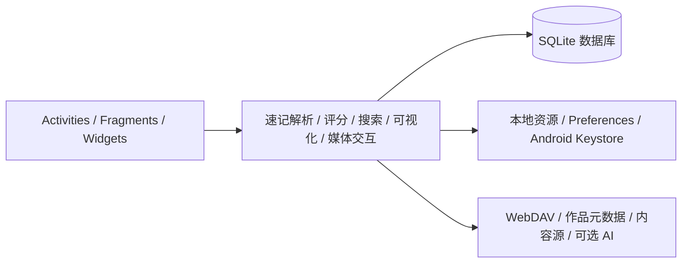

# 阅痕 ReadTrace

> 一个以本地优先为核心的个人文化档案 Android 应用，用来记录、整理和回看读过的书、看过的动画与电影、玩过的游戏以及听过的音乐。

[](https://github.com/liuGuanYi-hub/ReadTrace/actions/workflows/ci.yml)
[](https://github.com/liuGuanYi-hub/ReadTrace/releases)
[](https://developer.android.com)
[](https://kotlinlang.org)
[](LICENSE)

读过的东西往往分散在不同平台。阅痕把作品、状态、评分、标签、短评、摘录和个人心智维度放进一个可搜索、可备份、可回看的私人档案。核心记录可以离线运行，外部服务按需启用。

当前版本为 `v1.0.13`。项目仍在持续开发，第三方数据源、音频服务和云端社区功能可能随服务方规则变化。

## 目录

- [产品定位](#产品定位)
- [核心能力](#核心能力)
- [快速开始](#快速开始)
- [可选服务配置](#可选服务配置)
- [技术架构](#技术架构)
- [仓库结构](#仓库结构)
- [参与开发](#参与开发)
- [许可证](#许可证)

## 产品定位

阅痕关注一件事

**让文化消费留下可检索、可理解、可再次回看的个人痕迹。**

它把作品记录分成五种媒介，并把一次记录延伸成三个层次

1. 记录作品本身，包含状态、评分、标签、短评和摘录。
2. 观察自己的偏好，通过多维评分、时间线、星系和地形图回看内容之间的关系。
3. 把记忆整理成作品海报、年度画册、藏书票和个人展厅。

## 核心能力

### 五媒介个人藏库

- 支持书籍、动画、电影、游戏和音乐。
- 支持在看、看完、想看、暂停和弃看等状态。
- 支持评分、标签、短评、长评、摘录、角色、章节大纲和阅读记录。
- 支持拼音首字母搜索、媒介筛选、状态筛选、评分区间和标签筛选。

### 快速记录与元数据补全

- 支持自然语言速记，例如 `读完 三体 9分`。
- 可从 Bangumi、豆瓣、Steam、Google Books 等来源检索作品信息，具体可用性取决于网络和第三方接口。
- 可选用兼容 OpenAI Chat Completions 协议的服务补全元数据、角色信息、故事大纲和思考内容。

### 心智视图

- 多维评分与雷达图，用来观察长期偏好。
- 跨媒介星系，把作品之间的标签、概念和共鸣关系放在同一张图里。
- 心智拓扑图，把个人记录转成可旋转、可筛选的二维或三维视图。

### 回顾与创作

- 黑胶唱机与磁带卡座播放器，支持本地音频、试听源、歌词和传感器交互。
- 年度画册、金句海报、共鸣海报、电影票根、游戏卡带和藏书票等导出体验。
- 每日金句、时间线、封面画廊、纪念护照和桌面小组件。
- 社区展厅用于浏览和发布主题化的作品集合。

### 本地优先的数据管理

- 作品与笔记保存在本地 SQLite 数据库。
- 支持 JSON 完整备份、富内容 JSON 导入、CSV 导入导出和 Markdown 文集导出。
- 支持回收站、数据库迁移和导入合并，便于换机和恢复。
- 可选配置 WebDAV，用于在 NAS、坚果云或其他 WebDAV 服务之间同步数据。

## 快速开始

### 环境要求

- Android Studio
- JDK 21
- Android SDK 37
- Android 12 或更高版本的设备或模拟器

### 从源码构建

Windows PowerShell

```powershell
git clone https://github.com/liuGuanYi-hub/ReadTrace.git
cd ReadTrace
.\gradlew.bat testDebugUnitTest
.\gradlew.bat lintDebug
.\gradlew.bat assembleDebug
```

macOS 或 Linux

```bash
git clone https://github.com/liuGuanYi-hub/ReadTrace.git
cd ReadTrace
./gradlew testDebugUnitTest
./gradlew lintDebug
./gradlew assembleDebug
```

Debug APK 输出到 `app/build/outputs/apk/debug/app-debug.apk`。

也可以直接前往 [Releases](https://github.com/liuGuanYi-hub/ReadTrace/releases) 下载已发布版本。

### 发布构建

Release 构建需要正式签名配置。请参考 [`gradle.properties.example`](gradle.properties.example) 配置用户级 Gradle 属性，并在本地准备 `keystore.properties`。密钥、AccessKey、Cookie 和 API Key 不应写入仓库。

```powershell
.\gradlew.bat assembleRelease
```

缺少正式签名配置时，构建脚本会阻止 Release 任务继续执行。这样可以避免把调试签名包误当成正式版本发布。

## 可选服务配置

阅痕的本地记录、搜索、评分、备份和大部分可视化功能不依赖这些配置。

| 服务 | 配置位置 | 说明 |
| --- | --- | --- |
| 微信登录 | 用户级 Gradle 属性中的 `WECHAT_APP_ID` | 未配置时，Debug 构建使用本地沙盒流程 |
| 阿里云短信 | `ALIYUN_SMS_ACCESS_KEY_ID`、`ALIYUN_SMS_ACCESS_KEY_SECRET`、`ALIYUN_SMS_SIGN_NAME`、`ALIYUN_SMS_TEMPLATE_CODE` | 四项完整配置后启用正式短信通道 |
| AI 辅助 | App 内设置 | 支持自定义 OpenAI 兼容服务地址和模型，API Key 使用 Android Keystore 加密保存 |
| WebDAV | App 内同步设置 | 用于可选的远程备份和同步 |
| 社区内容 | `content-repo/` | 客户端按需读取公开的策展内容源 |

配置模板只包含键名和占位符，详见 [`gradle.properties.example`](gradle.properties.example)。

## 技术架构

阅痕采用 Android 原生实现，核心数据路径保持在本地，网络能力通过独立适配器接入。



### 技术选型

| 层次 | 方案 |
| --- | --- |
| 平台 | Android Native |
| 语言 | Kotlin |
| UI | Android View System、AppCompat、Material Components、ConstraintLayout |
| 持久化 | SQLite、SharedPreferences、本地 assets |
| 后台任务 | WorkManager |
| 动效与交互 | 自定义 View、Canvas、OpenGL ES、陀螺仪、线性马达和音频 API |
| 测试 | JUnit、Robolectric、Android Instrumentation、Espresso |
| 自动化 | GitHub Actions，执行单元测试、Lint 和 Debug APK 构建 |

### 主要代码入口

| 目录或文件 | 作用 |
| --- | --- |
| `app/src/main/java/com/example/readtrace/ui/fragment/` | 主页、藏库、星系、纪念和个人中心 |
| `app/src/main/java/com/example/readtrace/data/` | SQLite、数据库迁移、偏好设置和安全存储 |
| `app/src/main/java/com/example/readtrace/util/` | 速记解析、评分、搜索、外部数据源和媒体能力 |
| `app/src/main/java/com/example/readtrace/widget/` | 自定义视觉控件和桌面小组件 |
| `app/src/main/java/com/example/readtrace/sync/` | WebDAV 与跨端数据协议 |
| `app/src/main/assets/` | 内置内容、封面和本地资源 |

## 仓库结构

```text
.
├── app/                  Android 应用
├── content-repo/         社区策展内容源
├── mp-research/          微信小程序化调研资料
├── docs/                 项目文档和验证记录
├── .github/workflows/    CI 与 Release 工作流
├── gradle/               Gradle 版本目录
└── README.md
```

## 参与开发

欢迎通过 Issue 和 Pull Request 参与。提交功能建议时，尽量说明用户场景、离线行为、数据结构影响和外部服务依赖。

提交 PR 前建议完成以下检查

```text
testDebugUnitTest
lintDebug
assembleDebug
```

请不要提交以下内容

- API Key、密码、Cookie、AccessKey 或其他凭据
- `keystore.properties`、签名文件和本地数据库
- 只适用于个人环境的路径和调试产物

第三方数据源、音频服务和登录服务各自受其服务条款约束。使用相关功能前，请确认自己的使用场景符合对应平台规则。

## 许可证

本项目基于 [Apache License 2.0](LICENSE) 开源。
