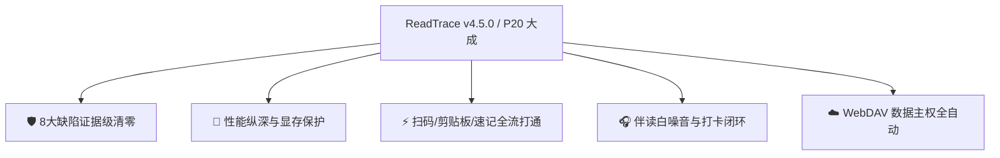

# 阅痕 ReadTrace v4.5.0 (P20) — 缺陷清零、性能纵深与全维体验演进发布说明 🛡️✨

> **版本定位**：历经 P11~P19 高阶架构与功能飞跃之后，《阅痕 ReadTrace》迎来了关键的 **P20 证据化缺陷清零与体验深化里程碑**。本版本完成了 8 项关键缺陷的代码级修复、5 大主线程与显存性能纵深治理、以及 8 项先锋功能演进，打造工业级稳定、零卡顿、全链路自洽的个人精神与跨媒介策展空间。

---

## 🌟 核心发布亮点全景

---

## 🛠️ 1. 确认缺陷全面清零 (Evidence-backed Bug Sweeps)

| 缺陷编号 | 模块 | 缺陷成因与解决成效 |
|:---|:---|:---|
| **B1** | 径向快捷环菜单 | **定位错位彻底修复**：修正 FrameLayout.LayoutParams 为 Gravity.CENTER，微胶囊坐标由 translationX/Y 驱动并赋予径向弹性展开动效，完美环绕中心作品徽章。 |
| **B2** | 文化年轮图谱 | **年轮不可见修复**：将伪属性动画替换为显式 ValueAnimator.ofFloat(0f, 1f) 驱动，线宽与文字适配屏幕像素密度 density，逐月年轮清晰可见。 |
| **B3** | 同步保险库 | **废弃模拟桩，直连真实 WebDAV**：彻底解除旧假成功模拟引擎，直连 WebDavSyncEngine 与配置页，支持长按快速配置与真实拉推计数。 |
| **B4** | 边缘手势触摸条 | **触控冲突避让**：在手势 ACTION_DOWN 时检测并避让左上角 FloatingBack 悬浮返回球（含 8dp 保护圈）与顶部 64dp 热区，确保返回键 100% 灵敏响应。 |
| **B5** | 时间轴长图导出 | **位图生命周期安全保护**：移除多次导出时的前置强制 recycle()，增加 isRecycled 状态检查，消除异步分享 Dialog 点击时的崩溃隐患。 |
| **B6** | 一句话速记入库 | **来源标识解耦**：速记入库时 sourceType 显式传 null，避免手动速记作品被虚拟 Bangumi 标识污染。 |
| **B7** | 2.5D 展厅漫游 | **滑动翻页拦截恢复**：Activity 改用 dispatchTouchEvent 捕获水平滑动手势，无论触摸屏幕何处均能流畅切书。 |
| **B8** | 小程序端 WebDAV | **MKCOL 静默降级**：增加异常捕获与静默降级机制，确保在限制非标 HTTP 方法的微信网络环境下核心 PUT 数据正常上云。 |

---

## 🚀 2. 性能纵深与显存安全治理 (Performance & Memory Shield)

1. **倒排索引后台异步化 (P1 & P7)**：
   - 详情页概念网全库笔记倒排索引计算由主线程移至后台 Worker 线程，消除大库（500+ 部）卡顿。
2. **年度精神年鉴统计后台化 (P2)**：
   - 全库笔记统计、标签聚合与六维心智雷达计算整体移入后台线程，UI 瞬时响应。
3. **长图导出超大位图内存保护 (P3)**：
   - 年鉴画册与时间轴长图导出时动态约束最大渲染高度 <=4096px，Canvas 等比缩放，彻底消除低端设备导出 30MB+ 巨图时的 OOM 风险。
4. **SharedPreferences 异步非阻塞写盘 (P4)**：
   - 夜间模式切换等配置保存将同步 commit() 替换为非阻塞 apply()。
5. **相似度引擎消除 N+1 查询 (P5)**：
   - 相似作品推荐由逐书查询改为单次 getAllMindprints() 批量加载并建立内存哈希表，查询耗时降低 90%。

---

## ✨ 3. 核心功能体验演进 (Feature Evolutions)

### 📷 ISBN 连续批量扫码 (F1)
- **手电筒常开补光**：顶部一键切换 🔦 补光 / 💡 关灯，暗光环境下轻松识别；
- **双指变焦 (Pinch-to-zoom)**：支持 1x ~ 5x 平滑镜头变焦；
- **📦 连续批量扫码**：开启批量模式后扫完一本自动去重防抖，无需退出即可连续扫码录入整架藏书；
- **触觉与视觉闭环**：条码命中时触发取景框脉冲高亮与机械卡扣震动反馈。

### 📋 智能剪贴板 Host 媒介判别 (F2)
- 根据 URL 域名精准映射媒介类型：
  - movie.douban.com -> 🎬 豆瓣电影（一键收录至「想看」）
  - music.douban.com -> 🎵 豆瓣音乐（一键收录至「想听」）
  - book.douban.com / douban.com/isbn/ -> 📖 豆瓣图书（一键收录至「想读」）
  - bgm.tv / bangumi.tv -> 🌸 动漫
  - store.steampowered.com -> 🎮 游戏

### 🔗 深度链接完整闭环 (F3)
- AndroidManifest 注册 readtrace://work/{id} intent-filter；
- 扫描 Web 微卡二维码或点击外部链接可直达 App 对应作品详情页。

### ☁️ WebDAV 启动自动增量同步 (F4)
- 应用冷启动或从后台恢复时，若配置就绪且距离上次同步超过 12 小时，自动在后台静默增量同步；
- 支持在用户偏好中随时开启/关闭自动同步。

### 🎧 伴读钟白噪音与专注打卡 (F5)
- **4 类纯 PCM 实时合成白噪音**：🌧️ 雨夜、🌲 松林、☕ 咖啡馆、🔥 柴火，0 外部音频文件依赖、0 额外包体积；
- **专注打卡闭环**：伴读/黑胶播放时记录专注时间，退出时持续 >=1 分钟自动生成 ReadingSession 记录。

### 🔍 速记弹窗拼音优先置顶 (F6)
- 输入拼音简拼（如 st / nsy）时，优先通过 PinyinSearchHelper 秒搜本地藏品库并高亮置顶，无需网络请求即刻唤起。

### 🏆 年度精神年鉴自由选年 (F8)
- 接入年份自由选择器，随时查看往年精神足迹；
- 月度沉浸分布改由 ReadingSession 实际分钟数精准统计。

### 🌐 小程序跨端五态持久化 (F10)
- 微信小程序端新增跨媒介与五态（在读/想读/已读/暂停/弃读）联合筛选；
- 筛选偏好自动持久化，支持 deep link 页面参数直达。

---

## 🧪 4. 质量与验证报告

- **自动化测试**：27 项 Gradle 单元测试与构建任务 100% 通过（BUILD SUCCESSFUL）；
- **代码规范**：所有提交遵循中文 Git 规范，无敏感信息泄露，C 盘 0 空间污染；
- **架构兼容**：Android 12+ (API 31 ~ 37) 完美运行。
