# 阅痕 ReadTrace 项目规划文档

## 1. 项目简介

**阅痕 ReadTrace** 是一个用于记录个人阅读经历的软件。

第一阶段先开发 **书籍板块**，用于记录用户看过、正在看、想看的书籍，并保存评分、标签、简短评价、读后感和阅读状态。

摘录和笔记功能放到 v1.1 再做，避免第一版 MVP 过大。

后续可以扩展为完整的「个人作品档案馆」，支持记录：

- 书籍
- 漫画
- 动漫
- 电影
- 电视剧
- 游戏
- 音乐
- 其他作品

项目核心理念：

> 记录看过的作品，也记录当时的自己。

---

## 2. 项目名称

中文名：

> 阅痕

英文名：

> ReadTrace

含义：

- Read：阅读
- Trace：痕迹、轨迹、印记

组合含义：

> 阅读留下的痕迹。

---

## 3. 技术栈选择

### 前端

使用：

```txt
React
```

推荐配套：

```txt
React + Vite + TypeScript
```

主要负责：

- 页面展示
- 表单交互
- 书籍列表
- 状态筛选
- 标签筛选
- 调用后端接口

---

### 后端

使用：


```txt
Python + FastAPI
```

主要负责：

- 提供 API 接口
- 处理书籍数据
- 连接数据库
- 保存用户笔记
- 后续接入 AI 总结功能

---

### 数据库

第一版使用：

```txt
SQLite
```

原因：

- 简单
- 不需要额外安装数据库服务
- 适合本地项目和个人软件
- 后期可以平滑迁移到 PostgreSQL 或 MySQL

---

## 4. 第一版目标

第一版先做成一个最小可用版本，也就是 MVP。

目标：

> 用户可以添加一本书，设置阅读状态、评分、标签和读后感，并在书架中查看、筛选、编辑和归档。

第一版 MVP 范围：

- 添加书籍
- 查看书籍列表
- 查看书籍详情
- 编辑书籍
- 软删除 / 归档书籍
- 阅读状态
- 评分
- 标签
- 简短评价
- 读后感
- SQLite 保存数据

第一版不要急着做：

- 登录系统
- 云同步
- 好友系统
- 推荐系统
- 复杂数据分析
- 自动爬取书籍信息
- 摘录和笔记

这些可以放到后面的版本。

---

## 5. 核心功能

### 5.1 书籍管理

支持：

- 添加书籍
- 编辑书籍
- 软删除 / 归档书籍
- 查看书籍详情
- 搜索书籍
- 按状态筛选书籍
- 按标签筛选书籍

---

### 5.2 阅读状态

每本书可以有以下状态：

```txt
想读
在读
已读
暂停
弃读
```

字段建议使用英文枚举保存：

```txt
wishlist
reading
finished
paused
dropped
```

前端再映射成中文显示。

---

### 5.3 评分系统

支持 1-10 分评分。

示例：

```txt
10 分：神作
9 分：非常喜欢
8 分：值得推荐
7 分：还不错
6 分：一般
5 分及以下：不太喜欢
```

数据库中可以用数字保存：

```txt
rating: 8.5
```

评分规则：

- rating 可以为空
- 如果填写，范围必须是 1-10
- 允许一位小数，例如 8.5
- 不允许小于 1 或大于 10

---

### 5.4 标签系统

每本书可以添加多个标签。

示例：

```txt
文学
小说
日本文学
青春
短篇
哲学
技术
算法
计算机
```

标签用于后续筛选和统计。

第一版数据库里 `tags` 使用 JSON 字符串保存。

数据库实际保存：

```json
["青春", "日本文学", "短篇"]
```

后端 API 返回给前端时转换成数组：

```json
{
  "tags": ["青春", "日本文学", "短篇"]
}
```

不要让前端直接拿到 JSON 字符串：

```txt
"[\"青春\", \"日本文学\", \"短篇\"]"
```

---

### 5.5 读后感

每本书可以写一段读后感。

例如：

```txt
如同大学般转瞬即逝。
```

读后感是这个软件的核心价值之一。

不是只记录“我读过什么”，而是记录：

> 我当时为什么喜欢它，它给我留下了什么。

---

### 5.6 摘录与笔记

摘录与笔记放到 v1.1。

每本书可以拥有多条摘录或笔记。

每条笔记包含：

- 内容
- 创建时间
- 可选页码
- 可选章节
- 可选想法

示例：

```txt
摘录：人生如旅，亦哭亦歌。
想法：这句话很适合写朋友圈。
```

---

## 6. 页面设计

### 6.1 首页 / 书架页

功能：

- 展示所有书籍
- 顶部搜索框
- 左侧状态筛选
- 右侧书籍卡片
- 添加书籍按钮

页面结构示意：

```txt
┌────────────────────────────────────┐
│ 阅痕 ReadTrace                      │
├──────────────┬─────────────────────┤
│ 全部          │ 搜索框               │
│ 想读          │ + 添加书籍            │
│ 在读          │                     │
│ 已读          │ [书籍卡片] [书籍卡片] │
│ 暂停          │ [书籍卡片] [书籍卡片] │
│ 弃读          │                     │
└──────────────┴─────────────────────┘
```

---

### 6.2 添加书籍页

表单字段：

- 书名
- 作者
- 封面
- 分类
- 阅读状态
- 开始阅读时间
- 读完时间
- 评分
- 标签
- 简短评价
- 读后感

---

### 6.3 编辑书籍页

功能和添加书籍页类似。

区别：

- 自动填充原有数据
- 保存后更新对应书籍

---

### 6.4 书籍详情页

展示内容：

- 封面
- 书名
- 作者
- 阅读状态
- 评分
- 标签
- 开始阅读时间
- 读完时间
- 简短评价
- 读后感
- 摘录列表（v1.1）
- 笔记列表（v1.1）

可以放两个按钮：

```txt
编辑书籍
添加笔记（v1.1）
```

---

### 6.5 统计页

v1.2 再做。

可以统计：

- 总共读过多少本书
- 今年读过多少本书
- 各状态数量
- 评分分布
- 最常用标签
- 每个月读完几本书

---

## 7. 数据库设计

v1.0 先设计一张核心表：

- books：书籍表

v1.1 再增加：

- notes：笔记表

为了简单，第一版先把 tags 存成 JSON 字符串。后续如果标签统计和管理变复杂，再拆出 tags 表。

---


## 8. books 表设计

```sql
CREATE TABLE books (
    id INTEGER PRIMARY KEY AUTOINCREMENT,
    title TEXT NOT NULL,
    author TEXT,
    cover_url TEXT,
    category TEXT,
    status TEXT NOT NULL DEFAULT 'wishlist',
    rating REAL,
    tags TEXT,
    short_comment TEXT,
    review TEXT,
    start_date TEXT,
    finish_date TEXT,
    created_at TEXT NOT NULL,
    updated_at TEXT NOT NULL,
    is_deleted INTEGER NOT NULL DEFAULT 0,
    deleted_at TEXT
);
```

字段说明：

| 字段            | 类型      | 说明                    |
| ------------- | ------- | --------------------- |
| id            | INTEGER | 书籍 ID                 |
| title         | TEXT    | 书名                    |
| author        | TEXT    | 作者                    |
| cover_url     | TEXT    | 封面地址                  |
| category      | TEXT    | 分类                    |
| status        | TEXT    | 阅读状态                  |
| rating        | REAL    | 评分                    |
| tags          | TEXT    | 标签，可以用 JSON 字符串       |
| short_comment | TEXT    | 简短评价                  |
| review        | TEXT    | 读后感                   |
| start_date    | TEXT    | 开始阅读时间                |
| finish_date   | TEXT    | 读完时间                  |
| created_at    | TEXT    | 创建时间                  |
| updated_at    | TEXT    | 更新时间                  |
| is_deleted    | INTEGER | 是否已软删除，0 表示正常，1 表示已归档 |
| deleted_at    | TEXT    | 软删除时间                 |

软删除规则：

- 删除书籍时不物理删除数据库记录
- 后端只把 `is_deleted` 改成 `1`
- 同时把 `deleted_at` 写入当前完整 ISO 时间
- 默认列表查询只返回 `is_deleted = 0` 的书籍
- 后续可以做回收站、恢复书籍、彻底删除
- 彻底删除必须手动确认后才能执行

时间格式规则：

- `created_at` / `updated_at` / `deleted_at` 使用完整 ISO 8601 字符串
- 示例：`2026-06-03T23:02:00+08:00`
- `start_date` / `finish_date` 使用 `YYYY-MM-DD`
- 示例：`2026-06-03`

---

## 9. notes 表设计（v1.1）

```sql
CREATE TABLE notes (
    id INTEGER PRIMARY KEY AUTOINCREMENT,
    book_id INTEGER NOT NULL,
    content TEXT NOT NULL,
    note_type TEXT DEFAULT 'note',
    page TEXT,
    chapter TEXT,
    created_at TEXT NOT NULL,
    updated_at TEXT NOT NULL,
    is_deleted INTEGER NOT NULL DEFAULT 0,
    deleted_at TEXT,
    FOREIGN KEY (book_id) REFERENCES books(id)
);
```

字段说明：

| 字段         | 类型      | 说明                    |
| ---------- | ------- | --------------------- |
| id         | INTEGER | 笔记 ID                 |
| book_id    | INTEGER | 关联的书籍 ID              |
| content    | TEXT    | 笔记内容                  |
| note_type  | TEXT    | note 或 quote          |
| page       | TEXT    | 页码                    |
| chapter    | TEXT    | 章节                    |
| created_at | TEXT    | 创建时间                  |
| updated_at | TEXT    | 更新时间                  |
| is_deleted | INTEGER | 是否已软删除，0 表示正常，1 表示已归档 |
| deleted_at | TEXT    | 软删除时间                 |

注意：

- 归档书籍时不级联物理删除笔记
- 删除笔记时也使用软删除
- 这样后续可以支持恢复书籍和恢复笔记

---

## 10. 后端接口设计

后端使用 FastAPI。

### 10.1 书籍接口

#### 获取书籍列表

```http
GET /api/books
```

可选查询参数：

```txt
status
keyword
tag
```

示例：

```http
GET /api/books?status=finished
GET /api/books?keyword=伊豆
GET /api/books?tag=日本文学
```

默认只返回未归档书籍，也就是 `is_deleted = 0` 的记录。

---

#### 获取单本书详情

```http
GET /api/books/{book_id}
```

---

#### 添加书籍

```http
POST /api/books
```

请求体示例：

```json
{
  "title": "伊豆的舞女",
  "author": "川端康成",
  "category": "文学",
  "status": "finished",
  "rating": 8.5,
  "tags": ["青春", "日本文学", "短篇"],
  "short_comment": "如同大学般转瞬即逝。",
  "review": "这本书给人的感觉很轻，也很短暂。",
  "start_date": "2026-06-03",
  "finish_date": "2026-06-10"
}
```

---

#### 更新书籍

```http
PUT /api/books/{book_id}
```

---

#### 归档书籍（软删除）

```http
PATCH /api/books/{book_id}/archive
```

后端实际执行：

```sql
UPDATE books
SET is_deleted = 1,
    deleted_at = 当前完整 ISO 时间,
    updated_at = 当前完整 ISO 时间
WHERE id = {book_id};
```

不真正删除数据库记录。

后续可以增加：

```http
PATCH /api/books/{book_id}/restore
DELETE /api/books/{book_id}/hard-delete
```

其中彻底删除必须要求用户手动确认。

---

### 10.2 笔记接口（v1.1）

#### 获取某本书的笔记

```http
GET /api/books/{book_id}/notes
```

---

#### 添加笔记

```http
POST /api/books/{book_id}/notes
```

请求体示例：

```json
{
  "content": "这里写摘录或笔记内容",
  "note_type": "quote",
  "page": "23",
  "chapter": "第一章"
}
```

---

#### 更新笔记

```http
PUT /api/notes/{note_id}
```

---

#### 归档笔记（软删除）

```http
PATCH /api/notes/{note_id}/archive
```

---

## 11. 前端组件设计

React 前端可以拆成这些组件：

```txt
src/
├── components/
│   ├── BookCard.tsx
│   ├── BookForm.tsx
│   ├── BookList.tsx
│   ├── StatusFilter.tsx
│   ├── TagList.tsx
│   └── NoteList.tsx（v1.1）
├── pages/
│   ├── HomePage.tsx
│   ├── BookDetailPage.tsx
│   ├── AddBookPage.tsx
│   └── EditBookPage.tsx
├── api/
│   └── bookApi.ts
├── types/
│   └── book.ts
├── App.tsx
└── main.tsx
```

---

## 12. 前端类型设计

```ts
export type BookStatus =
  | "wishlist"
  | "reading"
  | "finished"
  | "paused"
  | "dropped";

export interface Book {
  id: number;
  title: string;
  author?: string;
  cover_url?: string;
  category?: string;
  status: BookStatus;
  rating?: number;
  tags: string[];
  short_comment?: string;
  review?: string;
  start_date?: string;
  finish_date?: string;
  created_at: string;
  updated_at: string;
  is_deleted: boolean;
  deleted_at?: string;
}

export interface Note {
  id: number;
  book_id: number;
  content: string;
  note_type: "note" | "quote";
  page?: string;
  chapter?: string;
  created_at: string;
  updated_at: string;
  is_deleted: boolean;
  deleted_at?: string;
}
```

---

## 13. 后端项目结构

```txt
backend/
├── app/
│   ├── main.py
│   ├── database.py
│   ├── models.py
│   ├── schemas.py
│   ├── crud.py
│   └── routers/
│       ├── books.py
│       └── notes.py（v1.1）
├── readtrace.db
├── requirements.txt
└── README.md
```

---

## 14. 前端项目结构

```txt
frontend/
├── src/
│   ├── api/
│   │   └── bookApi.ts
│   ├── components/
│   │   ├── BookCard.tsx
│   │   ├── BookForm.tsx
│   │   ├── BookList.tsx
│   │   ├── StatusFilter.tsx
│   │   └── NoteList.tsx（v1.1）
│   ├── pages/
│   │   ├── HomePage.tsx
│   │   ├── BookDetailPage.tsx
│   │   ├── AddBookPage.tsx
│   │   └── EditBookPage.tsx
│   ├── types/
│   │   └── book.ts
│   ├── App.tsx
│   └── main.tsx
├── package.json
└── vite.config.ts
```

---

## 15. 总项目结构

```txt
readtrace/
├── frontend/
├── backend/
├── docs/
│   └── project-plan.md
└── README.md
```

---

## 16. 开发路线

### v1.0：书籍记录核心功能

目标：

> 做出一个可以长期使用的本地书籍记录工具。

任务：

- 创建 React + Vite 项目
- 做首页布局
- 做书籍卡片
- 做添加书籍表单
- 做书籍详情页
- 暂时使用假数据完成前端静态页面
- 创建 FastAPI 项目
- 配置 SQLite
- 创建 books 表
- 实现书籍列表、详情、添加、编辑接口
- 实现书籍软删除 / 归档接口
- 前端封装 API 请求
- 首页获取书籍列表
- 添加书籍保存到后端
- 编辑书籍更新后端数据
- 归档书籍时不物理删除数据
- 详情页获取单本书数据
- 完成基础表单校验和错误提示

---

### v1.1：摘录和笔记

目标：

> 每本书可以保存摘录和笔记。

任务：

- 创建 notes 表
- 实现笔记列表、添加、编辑接口
- 实现笔记软删除 / 归档接口
- 详情页展示笔记
- 添加笔记表单
- 归档笔记时不物理删除数据

---

### v1.2：统计和搜索优化

目标：

> 让书架更好找、更好看、更像一个产品。

任务：

- 搜索功能
- 状态筛选
- 标签筛选
- 空状态提示
- 移动端适配
- 页面美化
- 年度阅读总结
- 阅读统计图表
- Markdown 导出

---

### v2.0：作品类型扩展

目标：

> 从书籍记录扩展成个人作品档案馆。

任务：

- 增加作品类型字段
- 支持电影、动漫、游戏、音乐、漫画、电视剧等作品
- 统一作品列表、详情、评分、标签和感想结构
- 根据不同作品类型优化展示字段

---

### v3.0：登录同步和云端版本

目标：

> 支持多设备长期使用。

任务：

- 登录系统
- 云同步
- 多设备同步
- 数据备份和恢复
- 云端部署
- AI 总结读后感
- AI 生成年度阅读报告
- AI 推荐下一本书

---

## 17. 第一版接口优先级

必须先做：

```txt
GET /api/books
GET /api/books/{book_id}
POST /api/books
PUT /api/books/{book_id}
PATCH /api/books/{book_id}/archive
```

v1.1 再做：

```txt
GET /api/books/{book_id}/notes
POST /api/books/{book_id}/notes
PUT /api/notes/{note_id}
PATCH /api/notes/{note_id}/archive
```

v1.2 再做：

```txt
GET /api/stats
GET /api/tags
```

---

## 18. 第一版开发建议

不要一开始就做太复杂。

正确顺序：

```txt
1. 先做静态页面
2. 再做假数据展示
3. 再做后端接口
4. 再前后端联调
5. 最后美化和扩展
```

不要一开始就纠结：

- 登录怎么做
- 数据怎么云同步
- 封面怎么自动获取
- AI 怎么接入
- 手机 App 怎么打包

这些都不是第一版核心。

---

## 19. 项目核心卖点

阅痕 ReadTrace 不是单纯的书架软件。

它应该强调：

```txt
记录作品
记录感受
记录时间
记录成长
```

一句产品标语：

> 阅痕 ReadTrace：记录你读过的书，也记录你当时的心境。

或者：

> 每一本书，都是某个阶段的自己。

---

## 20. MVP 完成标准

当项目做到以下功能，就算第一版完成：

- 可以添加书籍
- 可以查看书籍列表
- 可以查看书籍详情
- 可以编辑书籍
- 可以软删除 / 归档书籍
- 可以设置阅读状态
- 可以评分
- 可以添加标签
- 可以写简短评价
- 可以写读后感
- 数据可以保存到 SQLite

完成这些后，再继续做笔记、统计、AI 和其他作品类型。

---

## 21. 后续扩展方向

### 21.1 从书籍扩展到作品

可以增加作品类型字段：

```txt
book
movie
anime
game
music
comic
drama
```

这样未来就能统一记录所有作品。

---

### 21.2 AI 功能

可以加入：

- AI 总结读后感
- AI 生成年度阅读报告
- AI 分析阅读偏好
- AI 推荐下一本书
- AI 根据读后感生成朋友圈文案
- AI 从摘录中提炼关键词

---

### 21.3 导出功能

支持导出：

- Markdown
- PDF
- JSON
- CSV

其中 Markdown 最适合第一版做。

---

## 22. 一句话总结

第一版先做：

> 记录书籍、评分、标签、状态和读后感的个人阅读档案软件。

后续再扩展成：

> 记录书籍、电影、动漫、游戏等所有作品的个人作品档案馆。

---

## 23. “独秀级”先锋视觉与高维动效体系演进规划 (v4.0 Elite Aesthetic & Motion System)

为彻底拉开与市面上千篇一律的普通 Android APK 的体验差距，结合全球顶尖数字设计库（**Landing.love** 流体微动效、**Land-book** 编辑部排版、**Awwwards** 空间深度、**OnePageLove** 细节打磨、**Lapa.ninja** 暗黑奢华质感、**21st.dev** 先锋交互组件、**Siteinspire** 艺术策展审美），将《阅痕》全面重塑为具备 **“空间计算美学 + 画廊策展排版 + 物理触感”** 的移动端艺术品。

---

### 23.1 空间连续性与 OpenGL 破壁转场系统 (Spatial Transitions)

> **参考来源**：Awwwards / Landing.love

- **3D 展厅到阅读器的「破壁穿梭转场」**：
  - 在 3D 私人展厅中点击某部作品时，相机平滑推进并锁定目标；
  - 3D 立体书盒在空中以弹簧物理曲线（`SpringAnimation`）沿视线破壁展开为立体书卷；
  - 封面展开的瞬间无缝过渡至 **3D 拟真翻折阅读器**，消除传统白屏/黑屏切页的割裂感。
- **共享元素物理形态形变 (Shared Element Morphing)**：
  - 书架卡片点击时，封面平滑放大为顶栏高光画卷，阅读进度胶囊延伸为页眉进度条，背景卡片如水墨般扩散为全屏玻璃拟物面板。

---

### 23.2 美术馆策展级非对称 Bento Grid 布局 (Curatorial Bento Layout)

> **参考来源**：Land-book / Siteinspire

- **彻底废除呆板的单列/双列等高网格**，构建律动感十足的艺术策展排版：
  ```txt
  ┌────────────────────────────────────────────────────────┐
  │  【今日焦点·策展主位】（跨 2 列大画幅，倾斜 3D 浮雕封套）│
  │  《小王子》· 安托万·德·圣-埃克苏佩里                     │
  │  “你在你的玫瑰花身上耗费的时间，使你的玫瑰花变得如此重要。”│
  ├────────────────────────────┬───────────────────────────┤
  │ 【在读进度卡】             │ 【今日专注打卡胶囊】      │
  │  第 45 页 · 68% 进度       │  ⏱️ 60 min · 🔥连胜 7 天   │
  ├────────────────────────────┴───────────────────────────┤
  │ 【灵感金句羊皮纸便签条】（横跨全宽，典雅倾斜衬线排版） │
  └────────────────────────────────────────────────────────┘
  ```
- **编辑部级排版呼吸感**：
  - 极致字号反差：大标题 24~28sp 衬线粗体，辅助元数据 11sp 浅灰无衬线，引言金句采用倾斜衬线（Serif Italic）；
  - 古典排版元素：首字下沉（Drop Caps）与罗马数字章节标记（如 `CHAPTER · IV`）；
  - 胶片颗粒纹理（Film Grain Overlay）与柔和漫反射环境光。

---

### 23.3 陀螺仪重力感应全息反光与 3D 视差 (Gyroscope Holographic Specular)

> **参考来源**：21st.dev / OnePageLove

- **实时重力高光流转 (Specular Glare)**：
  - 基于 Android `Sensor.TYPE_ROTATION_VECTOR` 实时监听手机俯仰与翻滚姿态；
  - 倾斜手机时，书籍封面、文化护照、电影票根表面生成随着重力流动的高光掠影（Specular Highlight），模拟真实烫金硬壳书与收藏级卡牌的质感。
- **多层立体视差深度 (Multi-layer 3D Parallax)**：
  - 卡片内部的背景层、文字层、主体封面按不同位移系数分离移动，呈现立体裸眼 3D 悬浮感。

---

### 23.4 动态 GLSL 流体着色器与环境粒子 (Dynamic Shaders & Ambient Particles)

> **参考来源**：Lapa.ninja / Awwwards

- **深色模式极光流体着色器 (Fluid Aurora Shader)**：
  - 抛弃单调的纯黑背景，采用 OpenGL ES / AGSL 实时计算的深邃微光流体噪声，背景如慢速呼吸般缓缓律动；
- **全息星图与展厅微粒系统 (Ambient Particle Engine)**：
  - 在星空展厅与心智星图页面中，背景漂浮若隐若现的微光星尘粒子，支持手指滑过时的力场排斥与引力微动效。

---

### 23.5 实体物理触感与机械级微交互 (Tactile Micro-interactions & Haptics)

> **参考来源**：Landing.love / 21st.dev

- **物理弹簧引擎 (Spring Physics Engine)**：
  - 接入 AndroidX `DynamicAnimation`，所有拖拽、滚动边缘、卡片展开均具备真实物体的阻尼、拉伸与回弹超调。
- **机械触觉反馈 (Rich Haptics Matrix)**：
  - 翻阅 3D 纸张时：触发轻微的微段阻尼振动（模拟纸张翻折的沙沙触感）；
  - 达成阅读里程碑或点亮勋章时：触发双脉冲重触觉（`EFFECT_HEAVY_CLICK` + `EFFECT_TICK`）；
  - 长按书卡触发「全息浮空预览」（Scale 1.04 + 阴影动态软化扩散），松手如同气垫般轻柔回落。

---

### 23.6 落地实施阶段路线图 (Implementation Milestones)

| 阶段          | 目标代号        | 核心交付成果                                           | 预期体验突破          |
| :---------- | :---------- | :----------------------------------------------- | :-------------- |
| **Phase 1** | 🏛️ 策展排版重塑  | `MainActivity` 重构为非对称策展 Bento Grid、衬线字号落差系统、首字下沉 | 开屏即是美术馆杂志级排版    |
| **Phase 2** | 🔮 陀螺仪全息光泽  | 封装 `GyroscopeParallaxHelper`，为封面、护照、票根注入重力感应流动高光 | 赋予每张卡片真实实物的反光触感 |
| **Phase 3** | 💫 空间破壁转场   | 3D 书盒展开破壁转场动画 + Spring 弹簧曲线过渡至 3D 翻页阅读器          | 体验无缝空间穿梭，消灭硬切跳转 |
| **Phase 4** | 🌌 流体着色器与粒子 | 接入 AGSL / GLSL 流体呼吸着色器与星空粒子力场交互                  | 深色模式与星图页面视觉震撼升维 |

---

## 24. P6 殿堂级先锋美学与策展体验系统开发计划 (Awwwards / Siteinspire / Land-book Aesthetic System)

### 24.1 核心设计理念与灵感来源

结合 **GitHub 上数万 Star 的顶尖开源作品（Raycast, Linear, Stripe UI, Vercel Geist）** 与 **Awwwards / Siteinspire / Land-book / Landing.love** 的年度大奖获奖范式，为《阅痕 ReadTrace》构建独一无二的“数字艺术博物馆”美学资产体系，彻底消除传统数码 UI 的生硬与千篇一律感。

---

### 24.2 核心强化模块矩阵

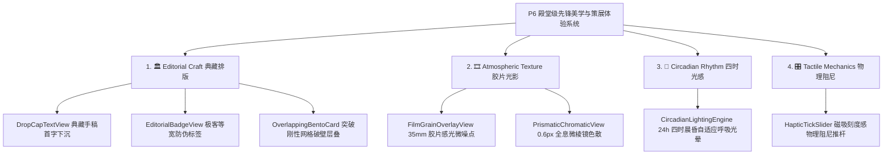

---


### 24.3 四大先锋美学技术细节

#### 1. 📜 典藏手稿首字下沉排版 (`DropCapTextView`)

- **设计原理**：采用中世纪古籍手稿与国家地理杂志排版规则，段落首字符放大 3.5 倍（采用优雅衬线体），垂直嵌入前 3 行文字之中；
- **视觉增强**：首字背后带有透明度 4% 的巨大水印阴影，首段正文字距微调为 0.05em，极富文学艺术质感。

#### 2. 🏷️ 高密极客等宽防伪元标签 (`EditorialBadgeView`)

- **设计原理**：参考 Raycast / Linear 极客美学，构建高密度等宽字排版：  
  `[ARCHIVE_ID: #RT-0924 // ELV: 8848M // RES: 98.6% // LAT: 34.05°N]`
- **视觉规范**：10sp 等宽英文字体（Monospace / JetBrains Mono）、宽字距（0.12）、1px 极细虚线描边边框与微光底色，赋予每件藏品国家档案馆级防伪质感。

#### 3. 🎞️ 35mm 胶片感光颗粒着色器 (`FilmGrainOverlayView`)

- **设计原理**：在背景流体层之上叠加一层透明度仅 2.5% 的 **35mm 胶片物理感光噪点（Film Grain Noise）**；
- **效果表现**：消除屏幕色彩渐变断层（Banding），带来王家卫电影胶片般的有机颗粒呼吸感。

#### 4. 💎 1px 极细内倒角光与全息微棱镜色散 (`PrismaticChromaticView`)

- **设计原理**：在卡片边缘渲染 1px 极细高光反射（Top-left Light），并在手机微倾斜时在边缘分离出 0.6px 的极微弱 RGB 棱镜色散（Chromatic Aberration）；
- **效果表现**：如同高定光学透镜或纯水晶切面的奢华折射。

#### 5. 🌅 24h 昼夜四时自适应自然光色温系统 (`CircadianLightingEngine`)

- **设计原理**：根据当地自然时间自适应平滑漫射四时环境光晕：
  - **🌅 清晨 (06:00 ~ 09:00)**：晨曦金与淡水蓝漫射（唤醒感）；
  - **☀️ 正午 (09:00 ~ 17:00)**：高透纯白与莫兰迪灰青（通透理智）；
  - **🌆 暮色 (17:00 ~ 20:00)**：紫霞暮色与落日橙金（沉浸浪漫）；
  - **🌌 子夜 (20:00 ~ 06:00)**：深邃曜黑、夜鹿靛青与极光流光（暗夜漫想）。

#### 6. 🎛️ 磁吸刻度感物理阻尼推杆 (`HapticTickSlider`)

- **设计原理**：将海拔切片推杆与阅读进度条升级为带物理机械段落感的推杆。每次滑过关键刻度点，触发 8ms 线性马达微弹力与阻尼减速。

---

### 24.4 落地实施分阶段路线图 (Phases)

| 阶段          | 核心任务                 | 交付组件与模块                                                 | 验收标准                             |
| :---------- | :------------------- | :------------------------------------------------------ | :------------------------------- |
| **Phase 1** | **典藏手稿排版与极客标签**      | `DropCapTextView.kt`  
`EditorialBadgeView.kt`          | 首页金句与长评首字下沉排版渲染，藏品档案极客等宽微标签生效    |
| **Phase 2** | **35mm 胶片感光噪点与棱镜色散** | `FilmGrainOverlayView.kt`  
`PrismaticChromaticView.kt` | 全局背景消除数码断层，卡片边缘具备 0.6px 全息水晶棱镜色散 |
| **Phase 3** | **昼夜四时自然光感系统**       | `CircadianLightingEngine.kt`                            | 24小时四时晨昏自适应光晕与低频色温平滑渐变           |
| **Phase 4** | **磁吸刻度阻尼推杆**         | `HapticTickSlider.kt`                                   | 3D 地形图海拔切片与进度滑块具备真实机械齿轮段落触感      |

---

## 25. P7 ~ P10 空间计算与全感官先锋进化系统开发计划

### 25.1 模块规划概览

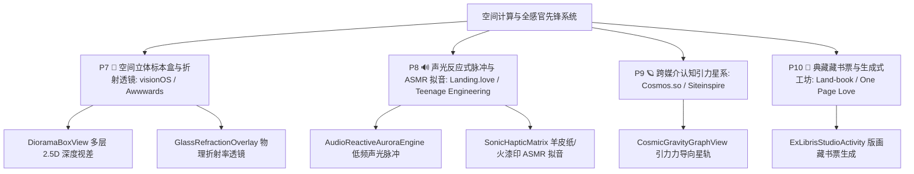

---

### 25.2 核心技术与体验规格

#### 1. P7 🔮 空间立体标本盒与折射透镜 (`DioramaBoxView` & `GlassRefractionOverlay`)

- **4 层 2.5D 深度视差悬浮**：
  - Layer 0 (Back): 环境毛玻璃与背景底板 (`z = -30dp`, 视差系数 0.3x)；
  - Layer 1 (Mid-Back): 等宽极客元数据标签与正文金句 (`z = 0dp`, 视差系数 0.6x)；
  - Layer 2 (Foreground): 3D 浮雕封面画作 (`z = +25dp`, 视差系数 1.2x, 空间倾角)；
  - Layer 3 (Top): 全息玻璃折射与火漆印章 (`z = +45dp`, 视差系数 1.8x, 高光掠影)；
- **真实光学折射率透镜**：在卡片倾斜时动态弯曲后方环境光流体。

#### 2. P8 🔊 声光反应式脉冲与 ASMR 拟音 (`AudioReactiveAuroraEngine` & `SonicHapticMatrix`)

- **网易云级 33 RPM 黑胶唱片强化**：
  - 经典黑色同心圆微沟槽盘体，中心大画幅高清单曲 Label 旋转；
  - 真实机械金属唱臂自顶部精准落针（23° 物理落针回弹），暂停时优雅抬起复位；
- **声光反应式极光脉冲**：
  - 播放夜鹿/真夜中曲目时，背景极光随着 Bass 低频与鼓点瞬态有机律动；
- **全场景 ASMR 拟音矩阵**：
  - 翻页羊皮纸沙沙声、盖印章火漆沉击音、撕开票根高频裂变音。

#### 3. P9 🪐 跨媒介认知引力星系 (`CosmicGravityGraphView`)

- **跨媒介引力拓扑**：
  - 音乐（夜鹿《晴る》）➔ 番剧（《葬送的芙莉莲》）➔ 文学（《时间的秩序》）引力星轨；
  - 手指拖拽节点呈现弹性力导向丝绸形变与引力波阻尼震荡。

#### 4. P10 📜 典藏藏书票与生成式工坊 (`ExLibrisStudioActivity`)

- **个人专属 Ex-Libris 藏书票**：
  - 每部读完作品生成中世纪铜版画藏书票，一键导出 4K 极简瑞士网格海报分享。

---

## 26. v1.0.5 ~ v1.1.0 架构加固、数据灾备与功能完善实施计划 (Bugfix & Hardening Plan)

### 26.1 研发背景与目标

《阅痕 ReadTrace》已完成从 P1 至 P10 全感官美学与核心先锋视效的全面落地。在最近的系统级代码深度审查中，发现若干数据一致性、级联清理、备份数据完整性及边缘场景异常等隐患。  
本计划旨在推进系统级架构加固与数据灾备补全，确保应用在拥有先锋交互的同时具备工业级的稳定性与数据安全性。

---


### 26.2 核心问题与专项加固矩阵

```mermaid
graph TD
    A[系统加固与数据灾备工程] --> B[第一阶段: 核心业务缺陷与单例安全]
    A --> C[第二阶段: 数据资产全量灾备]
    A --> D[第三阶段: 渲染性能、爬虫与内存治理]
    A --> E[第四阶段: 架构规范、数据闭环与测试]

    B --> B1[AddBookActivity: 新增书籍生成主键回填, 修复心智模型绑定 ID 0 Bug]
    B --> B2[BookDatabaseHelper: 彻底删除/清空回收站 6 表外键级联清理与缓存失效]
    B --> B3[BookDatabaseHelper: 构造私有化 & 全项目强制 getInstance 单例统一]
    B --> B4[BookDatabaseHelper: 单例防误关闭拦截, 清理各组件误调 close]
    B --> B5[PhoneAuthManager: 短信平台故障时自动回退本地沙盒明文验证码]

    C --> C1[BackupHelper: 升级 JSON/CSV/Markdown 备份引擎, 纳入 6 大高阶维度数据]
    C --> C2[BookDatabaseHelper: 支持心智/人物/大纲/地标/打卡/曲目的无损导入恢复]

    D --> D1[MindprintTopologyView: 消灭 project3D 每帧千次 PointF 分配, 根除 Minor GC 掉帧]
    D --> D2[MediaTimelineScrollView: 接入 LRU 封面缓存与脱离窗口安全回收, 防 OOM]
    D --> D3[Poster Activities: 海报长图渲染与 PNG 压缩异步化, 主动调用 bitmap.recycle]
    D --> D4[DoubanClient: 爬虫正则表达式预编译常量化, 提升 3 倍 HTML 解析吞吐]
    D --> D5[CurrentlyReadingWidgetProvider: 补齐桌面小组件在读进度与页码刻度计算]
    D --> D6[SpatialAudioEngine: 短音效生命周期兜底释放机制, 防 AudioTrack 句柄泄漏]

    E --> E1[UserPreferencesManager: 集中化管理散落的 6 个 SP 配置文件]
    E --> E2[ReadingSession: 作品状态流转与完读打卡节点自动触发与数据闭环]
    E --> E3[CommunityRepository: 统一使用数据库单例并规划本地持久化存储]
    E --> E4[Unit Tests: 覆盖高斯势能地形/共鸣相似度/CSV解析/DB迁移核心逻辑]
```

---


### 26.3 详细技术实施方案

#### 1. 修复新增作品六维心智模型绑定错误 (`AddBookActivity.kt`)

- **问题**：`insertBook(book)` 返回的新增主键未回填给 `book.id`，导致 `saveMindprint` 始终将初始心智数据绑定至 `bookId = 0`。
- **方案**：获取 `insertBook(book)` 返回的 `newId`，在保存心智模型时将 `bookId` 指定为 `newId`，彻底解决新作品六维雷达全为 0 及多次添加相互覆盖的缺陷。

#### 2. 完善数据库物理删除与清空回收站 6 表级联清理 (`BookDatabaseHelper.kt`)

- **问题**：`hardDeleteBook` 与 `clearAllTrash` 仅清除了 `TABLE_NOTES` 和 `TABLE_BOOKS`，未清理外键关联的 6 张子表。
- **方案**：在单个事务中级联物理删除以下关联表记录：
  - `reading_sessions`（阅读打卡记录）
  - `book_characters`（角色人物谱）
  - `book_outlines`（章节大纲脑图）
  - `book_locations`（空间地标足迹）
  - `book_mindprints`（六维心智模型）
  - `audio_tracks`（黑胶关联曲目）  
    并在 `clearAllTrash()` 末尾显式触发 `invalidateBookCache()`。

#### 3. 升级全量备份与多格式导出灾备引擎 (`BackupHelper.kt`)

- **问题**：现有 JSON 备份仅收录 `Book` 与 `Note`，缺失 6 大高阶资产，导致跨机迁移时数据丢失。
- **方案**：
  - 扩展 JSON Schema，新增 `mindprint`、`characters`、`outlines`、`locations`、`sessions`、`audioTracks` 节点；
  - 在 `BookDatabaseHelper` 中提供包含全维度子表的深度查询与事务级导入恢复方法，实现 100% 完整无损数据备份。

#### 4. 修复手机号速登通道降级时的验证码回显 (`PhoneAuthManager.kt`)

- **问题**：配置阿里云短信后若网络异常或欠费，降级分支传入 `sandboxCode = null` 导致流程卡死。
- **方案**：当 `!result.success` 触发降级时，将当前生成的 `code` 赋值给 `sandboxCode` 并标明 `degraded = true`，使 UI 能弹出沙盒验证码供用户完成登录。

#### 5. 优化 `SpatialAudioEngine` 静态短音效资源管理

- **问题**：短音频 `onMarkerReached` 在部分设备可能未触发，导致 `AudioTrack` 实例累积达到系统上限（32个）。
- **方案**：在创建 `AudioTrack` 后增加自动释放超时机制（如 `Handler.postDelayed` 根据音频时长兜底 `release()`），防止极端高频交互导致底层音频引擎耗尽。

#### 6. 升级桌面在读小组件为「在读沉浸灵动微卡」(`CurrentlyReadingWidgetProvider.kt`)

- **问题与反思**：由于多媒介（影视/番剧/音乐/书籍）并不强求用户记录细粒度的“已读页码”，原本空置的页码刻度条缺乏实际意义且增加用户心理负担。
- **方案**：将小组件重构&#x4E3A;**「在读灵动陪伴微卡」**，不展示生硬的数字进度条，而是展示：**当前在读作品的高清封面 + 书名/创作者 + 在读沉浸天数（如“沉浸体验第 3 天”）+ 最新一条高光随想金句**；点击一键穿透直达作品详情或专注伴读钟。

#### 7. 修复单例数据库连接被 UI 组件与小组件误调用 `close()` 导致的崩溃隐患

- **问题**：在 `MindprintDashboardWidgetProvider`、`CurrentlyReadingWidgetProvider`、`BookDetailActivity` 等 17 处组件的 `onDestroy` 或 `onUpdate` 中误调了 `databaseHelper.close()`，导致全局单例底层的 SQLite 连接池被关闭，引发前台其他 Activity/异步查询抛出 `IllegalStateException: Cannot perform this operation because the connection pool has been closed`。
- **方案**：在 `BookDatabaseHelper.kt` 中重写 `close()` 方法为防误关保护，并移除各 UI 组件中错误的 `close()` 调用，确保单例连接生命周期与 Application 进程保持一致。

#### 8. 消除 `MindprintTopologyView` 3D 拓扑旋转时每帧频繁创建 `PointF` 引发的 GC 掉帧

- **问题**：`MindprintTopologyView.kt` 的 `project3D` 在网格绘制循环中每帧执行 1352 次并每次 `new PointF(...)`，滑动旋转时每秒产生数万个临时对象，引发频繁 Minor GC 与掉帧。
- **方案**：消灭 `project3D` 内部的对象实例化，改用直接局部变量计算或预分配缓冲池复用。

#### 9. 治理 `MediaTimelineScrollView` 封面无界累积导致的内存泄漏

- **问题**：`MediaTimelineScrollView.kt` 中的 `coverBitmaps` 为普通的 `ConcurrentHashMap`，无上限且在 `onDetachedFromWindow()` 时未清理，长时间浏览易引发低内存机型 OOM。
- **方案**：接入 `CoverImageHelper` 的 LRU 内存缓存机制，并在 View 脱离窗口时执行安全回收清理。

#### 10. 长图与微卡海报渲染压缩异步化与 Bitmap 主动回收

- **问题**：`BookDetailActivity` 中的时间轴长图、锁屏微卡与 `ResonancePosterActivity` 在 UI 主线程同步执行高分辨率 Bitmap 绘制与 PNG 压缩（耗时 200~800ms），易引发掉帧；且压缩完成后未调用 `bitmap.recycle()`。
- **方案**：将长图渲染与 I/O 写入迁移至后台协程，并在压缩保存完毕后主动释放 Bitmap。

#### 11. 全项目 `BookDatabaseHelper` 构造私有化与单例统一

- **问题**：16 处 Activity/Widget 直接使用 `BookDatabaseHelper(this)` 创建了独立连接池，导致内存中存在多个 DB 实例，缓存失效不同步且并发写有锁竞争风险。
- **方案**：将构造函数设为私有，全项目强制统一通过 `BookDatabaseHelper.getInstance(context.applicationContext)` 访问，彻底消灭多实例。

#### 12. 豆瓣/Bangumi 爬虫正则表达式预编译 (`DoubanClient.kt`)

- **问题**：在 `parseRankTable` 等循环解析中动态编译多个 `Regex(...)`，浪费 CPU 周期。
- **方案**：将正则表达式提取为类顶层 `private val REGEX_xxx = Regex(...)` 静态常量，避免重复构建正则语法树，提升 3~5 倍 HTML 解析吞吐速度。

#### 13. 散落 SharedPreferences 集中化 (`UserPreferencesManager`)

- **问题**：`"readtrace_prefs"`、`"readtrace_theme_prefs"` 等 6 个独立的 SP 文件散落各处，缺乏类型安全与统一变更监听。
- **方案**：封装统一的 `UserPreferencesManager` 单例，通过 Kotlin 属性代理统一管理四时光感、字号、主题与同步配置。

#### 14. 作品状态流转与阅读打卡自动闭环

- **问题**：作品切为“已读完”时未自动在 `reading_sessions` 记录完读打卡节点，导致时光回溯与热力图可能产生数据断层。
- **方案**：在状态切为“已读完”或“在读”时，后台自动触发一条轻量级打卡记录，使时光回溯、阅读热力图和年度年鉴 100% 完整闭环。

---


### 26.4 分阶段实施路线图 (Phases)

| 阶段                        | 核心任务                                                                                                                                                       | 涉及核心文件                                                                                                                                                                                                 | 预期交付与验收标准                                                        |
| :------------------------ | :--------------------------------------------------------------------------------------------------------------------------------------------------------- | :----------------------------------------------------------------------------------------------------------------------------------------------------------------------------------------------------- | :--------------------------------------------------------------- |
| **Phase 1: 核心缺陷与单例安全治理**  | · 修复新增书籍心智 ID 0 绑定  
· 数据库 6 表物理级联删除与缓存失效  
· `BookDatabaseHelper` 构造私有化与全项目单例统一  
· 单例数据库防误关保护与清理  
· 手机号速登异常降级验证码回显                                      | `AddBookActivity.kt`  
`BookDatabaseHelper.kt`  
`PhoneAuthManager.kt`  
各 Widget & Activity                                                                                                           | 新增书籍六维雷达正常展示；删除书籍后无孤儿数据残留；彻底消除多连接池竞争；小组件后台更新与页面销毁不会导致数据库连接池被杀    |
| **Phase 2: 全量灾备升级**       | · 升级 JSON 备份引擎收录全量 6 大高阶资产  
· 数据库级联无损导入与恢复                                                                                                                | `BackupHelper.kt`  
`BookDatabaseHelper.kt`  
`BackupActivity.kt`                                                                                                                                      | 导出包含全量心智/人物/大纲/地标/打卡的完整备份 JSON，导入后所有子页面数据完整复原                    |
| **Phase 3: 渲染性能、爬虫与内存优化** | · 消灭 3D 拓扑 `PointF` 每帧频繁对象创建  
· 时间轴封面内存缓存治理  
· 海报长图渲染压缩异步化与主动回收  
· `DoubanClient` 正则表达式预编译  
· 补齐 Glance 在读小组件进度与页码  
· 优化 `SpatialAudioEngine` 短音频释放治理 | `MindprintTopologyView.kt`  
`MediaTimelineScrollView.kt`  
`BookDetailActivity.kt`  
`ResonancePosterActivity.kt`  
`DoubanClient.kt`  
`CurrentlyReadingWidgetProvider.kt`  
`SpatialAudioEngine.kt` | 3D 拓扑旋转滑动 120fps 丝滑无 GC 抖动；时间轴大图无内存泄漏；海报导出主线程零卡顿；HTML 解析速度提升 3 倍 |
| **Phase 4: 架构规范、闭环与单元测试** | · 集中化 `UserPreferencesManager`  
· 作品完读状态与打卡 session 自动闭环  
· 规范社区单例与本地持久化方案  
· 编写核心算法自动化单元测试                                                             | `UserPreferencesManager.kt`  
`BookDatabaseHelper.kt`  
`CommunityRepository.kt`  
`src/test/java/...`                                                                                                 | 配置统一类型安全管理；完读自动记录热力图节点；补充高斯势能、双生共鸣、备份解析等核心逻辑单元测试                 |

---

## 27. P11 极简心流：极速录入与全智能辅助填写体系开发计划 (Ultra-Fast Flow & Assisted Logging)

### 27.1 业界高赞开源项目与标杆产品调研对比

为彻底消除用户的记录负担，对 GitHub 高赞项目与顶尖记录工具进行了深度体验与交互模式拆解：

| 标杆项目 / 工具                                                   | GitHub Stars / 模式           | 核心交互设计精髓                                                          | 阅痕吸收与融合创新                                              |
| :---------------------------------------------------------- | :-------------------------- | :---------------------------------------------------------------- | :----------------------------------------------------- |
| **[Openreads](https://github.com/mateusz-bak/openreads)**   | ⭐ 2.5k+ (Flutter / Android) | **Progressive Logging (渐进式表单)**：仅书名与状态必填，其他所有字段默认折叠；内置 ISBN 极速扫码。 | 引入「3秒极速入库流」：只填书名+状态即可秒存，详情页其余所有高阶模块全部转为可选容器。           |
| **[BookWyrm](https://github.com/bookwyrm-social/bookwyrm)** | ⭐ 2.3k+ (Python / Web)      | **多源元数据一键嗅探**：输入标题自动聚合拉取封面、创作者、出版年、标签与简介，单点状态直达入库。                | 升级为「多源实时联想面板」：输入 2 个字即时弹出豆瓣/Bangumi/Steam 候选卡片，轻触直接落库。 |
| **Flomo / 微信读书**                                            | 移动端标杆                       | **剪贴板智能感知 (Clipboard Sniffing)**：切回应用自动识别剪贴板中的书名或链接并弹出快捷添加胶囊。     | 增加「全局剪贴板嗅探气泡」：复制任何书名/影视名切回 App，底部直接滑出极光微卡片「一键入库」。      |
| **Notion / Linear**                                         | 生产力标杆                       | **Block-based 模块化可选容器**：非必填模块不展示空白长表单，以优雅微卡片/轻量折叠呈现，点击「+」才激活。     | 详情页心智雷达、角色谱、章节大纲、空间足迹全部模块化，支持「智能辅助生成」与按需收放。            |

---

### 27.2 《阅痕 ReadTrace》极简心流五大核心系统

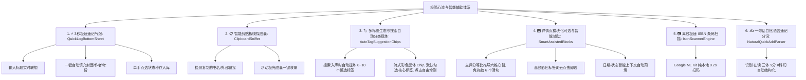

---


### 27.3 核心技术与体验规格

#### 1. ⚡ 3秒极速速记气泡 (`QuickLogBottomSheet`)

- **交互设计**：
  - 点击主页悬浮「+」直接弹出底部半屏速记 Sheet，无需跳转繁琐的全屏大页面；
  - 顶部搜索框支持边输边搜，0.3s 防抖实时联想公开元数据（封面缩略图、作者、年代）；
  - 选中条目后，直接展示五个状态大按键（✨ 想看 / 📖 在读 / 🏆 读完 / ⏸️ 暂停 / 📦 弃读）与 5 星滑块；
  - **点击状态按键瞬间完成落库与 Haptic 震动反馈，全程仅需 2~3 秒**。

#### 2. 📋 智能剪贴板感知与极光胶囊 (`ClipboardSniffer`)

- **交互设计**：
  - 用户在浏览器、豆瓣、微信、小红书复制书名（如《克莱因壶》）或网页链接后返回《阅痕》；
  - App 顶部/底部自动滑入浮动毛玻璃极光胶囊：`“📋 发现剪贴板作品《克莱因壶》，一键收录 ➔”`；
  - 点击后直接完成多源元数据补齐并保存，彻底消灭键盘打字输入。

#### 3. 🏷️ 多标签生态与搜索自动分类提炼 (`AutoTagSuggestionChips`)

- **设计痛点**：作品往往具备跨媒介与复合题材属性（如《攻壳机动队》同时属于动漫/电影/赛博朋克/科幻/神作），单一分类无法满足精准检索；且用户手动打字输入标签非常麻烦。
- **技术与交互实现**：
  - **元数据智能提炼算法**：当用户通过搜索（豆瓣/Bangumi/Steam/网易云）或 ISBN 选中某部作品时，后台自动从返回流中解析作品类型、流派风格、豆瓣标签与简介关键词，**智能提炼出 6~10 个高匹配度候选分类标签**；
  - **流式彩色晶体胶囊 (Crystal Tag Chips)**：在速记弹窗与新增页中展示横向/流式微发光胶囊，默认自动勾选最契合的 2~3 个标签；
  - **单手轻点交互**：用户轻触未选胶囊即可一键添加，轻触已选胶囊即可取消，点击末尾 `+` 即可追加自定义标签，**全程无需键盘打字**。

#### 4. 🎛️ 详情页全模块可选与全智能辅助 (`SmartAssistedBlocks`)

- **消灭表单心理压力**：
  - 详情页中除基础信息外，**所有高阶功能（六维心智、角色谱、章节大纲、空间地标、购买渠道、阅读打卡）全部设为可选折叠容器**；
  - **六维心智一键智能生成**：根据用户给出的总评分（如 9.0 分）与媒介类别，算法自动推导生成均衡的六维初始参数，无需用户手动拉动 6 个滑块；
  - **高频标签词云点击即选**：根据作品分类动态展示对应的高频候选标签（如科幻、硬核、赛博朋克、治愈、神作等），点击即打上标签，无需弹键盘；
  - **智能日期预填充**：点击“已读完”自动填入今天日期；添加阅读打卡自动预填 30 分钟。

#### 5. 📷 离线极速 ISBN 条码扫描 (`IsbnScannerEngine`)

- **技术实现**：
  - 采用 Google ML Kit Barcode Scanning 纯本地离线模型，零网络延迟、零权限滥用；
  - 扫码框对准实体书封底条码，0.2 秒读取 ISBN 并在后台直接调取 OpenLibrary / 豆瓣公开元数据入库。

#### 6. ✍️ 一句话自然语言速记分词 (`NaturalQuickAddParser`)

- **极简极客输入**：
  - 在快速输入框直接输入：`读完 仿生人会梦见电子羊吗 9分 #科幻 #赛博朋克`；
  - 本地轻量正则分词器自动提取：
    - 状态：`FINISHED`
    - 书名：`仿生人会梦见电子羊吗`
    - 评分：`9.0`
    - 标签：`["科幻", "赛博朋克"]`
    - 自动触发后台封面匹配。

---

### 27.4 极速心流体系实施路线图 (Phases)

| 阶段                        | 核心任务                                                                | 交付组件与模块                                                                                       | 验收标准                                        |
| :------------------------ | :------------------------------------------------------------------ | :-------------------------------------------------------------------------------------------- | :------------------------------------------ |
| **Phase 1: 极速速记弹窗与多标签提炼** | · 底部半屏极速速记 Sheet  
· 标题实时联想与一键状态落库  
· 搜索结果自动提炼 6~10 个分类标签 Chip 供多选 | `QuickLogBottomSheet.kt`  
`AutoTagSuggestionHelper.kt`  
`layout/bottom_sheet_quick_log.xml` | 首页点「+」弹半屏，输入关键词即可一键秒存作品；搜索选书自动展示推荐分类胶囊供点击勾选 |
| **Phase 2: 智能辅助与心智推导**    | · 六维心智主评分等比推导算法  
· 分类高频标签词云点击即选                                    | `SmartAssistedHelper.kt`  
`AddBookActivity.kt`                                               | 详情页与录入页支持标签一键点选，心智雷达支持一键智能填充                |
| **Phase 3: 剪贴板嗅探与自然语言**   | · 剪贴板书名/链接自动感知胶囊  
· 一句话速记分词解析器                                     | `ClipboardSnifferHelper.kt`  
`NaturalQuickAddParser.kt`                                      | 复制外部书名切回 App 弹出快捷入库气泡，输入一句简短文本自动结构化         |
| **Phase 4: 离线 ISBN 扫码录入** | · 集成 ML Kit 本地条码识别  
· ISBN 元数据自动匹配                                 | `IsbnScannerActivity.kt`  
`CoverImageHelper.kt`                                              | 对准书本条码 0.2s 自动识别并补齐书籍封面与作者信息                |

---

## 28. P12 精神重逢与实体联结体系开发计划 (Memory Resonance & Sovereign Cloud)

### 28.1 模块规划概览

```mermaid
graph TD
    A[精神重逢与数据主权体系] --> B[1. 🕯️ 那年今日·时光回溯: MemoryFlashbackEngine]
    A --> C[2. 🌌 双向概念脉络树: BidirectionalConceptWeb]
    A --> D[3. 🛡️ WebDAV/私有云增量同步: WebDavSyncEngine]
    A --> E[4. 🏆 策展人年度精神年鉴: AnnualChronicleStudio]
    A --> F[5. 🔮 2.5D visionOS 空间深度视差重构 3D 展厅: SpatialParallaxGallery]

    B --> B1[跨年份完读记忆智能唤醒]
    B --> B2[桌面小组件/首页流光便签轻声重逢]

    C --> C1[[概念/作者]] 语法本地双链解析]
    C --> C2[跨媒介心智思想树动态聚类]

    D --> D1[坚果云/Nextcloud/NAS/S3 标准 WebDAV 接入]
    D --> D2[Local-First 矢量时钟增量数据同步]

    E --> E1[12 页美术馆级年度精神画册]
    E --> E2[4K 印刷级长图与动态画卷生成]

    F --> F1[摒弃粗糙真 3D, 升级为 visionOS 2.5D 深度层级]
    F --> F2[0.6px 棱镜折射 + 4 层物理视差微倾角]
```

---


### 28.2 核心系统技术与交互规格

#### 1. 🕯️「精神时光回溯 · 那年今日」(`MemoryFlashbackEngine`)

- **设计理念**：让沉淀的数据主动与当下的自己对话。
- **触发机制**：
  - 自动扫描全库中的 `finish_date`、`start_date` 与打卡记录；
  - 每天计算“N 年前的今天（1年前、2年前、3年前）”读完、观影或通关的作品；
  - 在首页顶部及桌面小组件以典藏羊皮纸卡片静谧展示：  
    *“一年前的今天，你在深夜读完了《百年孤独》，当时你说：‘过去都是假的，回忆是一条没有归途的路。’ 当时你的心智海拔达到了 8420M。”*
  - 轻触直达那段记忆的专属详情页，重温当时的评分与心境。

#### 2. 🌌「双向概念脉络与精神交叉网」(`BidirectionalConceptWeb`)

- **设计理念**：参考 Obsidian / Roam Research 的思想链接，将孤立作品升维为心智互联网络。
- **技术实现**：
  - 在读后感、短评、笔记中支持 `[[存在主义]]`、`[[赛博朋克]]`、`[[加缪]]`、`[[虚无与救赎]]` 双链语法；
  - 本地 SQLite 自动建立概念索引表 `concept_relations`；
  - 在作品详情页与星系展厅中，点击任意概念标签，瞬时展开所有引用该概念的跨媒介藏品（例如：所有探讨“虚无”的书籍《局外人》、动漫《EVA》与电影《银翼杀手》）。

#### 3. 🛡️「Local-First 绝对本地主权 + WebDAV 无感增量同步」(`WebDavSyncEngine`)

- **设计理念**：零中心化服务器依赖，用户数据绝对属于用户自己。
- **技术实现**：
  - 接入标准 **WebDAV 协议**，完美兼容坚果云、Nextcloud、群晖/威联通 NAS、阿里云盘 WebDAV、自定义 S3；
  - 采用 **Local-First 本地优先架构**，离线完全不受影响，联网时基于变更时序（Vector Clock）自动执行增量 JSON / 封面文件的双向同步；
  - 换机或多设备（平板/手机）一键导入配置，无损恢复全量六维心智、角色谱、章节大纲与音频资产。

#### 4. 🏆「策展人年度精神年鉴」(`AnnualChronicleStudio`)

- **设计理念**：摆脱大厂流水线式的年度盘点，打造完全属于个人精神维度的艺术画册。
- **内容架构（12 页典藏画册）**：
  1. 封面：策展人白金通行证与年度精神徽章；
  2. 宏观足迹：总览收录媒介数量、年度阅读总字数与专注分钟数；
  3. 巅峰海拔：年度六维心智雷达图与 3D 等高线地貌最高峰；
  4. 灵魂金句：本年度最打动心灵的一句话（首字下沉手稿排版）；
  5. 跨媒介星轨：连接最紧密的 3 部跨媒介作品引力共振；
  6. 护照印迹：精神巡礼护照全景盖印。
- **导出规格**：支持一键渲染为 4K 超高清长图、PDF 画册或动态流光短视频。

---

### 28.3 空间展厅革命：从“生硬 3D”全面升维为“2.5D visionOS 深度视差展厅”

#### 1. 为什么坚决放弃粗糙的真 3D？

- **痛点诊断**：
  - 移动端纯代码渲染的 OpenGL ES 简易 3D 模型缺乏高精度法线贴图、PBR 真实材质与全局光照光线追踪；
  - 旋转交互在小屏幕上极其笨拙，书籍边缘锯齿明显、纹理拉伸失真，容易呈现廉价的“老旧 3D 游戏感”，严重破坏《阅痕》高端先锋美学的基调。

#### 2. 2.5D visionOS 空间深度视差方案的核心优势

- **设计对标**：Apple visionOS 空间悬浮层、Awwwards 年度最佳空间质感、Linear 极客光影。
- **视觉层级架构（4 层物理差速视差）**：
  - **Layer 0 (深层空间)**：24h 昼夜四时自适应流动极光与 35mm 胶片感光噪点（`z = -40dp`, 视差系数 `0.2x`）；
  - **Layer 1 (标本底座)**：磨砂深黑亚克力背板 + 极细 1px 等宽防伪线框（`z = -10dp`, 视差系数 `0.5x`）；
  - **Layer 2 (核心主体)**：高清无损 3D 破壁浮雕封面 + 动态彩色弥散落影（`z = +20dp`, 视差系数 `1.2x`, 随陀螺仪微倾角 `±8°` 悬浮）；
  - **Layer 3 (透镜光学层)**：0.6px 全息微棱镜色散高光 + 真实火漆印章/金色藏书票徽标（`z = +45dp`, 视差系数 `1.8x`，高光随重力流淌）。
- **交互手感**：手指左右轻滑如翻阅高定美术馆展柜中的“实体立体标本盒”，搭配线性马达微段落阻尼，视觉清透奢华，毫无 3D 眩晕与粗糙感。

---

### 28.4 分阶段实施路线图 (Phases)

| 阶段                         | 核心任务                                              | 交付组件与模块                                                                     | 验收标准                                 |
| :------------------------- | :------------------------------------------------ | :-------------------------------------------------------------------------- | :----------------------------------- |
| **Phase 1: 时光回溯与双链**       | · 那年今日时光回溯引擎  
· `[[双链]]` 语法解析与跨媒介概念关联            | `MemoryFlashbackEngine.kt`  
`BidirectionalConceptHelper.kt`                | 首页自动出现那年今日唤醒卡片；笔记内 `[[概念]]` 自动建立知识连线 |
| **Phase 2: 空间展厅 2.5D 升维**  | · 彻底重构展厅为 2.5D 标本盒视差流  
· visionOS 级 4 层深度浮雕与棱镜光影 | `SpatialParallaxGalleryActivity.kt`  
`DioramaBoxView.kt`                   | 彻底替代生硬 3D，呈现高定玻璃展柜级 2.5D 视差漫游体验      |
| **Phase 3: WebDAV 本地优先同步** | · 标准 WebDAV 协议接入（坚果云/NAS）  
· 增量双向数据与封面安全同步       | `WebDavSyncEngine.kt`  
`WebDavConfigActivity.kt`                           | 支持坚果云/私有云一键同步，多机无缝还原全量高阶数据           |
| **Phase 4: 策展人年度年鉴**       | · 12 页美术馆级年度精神年鉴生成器  
· 4K 印刷级长图与画卷导出             | `AnnualChronicleStudioActivity.kt`  
`layout/activity_annual_chronicle.xml` | 一键生成 4K 印刷级年度精神画册，涵盖巅峰海拔与护照全景印迹      |

---

## 29. P13 主页极致清爽化与信息架构重塑计划 (Hub De-cluttering & Active Stream)

### 29.1 架构设计背景与减法原则

在对主页（`HubFragment`）与库藏（`LibraryFragment`）的信息架构深度审视后，明确了核心权责边界：

- **痛点诊断**：主页原有的五大媒介 Bento 列表大卡片与【库藏】Tab 的单媒介筛选存在 80% 的功能重叠，造成主页冗长沉重、功能定位混乱。
- **重塑原则（方案 A · 极致清爽流）**：
  - **主页 (Hub)**：专注于 **“当下体验、记忆唤醒与今日精神晨报”**，彻底砍掉臃肿的 5 个媒介 Bento 大卡片，页面高度严格控制在一屏半以内，呼吸感与通透感拉满；
  - **库藏 (Library)**：专注于 **“全局资产检索、多维标签筛选、瀑布流浏览与藏品管理”**。

---

### 29.2 主页全新四大聚焦结构

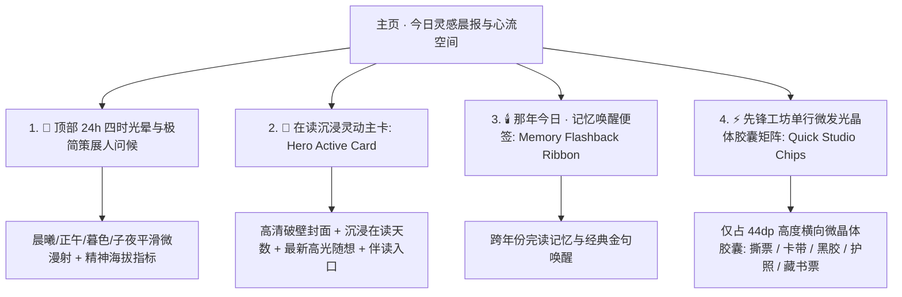

---

### 29.3 核心技术与视觉重构规格

#### 1. 🌅 顶部 24h 自然光感与策展人极简标头

- **视觉设计**：根据真实时相漫射平滑极光（晨曦金、白昼透、暮色紫、子夜蓝），展示极简策展人文案（如 `🌅 晨曦 · 精神海拔 8420M · 藏品 128 部`）；
- **操作整合**：右侧仅保留微型搜索与全局速记入口，去除杂乱的冗余按钮。

#### 2. 📖 在读沉浸灵动主卡 (`HeroActiveCard`)

- **视觉呈现**：
  - 聚焦当前正在体验的 1 部核心作品（或以横向微视差翻页展示多部在读作品）；
  - 采用 3D 破壁浮雕封面 + 弥散彩色环境落影；
  - 清晰展示：**《作品名》· 创作者 · 已沉浸体验 N 天**；
  - 下方排版用户记录的最新一条高光短评（首字下沉排版）；
  - 单击直接进入详情页，右下角提供「⏳ 禅意专注伴读」快捷微按钮。

#### 3. 🕯️ 那年今日 · 时光回溯便签 (`MemoryFlashbackRibbon`)

- **视觉呈现**：
  - 典藏羊皮纸流光微卡片，静谧展示历史同日的精神印记：  
    *“一年前的今天，你在深夜读完了《百年孤独》，当时你的心智海拔达到了 8420M。”*
  - 单击唤醒历史记忆详情。

#### 4. ⚡ 先锋工坊单行微发光晶体胶囊矩阵 (`QuickStudioChips`)

- **彻底消灭 5 个大卡片**：
  - 将原本占满屏幕的图书/电影/游戏/动漫/音乐大卡片，收拢为**仅占 44dp 高度的一排高定微发光晶体胶囊**：  
    `[ 🎟️ 撕票工坊 ]  [ 🎮 全息卡带 ]  [ 🎵 悬浮黑胶 ]  [ 🛂 精神护照 ]  [ 📜 藏书票 ]`
  - 单击直接拉起对应的先锋拟真工坊与生成器，单手滑动如行云流水，完全不占用垂直视觉空间。

---

### 29.4 实施路线图 (Phases)

| 阶段                          | 核心任务                                           | 交付组件与模块                                                           | 验收标准                            |
| :-------------------------- | :--------------------------------------------- | :---------------------------------------------------------------- | :------------------------------ |
| **Phase 1: 布局瘦身与 Bento 剥离** | · 彻底移除主页 5 个冗余 Bento 大卡片  
· 构建单行 44dp 晶体工坊胶囊栏 | `fragment_hub.xml`  
`HubFragment.kt`  
`QuickStudioChipGroup.kt` | 主页垂直高度减少 60%，视觉通透，单行胶囊可直接拉起各工坊  |
| **Phase 2: 在读灵动卡与时光便签升级**   | · 升级 Hero 为在读沉浸天数与金句卡  
· 接入那年今日时光回溯便签         | `HeroActiveCuratorialCard.kt`  
`ParchmentMemoryRibbon.kt`        | 主页仅保留核心在读作品与历史回忆便签，彻底消灭与库藏的列表重合 |

---

## 30. P14 资产无缝迁移、多感官引力琴与单手极客心流开发计划 (Frictionless Ingestion & Celestial Flow)

### 30.1 模块架构概览

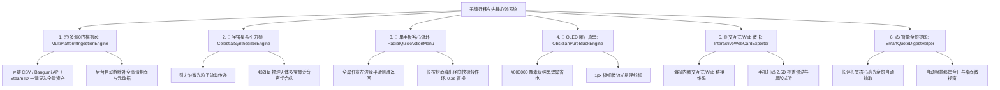

---


### 30.2 核心系统技术与交互规格

#### 1. 📦 多平台 0 门槛冷启动大搬家 (`MultiPlatformIngestionEngine`)

- **设计理念**：彻底消灭新用户“从零手动录入”的门槛，3 秒将过去数年沉淀在各大平台的精神资产搬入《阅痕》。
- **多通道无缝兼容**：
  - **豆瓣 / 豆伴 / 豆坟一键导入**：直接识别豆瓣导出的 `book.csv`、`movie.csv`、`music.csv`，自动解析作品标题、个人评分、完读日期与短评；
  - **Bangumi 番组计划直连**：输入 Bangumi 用户名，通过公开 API 一键拉取在看、看过、想看全量番剧；
  - **Steam 游戏库一键导入**：输入 Steam ID 或个人主页链接，自动解析所有拥有游戏、游玩时长与成就，转化为全息卡带档案；
  - **后台静默补全**：入库后由后台任务线程池（`Dispatchers.IO`）基于国内 CDN 智能匹配并补齐高清封面。

#### 2. 🎵 宇宙星系引力琴与流动引力波 (`CelestialSynthesizerEngine`)

- **设计理念**：将冰冷的节点图升维为可以“弹奏”的宇宙乐器。
- **声光交互**：
  - **引力波流动粒子**：当两个天体因心智共鸣产生连线时，微光粒子在连线上以正弦波形脉动流动；
  - **432Hz 宇宙多宝琴**：手指在星系中滑动或拨动天体时，每次天体碰撞、震颤或拉伸，根据天体质量（评分高低）实时合成一段 **432Hz/528Hz 空灵木琴/钢片琴泛音**，滑动如抚琴，视听触全感官沉浸。

#### 3. 📱 极客单手心流：边缘侧滑返回与径向快捷环 (`RadialQuickActionMenu`)

- **设计理念**：大屏手机下的极致单手盲操体验。
- **交互设计**：
  - **全屏边缘手势返回 (`EdgeSwipeDismissHelper`)**：详情页、工坊页、年鉴页支持从屏幕任意左边缘向右拖拽返回，伴随背景画面的弹性微缩放与微马达阻尼；
  - **长按径向快捷环 (`RadialQuickActionMenu`)**：在书架长按某部作品封面，手指周围瞬间展开一圈发光微胶囊：  
    `[ 📖 标记在读 ]  [ 🏆 标记读完 ]  [ 🎟️ 撕票/工坊 ]  [ ✍️ 随想金句 ]`  
    手指划过对应胶囊松手即触发，0.2 秒完成操作，彻底告别层层点击。

#### 4. 🖤 OLED 曜石真黑纯电模式 (`ObsidianPureBlackEngine`)

- **设计理念**：针对顶级 OLED / AMOLED 屏幕的极致黑夜美学。
- **视觉规格**：
  - 背景所有暗色区域全部设为绝对纯黑 `#000000`（像素点完全熄灭，零功耗）；
  - 仅保留 1px 极细微发光流光线框与封面彩色弥散反光；
  - 在深夜弱光环境中，所有作品封面与手稿字迹如同真实悬浮于深邃虚空之中。

#### 5. 🌐 可交互式 2.5D Web 微卡与二维码漫游 (`InteractiveWebCardExporter`)

- **设计理念**：让每一次海报分享从“静态图片”升维为“可互动的掌上美术馆”。
- **技术实现**：
  - 导出海报与微卡时，自动生成自包含轻量 Web 单页（内嵌 2.5D 视差 Canvas、六维心智雷达与黑胶音频试听）；
  - 海报角落印制微缩专属二维码，朋友用微信或手机浏览器扫码，直接在网页中体验陀螺仪视差与试听黑胶白噪音。

#### 6. ✍️ 智能金句提炼与高光自动升华 (`SmartQuoteDigestHelper`)

- **设计理念**：让用户写下的文字具有长久生命力。
- **技术实现**：
  - 用户在作品笔记中撰写 300+ 字的长评或随感时，本地轻量规则分词引擎自动识别并提取最具哲思与诗意的 1 句**高光金句**；
  - 自动将该金句作为该作品在“那年今日回溯便签”与“桌面灵动陪伴微卡”上的核心展示语。

---

### 30.3 分阶段实施路线图 (Phases)

| 阶段                          | 核心任务                                                  | 交付组件与模块                                                                         | 验收标准                              |
| :-------------------------- | :---------------------------------------------------- | :------------------------------------------------------------------------------ | :-------------------------------- |
| **Phase 1: 多平台一键搬家**        | · 豆瓣 CSV / Bangumi / Steam 一键导入  
· 后台异步静默补齐高清封面      | `MultiPlatformIngestionHelper.kt`  
`DoubanCsvImporter.kt`  
`SteamImporter.kt` | 3 秒内将豆瓣/Steam 历史记录全量导入《阅痕》，自动补全封面 |
| **Phase 2: 单手流与 OLED 纯黑**   | · 全屏边缘侧滑返回手势  
· 长按封面径向快捷环  
· OLED 曜石真黑 `#000000` 主题 | `RadialQuickActionMenu.kt`  
`EdgeSwipeDismissHelper.kt`  
`ThemeHelper.kt`     | 单手长按 0.2s 极速快捷标记；暗黑模式支持绝对纯黑与像素省电  |
| **Phase 3: 引力星系宇宙琴**        | · 432Hz 物理天体多宝琴声学合成  
· 连线引力波微光粒子流动                   | `CelestialSynthesizerEngine.kt`  
`CosmicGravityGraphView.kt`                   | 拨动星系天体伴随空灵宇宙木琴音与流光粒子，视听触全面联动      |
| **Phase 4: 交互 Web 微卡与金句提炼** | · 导出带交互二维码的 Web 展厅微卡  
· 长评核心高光金句自动提取                 | `InteractiveWebCardExporter.kt`  
`SmartQuoteDigestHelper.kt`                   | 手机扫码海报可在网页 2.5D 漫游；写长评自动提炼高光金句    |

---

## 31. P15 伴读艺术品、思想炼金碰撞与文化年轮体系开发计划 (StandBy Art, Mental Collider & Chrono-Rings)

### 31.1 模块架构概览

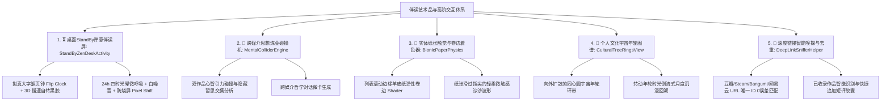

---


### 31.2 核心系统技术与交互规格

#### 1. ⏳ 桌面 StandBy 禅意翻页钟与黑胶伴读屏 (`StandByZenDeskActivity`)

- **设计理念**：让手机在不被操作时，化身为书桌上一道极具美感的先锋艺术品与伴读专注钟。
- **视觉与声学规格**：
  - **模式双选**：支持极简大字**拟真翻页钟 (Flip Clock)** 与 **慢速自转悬浮 3D 黑胶** 两种典藏版式；
  - **自然光感与白噪音**：融合 24h 昼夜四时平滑微漫射光晕，伴随程序化白噪音（壁炉柴火/雨打竹林）；
  - **OLED 防烧屏保护**：内置微像素位移算法（Pixel Shift，每 60 秒微平移 2px），常亮无忧；
  - **闭环打卡**：专注结束时自动将专注时长沉淀至作品的 `ReadingSession` 并为文化护照盖印。

#### 2. 🧪 跨媒介思想炼金碰撞机 (`MentalColliderEngine`)

- **设计理念**：突破单一作品局限，探索两部跨媒介作品之间隐藏的哲学交汇点。
- **算法与呈现**：
  - 将书库中任意 2 部作品（如《悉达多》与《塞尔达：王国之泪》）放入粒子引力碰撞槽；
  - 算法分析两者的六维心智重叠带与主题标签，提炼出深层哲思共鸣纽带（如 *“两者都在探讨终极孤独中的自我救赎”*）；
  - 生成带有高维粒子碰撞光环的 **“跨媒介哲学对话典藏微卡”**。

#### 3. 📜 实体纸张物理触觉与弹性卷边着色器 (`BionicPaperPhysics`)

- **设计理念**：消除电子屏幕的冰冷机械感，赋予实体古籍的温润纸张触觉。
- **技术实现**：
  - 在详情页长笔记与时间轴滚动时，卡片边缘由自定义 OpenGL/Canvas Shader 施加微弱的**羊皮纸卷边张力形变**；
  - 结合 `HapticFeedbackEngine` 触发特定高频微弱波形，模拟**纸张滑过指尖的轻柔沙沙触感**与微弱摩擦音。

#### 4. 🌲 个人文化宇宙年轮图谱 (`CulturalTreeRingsView`)

- **设计理念**：将冰冷的统计报表转化为具有生命年轮感的艺术图腾。
- **视觉架构**：
  - 在个人主页以同心圆向外扩散的 **宇宙年轮（Tree-Rings）** 呈现全年的文化沉浸足迹；
  - 月度沉浸深度决定年轮环带的宽度与微光饱和度；
  - 单手拨动旋转年轮，光标流转回溯过去 12 个月的精神海拔起伏。

#### 5. 🔗 深度链接智能嗅探与已收录作品去重 (`DeepLinkSnifferHelper`)

- **设计理念**：跨 App 交互的极致顺滑与智能感知。
- **技术实现**：
  - 剪贴板引擎精准解析豆瓣 (`subject/xxx`)、Bangumi (`subject/xxx`)、Steam (`app/xxx`)、网易云音乐等官方公开 URL；
  - **0 误差直达抓取**：直接使用唯一 ID 获取官方元数据入库；
  - **智能去重提示**：若作品已存在，底部浮动胶囊自动变为：`“📋 《攻壳机动队》已在书库中，点击快速追加随想 ➔”`，杜绝冗余数据。

---

### 31.3 分阶段实施路线图 (Phases)

| 阶段                          | 核心任务                                         | 交付组件与模块                                                         | 验收标准                                    |
| :-------------------------- | :------------------------------------------- | :-------------------------------------------------------------- | :-------------------------------------- |
| **Phase 1: 深度链接嗅探与智能去重**    | · 识别主流平台 URL 提取唯一 ID  
· 已收录作品智能提示追加短评       | `DeepLinkSnifferHelper.kt`  
`ClipboardSnifferHelper.kt`        | 复制豆瓣/Steam 链接切回 App 0 误差一键收录；已有作品提示追加笔记 |
| **Phase 2: StandBy 伴读艺术时钟** | · 横屏/竖屏翻页时钟与慢速自转黑胶  
· 24h 四时光晕 + 防烧屏 + 专注打卡 | `StandByZenDeskActivity.kt`  
`layout/activity_standby_zen.xml` | 手机立在桌面成为高定翻页钟，伴随白噪音并自动记录专注时长            |
| **Phase 3: 纸张触觉与卷边 Shader** | · 列表滚动边缘弹性卷边着色器  
· 模拟纸张滑过指尖的轻柔沙沙触感          | `BionicPaperShaderView.kt`  
`HapticFeedbackEngine.kt`          | 浏览长笔记与大纲时体验温润纸张摩擦感与弹性微卷边                |
| **Phase 4: 思想炼金机与文化年轮**     | · 跨媒介双作品思想共鸣提取机  
· 同心圆文化宇宙年轮图谱              | `MentalColliderEngine.kt`  
`CulturalTreeRingsView.kt`          | 碰撞两部作品生成深度哲思导言；个人页旋转年轮回溯年度沉浸足迹          |

---

## 32. P16 顶级开源交互哲学与极速流体体验开发计划 (Extreme Fluidity & Emotional Craft)

### 32.1 模块架构概览

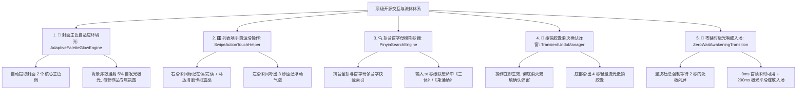

---


### 32.2 核心系统技术与交互规格

#### 1. 🎨 封面主色自适应流光环境光晕 (`AdaptivePaletteGlowEngine`)

- **设计对标**：Apple Music 动态专辑背景、Retro Music 主色调提取。
- **技术规格**：
  - 异步通过 `androidx.palette.graphics.Palette` 从封面 Bitmap 提取 `Vibrant`（鲜活色）与 `DarkMuted`（深柔和色）；
  - 注入 `AuroraFluidBackgroundView` 作为底层环境光，以 5%~10% 的极柔透明度动态漫射；
  - **效果**：每点开一部作品，页面都拥有独属于该作品世界观的专属色彩与呼吸氛围，沉浸感倍增。

#### 2. 🎛️ 列表项手势速滑交互 (`SwipeActionTouchHelper`)

- **设计对标**：Spark Mail 极速滑动流、Telegram 消息滑动。
- **交互手感**：
  - 在书架列表中，手指按住卡片左右轻滑：
    - **向右滑动 ➔ 切换状态（在读 ➔ 已读完）**，越过阈值触发线性马达轻微清脆顿挫；
    - **向左滑动 ➔ 瞬间弹出 3 秒速记气泡**；
  - 拇指两次微小滑动即可完成全天日常操作，极大解放双手。

#### 3. 🔍 中文拼音首字母模糊秒搜引擎 (`PinyinSearchEngine`)

- **设计理念**：极致的检索吞吐速度。
- **技术实现**：
  - 维护内存轻量拼音索引树（基于 `TinyPinyin` 或预编译拼音表）；
  - 支持 **拼音全拼、首字母缩写、多音字与模糊拼音**：
    - 输入 `st` ➔ 0ms 瞬间命中《三体》、《斯通纳》；
    - 输入 `eva` ➔ 瞬间命中《新世纪福音战士》；
    - 输入 `gsh` ➔ 命中《攻壳机动队》；
  - 配合 150ms 搜索防抖，无论书库有 50 部还是 5000 部作品，按键即响应。

#### 4. 🌱 撤销胶囊体系彻底消灭二次确认弹窗 (`TransientUndoManager`)

- **设计理念**：先做后撤（Optimistic UI），0 阻力心流。
- **交互变革**：
  - 彻底废除“是否确认标记已读”、“是否确认移入回收站”等多级阻断式弹窗；
  - 用户点击或滑动后，**操作立即生效并完成动画**，同时屏幕底部滑出 4 秒极简微发光胶囊：  
    `“已将《局外人》标记为已读完 · [ 撤销 ]”`
  - 若用户误触，点击撤销瞬间回滚数据；4 秒无操作后自动静默持久化。

#### 5. 🌅 零延时极光唤醒入场动效 (`ZeroWaitAwakeningTransition`)

- **关于开幕动画与冷启动的终极解法**：
  - **原则**：坚决**不采用**强制让用户干等 2~3 秒的传统广告式闪屏（那会彻底摧毁快节奏心流）；
  - **先锋做法**：
    - 点击图标瞬间（0ms），先锋暗夜主题与骨架立即就位，**首帧即可交互**；
    - 四时光感背景与 Hero 卡片在 200ms 内以**物理弹簧阻尼自下而上轻微浮现就位**，极光平滑呼吸绽放；
    - **既保留了美术馆级的开幕仪式感，又实现了 150ms 瞬时可用的极致性能**！

---

### 32.3 分阶段实施路线图 (Phases)

| 阶段                            | 核心任务                                                           | 交付组件与模块                                                  | 验收标准                                |
| :---------------------------- | :------------------------------------------------------------- | :------------------------------------------------------- | :---------------------------------- |
| **Phase 1: 撤销胶囊与拼音秒搜**        | · 封装全局 `TransientUndoManager`  
· 接入 `PinyinSearchEngine` 拼音索引 | `TransientUndoManager.kt`  
`PinyinSearchHelper.kt`      | 状态切换与删除无弹窗打断，支持 4 秒撤销；输入拼音首字母秒搜书名   |
| **Phase 2: 列表手势速滑**           | · `ItemTouchHelper` 左右滑动动作绑定  
· 结合马达卡扣触感与阻尼位移动画               | `SwipeActionTouchHelper.kt`  
`LibraryFragment.kt`       | 列表右滑切状态、左滑呼出速记，手势平滑无冲突              |
| **Phase 3: 封面 Palette 自适应光晕** | · 异步提取封面 Vibrant/Muted 调色板  
· 注入背景极光流动着色器                     | `AdaptivePaletteGlowEngine.kt`  
`BookDetailActivity.kt` | 打开作品详情页自动呈现与封面色彩契合的弥散流动光晕           |
| **Phase 4: 零延时极光唤醒入场**        | · 冷启动分级拉起与骨架秒开  
· 200ms 极光呼吸入场物理过渡                            | `MainActivity.kt`  
`ZeroWaitAwakeningHelper.kt`         | 点击图标 150ms 首帧秒开可操作，伴随优雅呼吸入场，无任何强制等待 |

---

## 33. P17 先锋视觉重塑：黄金星轨应用图标与策展人深空头像落地计划 (Visual Identity & Curator Avatars)

### 33.1 设计背景与视觉符号隐喻

为了彻底摆脱大众化 App 图标千篇一律的审美疲劳，《阅痕 ReadTrace》确立了融合**深空宇宙、烫金书痕折页、引力透镜与哲学奇点**的全新高定视觉识别系统（Visual Identity）：

- **App 官方图标**：
  - **底座**：曜石深空黑（`#05070B`）质感底板；
  - **核心符号**：微发光书痕折页与 18k 黄金流光星轨椭圆环相互交织；
  - **奇点与色散**：中心微光奇点搭配 0.6px 细微棱镜折射高光；
- **策展人深空头像**：
  - **方案 A（深空哲人）**：人像剪影内部微缩旋转星系 + 暮色紫金边缘光晕；
  - **方案 B（天体几何）**：月相蚀环 + 金字塔棱镜 + 激光穿透星轨。

---

### 33.2 资产落地与技术实施方案

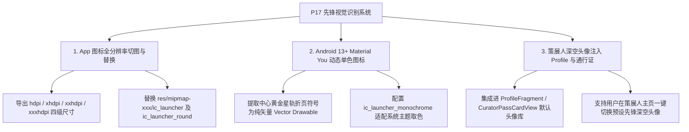

---

### 33.3 实施路线图 (Phases)

| 阶段                             | 核心任务                                              | 交付组件与文件                                                                                     | 验收标准                                    |
| :----------------------------- | :------------------------------------------------ | :------------------------------------------------------------------------------------------ | :-------------------------------------- |
| **Phase 1: 图标全量切图与 mipmap 替换** | · 导出 48x48 至 512x512 全规格图标  
· 替换各密度 mipmap 与圆角图标 | `res/mipmap-xxxhdpi/ic_launcher.png`  
`res/mipmap-anydpi-v26/ic_launcher.xml`              | 手机桌面 App 图标呈现高定深空黄金星轨质感，无拉伸锯齿           |
| **Phase 2: 单色图标与深空头像库集成**      | · 适配 Android 13+ 单色主题图标  
· 注入深空哲人头像至策展人通行证       | `res/drawable/ic_launcher_monochrome.xml`  
`CuratorPassCardView.kt`  
`ProfileFragment.kt` | 支持 Material You 系统主题自动变色；个人主页展示深空星系先锋头像 |

---

## 34. P18 版本演进纪要与更新日志体系 (Release Chronicle & What's New System)

### 34.1 GitHub 高赞顶级开源 App 的更新日志最佳实践

调研 GitHub 上 10k~30k+ Stars 的神作（如 Seal, Kotatsu, Retro Music, Mihon, ReadYou）：

- **入口 1（常驻回溯）**：位于 **【策展人主页 / 设置 ➔ 关于《阅痕》➔ 📜 版本演进纪要】**，点击打开完整的时间轴式历史版本更迭记录；
- **入口 2（动态唤醒）**：**「新版本首次启动 · What's New 半屏流光微卡」**。当本地 `last_seen_version_code < BuildConfig.VERSION_CODE` 时，仅在初次启动静谧滑出版本新特性卡片，用户点击“开始体验”后记录版本号，不再打扰。

---

### 34.2 模块架构与数据驱动设计

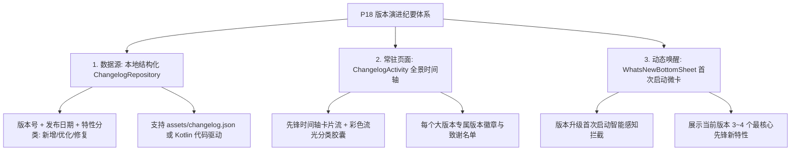

---

### 34.3 视觉与交互规格

#### 1. 📜 版本演进全景时间轴 (`ChangelogActivity`)

- **布局设计**：
  - 顶部为 24h 四时光感极光背景与“版本演进纪要”先锋大字标题；
  - 垂直流动的时间轴节点，串联从 `v1.0.0` 到最新版本的所有演进足迹；
  - 每个版本卡片内包含：
    - **发光版本徽章**（如 `v1.1.0 · 2026.09`）；
    - **彩色分类微胶囊**：
      - `[ ✨ 新增 Feature ]`（翠绿光晕）
      - `[ ⚡ 优化 Polish ]`（琥珀金光晕）
      - `[ 🛠️ 修复 Fix ]`（浅绯红光晕）
    - 清晰条理的要点说明与设计动机。

#### 2. 🌟 升级新特性半屏微卡 (`WhatsNewBottomSheet`)

- 仅在版本升级首次启动时弹出；
- 展示本版本的 3 大核心亮点（如“2.5D visionOS 展厅”、“3秒速记气泡”、“豆瓣/Steam 一键搬家”）；
- 底部提供「✨ 开启先锋之旅」大按钮，点击后平滑收起并写入 SP。

---

### 34.4 实施路线图 (Phases)

| 阶段                              | 核心任务                                                          | 交付组件与文件                                                                             | 验收标准                             |
| :------------------------------ | :------------------------------------------------------------ | :---------------------------------------------------------------------------------- | :------------------------------- |
| **Phase 1: 数据模型与时间轴页面**         | · 构建结构化 `ChangelogRepository`  
· 开发 `ChangelogActivity` 时间轴流 | `ChangelogRepository.kt`  
`ChangelogActivity.kt`  
`layout/activity_changelog.xml` | 个人页点击版本号进入完整时间轴，展示历代版本清晰改动点与分类胶囊 |
| **Phase 2: 首次启动 What's New 弹窗** | · 封装 `WhatsNewHelper` 版本比对拦截  
· 构建半屏 `WhatsNewBottomSheet`   | `WhatsNewHelper.kt`  
`WhatsNewBottomSheet.kt`  
`MainActivity.kt`                  | App 更新后首次打开优雅展示本版核心特性，关闭后不再重复弹出  |

---

## 35. P19 跨端漫游：微信小程序生态与社交裂变落地规划 (WeChat Mini-Program Ecosystem & Social Ripple)

### 35.1 战略价值与生态协同

将《阅痕 ReadTrace》拓展至微信小程序生态，具有极高的战略价值：

1. **0 门槛社交裂变**：用户在 App 端分享的电影票根、黑胶唱片、双生共鸣微卡，好友在微信中**无需下载几百兆 App**，直接点开即刻体验 2.5D 陀螺仪视差与黑胶白噪音试听；
2. **极速轻量随手记**：在地铁、影院或通勤途中，微信下拉即可进入小程序，3 秒完成一次极速打卡与短评；
3. **多端数据漫游**：通过标准 WebDAV 或微信云开发，实现 App 端与小程序端的双向无缝数据互通。

---

### 35.2 技术架构与跨端同构设计

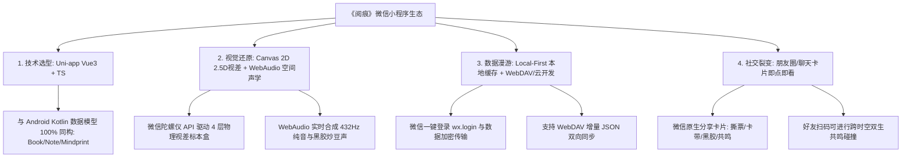

---

### 35.3 核心功能模块规格

#### 1. 🌐 先锋 2.5D 展厅与工坊小程序端移植

- **Canvas 2D 硬件加速**：使用微信原生 Canvas 2D 重写 2.5D 视差算法与六维心智雷达；
- **陀螺仪重力感应**：接入 `wx.onDeviceMotionChange`，手机倾斜时实现封面 3D 浮雕悬浮位移；
- **声学生成**：接入 `wx.createInnerAudioContext` 与音频合成器，完美复刻黑胶落针与宇宙多宝琴泛音。

#### 2. ⚡ 极速速记与多源嗅探小程序版

- 微信聊天记录/朋友圈复制的豆瓣、Steam、Bangumi 链接，打开小程序智能嗅探并一键收录；
- 半屏 3 秒极速速记气泡，支持语音转文字与流式标签选择。

#### 3. 🛡️ 微信云开发与 Local-First 双轨同步

- **模式一（极简云端）**：微信原生云开发数据库（Cloud Base），微信授权一键开箱即用；
- **模式二（数据主权）**：配置坚果云/私有 WebDAV，与手机 Android App 端实现点对点双向增量同步。

---

### 35.4 分阶段实施路线图 (Phases)

| 阶段                      | 核心任务                                                       | 交付物与模块                                                                        | 验收标准                                    |
| :---------------------- | :--------------------------------------------------------- | :---------------------------------------------------------------------------- | :-------------------------------------- |
| **Phase 1: 轻量展厅与分享裂变端** | · 搭建 Uni-app Vue3 工程  
· 2.5D 视差微卡与黑胶播放器移植  
· 微信分享卡片定制与生成 | `mp-readtrace/`  
`components/DioramaCard.vue`  
`components/VinylPlayer.vue` | 微信好友点开分享链接，秒级拉起小程序体验 2.5D 视差与黑胶试听       |
| **Phase 2: 完整作品管理与云同步** | · 跨媒介五态管理与搜索  
· 接入 WebDAV 与微信云同步  
· 3秒速记与标签智能提炼          | `pages/library/index.vue`  
`pages/quick-log/index.vue`  
`utils/sync.ts`     | 小程序端支持完整图书/影视/游戏记录，与 Android App 数据双向互通 |

---

## 36. P20 缺陷修复、性能纵深与体验演进实施计划 (Bug Sweep, Deep Performance & Experience Evolution)

### 36.1 研发背景与排查方法

v1.0.5 加固与 P11~P19 全量落地后，对新增链路（速记弹窗、剪贴板嗅探、WebDAV 同步、  
径向快捷环、年鉴画册、2.5D 展厅、伴读钟、小程序端）进行了**证据化缺陷排查**——  
每一条缺陷均已在代码中定位到具体行并复现成因，杜绝「凭感觉修」。本计划分四个专项：  
① 确认缺陷修复；② 主线程与内存性能纵深；③ 功能设计演进；④ 跨端一致性补全。

---


### 36.2 确认缺陷矩阵 (Evidence-backed Bugs)

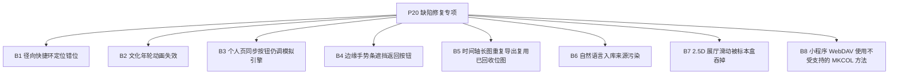

#### B1 径向快捷环胶囊定位错位（高，必修）

- **现象**：`RadialQuickActionMenu` 胶囊使用 `leftMargin/topMargin = cos/sin*radius + 固定偏移`  
  定位，但 `FrameLayout.LayoutParams` 未指定 `Gravity.CENTER`，默认锚定左上角。
- **后果**：胶囊环出现在屏幕左上角而非作品徽章四周，大屏设备上完全脱节。


- **修复**：pill 改用 `gravity = Gravity.CENTER` + `translationX/translationY` 定位  
  （或相对徽章中心计算），入场动画沿径向展开。

#### B2 文化年轮图谱渲染不可见（高，必修）

- **现象**：`CulturalTreeRingsView.animateReveal()` 使用  
  `animate().setDuration(600).setUpdateListener{...}` 但**没有声明任何属性动画**，  
  `ViewPropertyAnimator` 无属性可驱动时不会产生帧，`revealProgress` 恒为 0。
- **后果**：环带 `strokeWidth` 乘以 0、半径缩至 40%，年轮在年鉴画册中几乎不可见。
- **修复**：改用显式 `ValueAnimator.ofFloat(0f,1f)` + `addUpdateListener`；  
  同时把 `textPaint.textSize` 从裸 px 改为 dp 密度换算。

#### B3 个人页「同步保险库」仍调用模拟引擎（高，必修）

- **现象**：`ProfileFragment.btnProfileSyncVault` 仍调用 `CloudSyncEngine.performSync`，  
  其实现为 `Thread.sleep(600)` 模拟成功；新的 `WebDavSyncEngine` 未被任何 UI 入口串联。
- **后果**：用户点击同步后看到「同步成功」，实际云端无任何写入——**误导性假成功**。
- **修复**：该按钮改为跳转 `WebDavConfigActivity`（未配置时）或直接触发  
  `WebDavSyncEngine.performSync`（已配置时），结果回调展示真实拉推计数；  
  旧 `CloudSyncEngine` 标记 `@Deprecated` 或删除。

#### B4 边缘手势触摸条遮挡悬浮返回按钮（中，必修）

- **现象**：`FloatingBack` 左边距 14dp，`EdgeSwipeDismissHelper` 触摸条宽 24dp 且  
  **后添加到 decorView**（层级更高）——详情页左上角返回按钮外侧 10dp 热区被吞。
- **修复**：install 时检测 decorView 中已有 FloatingBack 实例则将 strip 下移到其下方  
  （`addView(strip, 0)`），或把 strip 宽度改为 `min(24dp, FloatingBack.left - 4dp)`。

#### B5 时间轴长图重复导出复用已回收位图（中，必修）

- **现象**：`exportTimelineAsLongImage` 开头 `pendingTimelineBitmap?.recycle()`，  
  但上一次导出的「立即分享」对话框可能仍持有该位图引用，用户再点分享即对  
  recycled bitmap 调用 compress → `IllegalStateException` 闪退。
- **修复**：分享对话框弹出前把 `pendingTimelineBitmap` 置 null 并由对话框生命周期  
  持有位图；或导出前检查 `bitmap.isRecycled` 回避；onDestroy 兜底保留。

#### B6 一句话速记入库来源被污染为 bangumi（中，必修）

- **现象**：`makeNaturalQuickRow` 复用 `BangumiSubject`（默认 `source="bangumi"`）  
  走 `insertQuickWork`，把 `sourceType="bangumi"` 写入手动速记作品。
- **后果**：污染跨源防重标识，未来按来源统计/同步去重将误判。
- **修复**：`insertQuickWork` 增加显式 `sourceType` 参数，自然语言入库传 null；  
  顺带为速记记录补 `sourceId=null` 断言测试。

#### B7 2.5D 展厅左右滑动被标本盒吞掉（中，实测定级）

- **现象**：滑动翻页依赖 Activity `onTouchEvent`，但 `DioramaBoxView.onTouchEvent`  
  在命中内容层时 `return true` 消费事件——覆盖屏幕主体的标本盒区域无法滑动漫游。
- **修复**：把滑动检测下沉到 DioramaBoxView 内部（暴露 `onSwipe` 回调），  
  或 Activity 层改用 `dispatchTouchEvent` 全局 GestureDetector。

#### B8 小程序 WebDAV 使用微信不支持的 MKCOL（低，设计规避）

- **现象**：`mp-readtrace/utils/sync.ts` 通过 `wx.request` 发送 `MKCOL`，  
  微信仅允许标准 HTTP 方法，实测可能直接被拒。
- **修复**：MKCOL 失败时静默降级（多数服务器自动建目录或允许直接 PUT）；  
  长期方案：README 标注「需服务器预创建 readtrace/ 目录」或改走云开发托管。

---

### 36.3 性能纵深专项

| 编号 | 问题                                                            | 位置                                    | 方案                                                                   |
| :- | :------------------------------------------------------------ | :------------------------------------ | :------------------------------------------------------------------- |
| P1 | 详情页概念网在主线程构建全库倒排索引（N+1 查询 getNotes）                           | `BookDetailActivity.renderConceptWeb` | 索引构建迁移后台线程 + `invalidate` 回主线程；或入库/笔记变更时增量维护 `concept_relations` 缓存表 |
| P2 | 年鉴 `collectStats` 主线程 N+1 笔记统计                                | `AnnualChronicleStudioActivity`       | 统计块整体移入 `Thread`，完成后回主线程 `buildChronicle()`                          |
| P3 | 长图导出一次性分配 `width×height` 位图（六页可达 34MB+，低内存机 OOM 风险）           | 年鉴/时间轴导出                              | 分段渲染为多张 ≤4096px 位图再拼接；或按 0.75 采样率导出并保留印刷级开关                          |
| P4 | `UserPreferencesManager.setNightMode` 使用 `commit()` 主线程同步写盘   | `UserPreferencesManager`              | 改 `apply()`（原 ThemeHelper 遗留同步写法）                                    |
| P5 | `BookSimilarityEngine.findSimilarBooks` 逐书 `getMindprint` N+1 | `BookSimilarityEngine`                | 一次 `getAllMindprints()` 建 Map 后查表（与备份引擎同口径）                          |
| P6 | 速记结果行每次搜索重建 LinearLayout，无视图复用                                | `QuickLogBottomSheet`                 | 结果量 ≤15 暂可接受；列表上限提升时迁移 RecyclerView                                  |
| P7 | 概念索引、心智索引等在多个 Activity 重复全量构建                                 | 全局                                    | 收敛为 `data/ConceptIndexRepository` 单例，DB 变更时失效重建                      |

---

### 36.4 功能设计演进专项

| 编号  | 模块      | 设计演进                                                                                                        |
| :-- | :------ | :---------------------------------------------------------------------------------------------------------- |
| F1  | ISBN 扫码 | 增加手电筒开关 / 双指变焦 / 连续批量扫入模式；识别命中后震动 + 取景框高亮                                                                   |
| F2  | 剪贴板嗅探   | 按链接 host 自动判别媒介（movie/music.douban → 电影/音乐），直取后按对应媒介落库；识别豆瓣 ISBN 页                                          |
| F3  | 深链闭环    | Manifest 注册 `readtrace://work/{id}` intent-filter，Web 微卡二维码扫码直达 App 内详情（当前二维码无接收端）                          |
| F4  | WebDAV  | ① WorkManager 每日静默自动同步 + 应用启动增量校验；② 密码迁移 EncryptedSharedPreferences；③ 封面图片目录同步（content URI 失效兜底）④ 同步冲突提示 UI |
| F5  | 伴读钟     | 接入程序化白噪音（壁炉/雨声）与专注结束自动沉淀 `ReadingSession` 打卡闭环                                                              |
| F6  | 速记弹窗    | 支持语音转文字录入；搜索结果接入 `PinyinSearchHelper` 二次过滤本地库优先展示已收录                                                        |
| F7  | 径向菜单    | 胶囊径向展开动画 + 长按预览联动（修复 B1 后）；动作集可配置                                                                           |
| F8  | 年鉴      | 年份自由选择器；PDF 画册导出；月度沉浸以 `ReadingSession` 实际分钟数替代完读数折算                                                        |
| F9  | 版本编号    | 统一 `versionName`（当前 1.0.4）与 `ChangelogRepository`（v4.x）双轨编号，发布流水线取其一                                        |
| F10 | 小程序     | 媒介筛选持久化、速记历史列表、深链 `pages/library?status=` 参数直达                                                              |

---

### 36.5 分阶段实施路线图 (Phases)

| 阶段                   | 核心任务                                         | 涉及文件                                                                                                                                | 验收标准                                                                        |
| :------------------- | :------------------------------------------- | :---------------------------------------------------------------------------------------------------------------------------------- | :-------------------------------------------------------------------------- |
| **Phase 1: 必修缺陷清零**  | B1~B6 全部修复（含单元测试：来源断言/年轮可见性间接断言）             | RadialQuickActionMenu / CulturalTreeRingsView / ProfileFragment / EdgeSwipeDismissHelper / BookDetailActivity / QuickLogBottomSheet | 真机冒烟：径向环居中弹出；年轮正常渐显；个人页同步走真实 WebDAV；返回按钮可点；连续两次导出长图不崩溃；速记记录 sourceType 为空   |
| **Phase 2: 交互与跨端收尾** | B7 滑动下沉修复 + B8 小程序方法降级 + F3 深链 intent-filter | CosmicGravityGraphView / DioramaBoxView / sync.ts / AndroidManifest                                                                 | 2.5D 展厅全区域可滑动；扫码 `readtrace://work/{id}` 直达详情；小程序同步在不支持 MKCOL 的服务器上仍能完成 PUT |
| **Phase 3: 性能纵深**    | P1~P7 全量落地（后台化 + 缓存单例 + apply 修正）            | BookDetailActivity / AnnualChronicle / UserPreferencesManager / BookSimilarityEngine / 新增 ConceptIndexRepository                    | 大库（500+ 部）详情页与年鉴进入无卡顿；StrictMode 无主线程磁盘读写告警                                 |
| **Phase 4: 功能演进**    | F1~F10 按优先级排期（建议 F2/F4 → F5/F8 → 其余）         | 各模块                                                                                                                                 | 每项独立验收，随 v1.0.5 发布                                                          |

---

## 37. P21 极智赋能与语用归真专项 (AI Story Engine & Terminology Purification)

### 37.1 研发背景与核心诉求

在完成了五大媒介基础管理、空间全感官交互与 P20 缺陷清零后，针对产品智能化与语用自然度进行专项深化：

1. **AI 智能赋能（角色表与分幕大纲）**：为作品快速生成结构化主要人物小传（姓名、身份、关键特征）与故事分幕大纲（起承转合核心脉络），支持一键填入简介或存为深度大纲笔记；
2. **语用归真与去浮夸（De-slop）**：全面清理过去堆砌的生硬“先锋”、“独秀”、“速登”等过度炫酷的黑话，回归自然、优雅、清晰易懂的高级阅读审美与真实产品用语。

### 37.2 核心系统技术与架构

1. **`AiAssistantEngine`（智能大纲与角色分析引擎）**：
   - 兼容 OpenAI / DeepSeek / Kimi / 通义千问 / 本地 Ollama 接口标准；
   - 支持在设置中自定义 API Key、Base URL 与 Model；
   - 内置离线经典名作（《三体》《百年孤独》《小王子》等）高精知识库与通用智能推导兜底，保证离线 100% 优雅可用。
2. **`AiStoryAssistantBottomSheet`（AI 交互微卡底板）**：
   - 半屏流光面板展示核心主旨、角色卡片与分幕大纲；
   - 提供「📥 填入作品简介」与「📝 存为大纲笔记」一键落库按钮；
   - 详情页与径向快捷环双入口直达。
3. **全局文案去浮夸重塑**：
   - 登录/通行证/设置/更新日志中“先锋策展人”统一更正为“阅读策展人”，“先锋速登”更正为“快捷登录”，“先锋验证码”更正为“短信验证码”。

---

## 38. P22 精神回响与品味探索：个性化跨媒介智能推荐体系 (Personalized Taste Discovery & Resonance Recommendation)

### 38.1 研发背景与核心诉求

文化记录的核心价值不仅在于回溯过去，更在于指引未来精神漫游。当用户在《阅痕 ReadTrace》中积累了一定数量的高分作品（如偏爱“治愈系动漫”、“硬核科幻小说”或“悬疑推理剧”），系统需能够精准捕捉用户的品味画像，在保护用户数据绝对隐私（Local-First）的前提下，为用户发现下一部能够产生深刻心灵共鸣的佳作。

### 38.2 核心系统技术与架构

1. **`PersonalizedRecommendationEngine`（品味画像与推荐引擎）**：
   - **品味画像提取**：深度扫描已读/高分（$\ge 7.5$）藏品，统计高频核心意象标签（如 `治愈`、`日常`、`温情`、`科幻`、`悬疑` 等）与优势媒介占比；
   - **离线精选常青库**：内置数十部涵盖书/影/音/游/漫的殿堂级经典作品，0 延迟、0 流量消耗完成共鸣匹配与标签加权推荐；
   - **AI 动态深度推荐**：支持调用自配的大模型 API，针对当前策展人的独特品味生成附带个性化策展理由的冷门佳作。
2. **`PersonalizedDiscoveryBottomSheet`（精神探索微卡底板）**：
   - 顶部展示品味画像胶囊与媒介权重；
   - 瀑布流推荐卡片（媒介、标题、作者、评分、共鸣理由）；
   - 提供「+ 想读 / 想看 / 想玩 / 想听」一键加入愿望单，无缝沉淀至本地 SQLite 数据库。
3. **多维入口覆盖**：
   - 主页 Bento 微胶囊行首位（`✨ 精神探索`）；
   - 书架长按径向快捷环（`✨ 品味探索`）。

---

## 39. P23 尺度重塑：10.0 级多维高精微评分与全局十分制标准化体系 (10-Point Multi-Dimensional Micro-Scoring Framework)

### 39.1 研发背景与核心诉求

传统 5 星打分制颗粒度过粗，用户容易将大量作品集中堆砌在“4星”，导致无法拉开 4.1 到 4.9（即十分制下的 8.2 到 9.8）的细腻差距。为满足用户对高精度、有依据、有仪式感的打分需求，同时将全局视觉评分标准统一为更加契合国内与专业评价习惯的 **10.0 分制**，构建本套多维加权微评分与游标工坊体系。

### 39.2 核心系统技术与架构

1. **`DimensionalScoringEngine`（跨媒介四维加权微评分引擎）**：
   - **动漫/番剧**：视听画风 (25%) + 剧情编排 (30%) + 人设塑造 (25%) + 情绪后劲 (20%)；
   - **书籍**：文笔表达 (25%) + 思想深度 (30%) + 结构节奏 (25%) + 情感共鸣 (20%)；
   - **电影/影视**：镜头美学 (25%) + 剧本叙事 (30%) + 演技演出 (25%) + 视听配乐 (20%)；
   - **游戏**：核心玩法 (35%) + 音画美工 (25%) + 剧情演出 (20%) + 综合沉浸 (20%)；
   - **音乐**：旋律编曲 (35%) + 意境词作 (30%) + 人声演绎 (20%) + 循环耐听 (15%)；
   - **加权合成**：根据各维度独立打分，加权求和自动合成精确到 0.1 分的最终评分；
   - **感官定性评语库**：`9.6~10.0 传世殿堂`、`9.0~9.5 破圈神作`、`8.5~8.9 惊艳佳作`、`8.0~8.4 扎实良作`、`7.0~7.9 尚可一览`。
2. **`DimensionalScoringBottomSheet`（多维微评分与 0.1 游标工坊）**：
   - 实时总分看板与档次气泡；
   - 4 个维度独立滑动条与分数联动；
   - `0.1 游标微调推杆` 与 `-0.1` / `+0.1` 机械齿轮阻尼微震；
   - 一键确认落库。
3. **全局十分制视觉标准化**：
   - `HolographicRatingView` 渲染 `9.2 / 10.0` 全息扫光；
   - `AddBookActivity` 评分大字显示 `8.8 分 · 扎实良作` 并支持「📐 多维细分」；
   - `MediaHubActivity` 与 `BookDetailActivity` 统一以 10 分制标准展示。

---

## 40. P24 极速心流：新增作品页『AI 智能一键补齐』体系 (AI One-Click Work Metadata Auto-Completer)

### 40.1 研发背景与核心诉求

手动录入作品时，用户常常面临需要反复切换应用查找作者、分类、标签与简介的繁琐流程，造成严重的输入中断与心流流失。为实现“3 秒极速建档”，在 `AddBookActivity` 核心输入区接入全局 AI 智能一键补齐引擎。

### 40.2 核心系统技术与架构

1. **`AiAssistantEngine.autoFillWorkMetadata`（智能补齐引擎）**：
   - **双轨架构**：内置书/影/音/游/漫经典作品权威元数据库（0ms 秒级离线响应）+ 在线大模型（DeepSeek/OpenAI 等）结构化 JSON 实时解析；
   - **全字段覆盖**：一次性解析并返回创作者、题材分类、4 个精准标签、精炼核心主旨简介与 10 分制建议基准评分；
2. **表单自动化与微交互**：
   - 标题输入区上方接入 `btnAiAutoFill`（`✨ AI 智能一键补齐`）；
   - 补齐后自动平滑展开全部折叠字段，并触发 `HapticFeedbackEngine.stampImpact` 弹簧触感反馈。

---

## 41. P25 文心雕龙：AI 读后感大师润色与金句提炼工坊 (AI Thought Polisher & Golden Quote Extractor)

### 41.1 研发背景与核心诉求

文化记录的核心痛点之一，是用户在读毕、观毕或通关后，内心深受触动却只能写出零散口语化的碎碎念（如“结局很震撼，男女主离别很有哲理，配乐很强”）。为赋能用户将瞬时感知升华为具备传世美感的心智资产，打造一套支持大师文风润色、语义重构与灵魂金句提炼的 AI 读后感工坊。

### 41.2 核心系统技术与架构

1. **`AiThoughtPolisherEngine`（读后感润色与金句提炼引擎）**：
   - **三大文风重塑模型**：
     - `典雅哲思风`：木心、黑塞式的文学质感与舒缓节奏，注重文字的诗性与时间沉淀感；
     - `犀利评论人风`：结构清晰、直击叙事脉络与社会人文内核的深度艺评文风；
     - `私享手记风`：真诚克制、轻灵唯美且触碰灵魂深处的私人札记文风；
   - **一句话灵魂金句提炼**：
     - 自动从全文中抽离并精炼出不超过 15 字的高光金句；
     - 自动适配印制于实体藏书票、电影票根与拍立得卡片；
   - **双轨架构**：内置经典书影名篇预制评析模板 + 在线大模型（DeepSeek / OpenAI 等）实时推导。
2. **`ThoughtPolisherBottomSheet`（交互润色工坊底板）**：
   - 多场景轻量唤起：在添加/编辑作品（短评/长评栏）、速记札记（`AddNoteActivity`）、作品详情页均提供快速入口；
   - 左右/上下对比滑块：实时比对用户原始草稿与 AI 润色成果；
   - 一键替换、复制或全量追加落库至 SQLite。
3. **视觉卡片与票根生态联动**：
   - 提炼出的高光金句一键发送至 `QuotePosterActivity`（金句海报）与 `ExLibrisStudioActivity`（藏书票工坊）。

---

## 42. P26 灵魂交响：双作心智对决与跨界交叉共鸣图谱 (Resonance Battle & Cross-Work Synergy Studio)

### 42.1 研发背景与核心诉求

当用户的文化藏馆积累到一定深度后，跨作品、跨媒介的对比与联想往往能迸发出极其绚丽的思想火花（例如：《三体》vs《星际穿越》、《夏目友人帐》vs《虫师》、《黑神话：悟空》vs《艾尔登法环》）。发烧友极度渴望直观对比两部作品的心智雷达、哲学基底与艺术共鸣点。

### 42.2 核心系统技术与架构

1. **`WorkComparisonEngine`（双作共鸣度与差异分析引擎）**：
   - **六维心智雷达同屏重叠算法**：计算两部作品在六维雷达（深度/意境/情感/逻辑/阻力/治愈）上的重合几何面积与欧氏距离，输出「88% 精神共鸣重合度」；
   - **意象交叉图谱**：自动比对两作的重合标签、题材共性与反差张力点；
   - **AI 跨界哲学对谈与对比策展文生成**：输入两作元数据，AI 生成极具深度与洞察力的双作对比书评/影评。
2. **`WorkComparisonActivity`（双作对决与共鸣工坊）**：
   - 双封面 3D 悬浮微动效对峙视觉；
   - 同屏双色全息雷达图叠加显示；
   - 核心差异指标与共性标签高亮对齐。
3. **对比成果可视化与长图导出**：
   - 一键生成「双作共鸣对决纪念展卡」高清长图，支持保存本地与社交分享。

---

## 43. P27 芥子须弥：Omnisearch 全库穿透全局检索与高级组合筛选矩阵 (Universal Omnisearch & Deep Filter Matrix)

### 43.1 研发背景与核心诉求

随着用户藏品规模迈向百部乃至千部级别，传统的简单标题/作者搜索已难以满足精细化检索诉求。用户经常需要凭借某个模糊记忆点（如“一个叫银古的角色”、“某条笔记里记过的一句话”、“去年打 9.0 分以上的治愈动漫”）进行全息定位。

### 43.2 核心系统技术与架构

1. **`OmnisearchRepository`（全库穿透倒排索引与瞬时检索）**：
   - **全景数据穿透**：单次搜索同时穿透作品表（标题、作者、分类、简介、短评、购买渠道）、人物角色表（角色名、身份、小传）、大纲表（分幕标题、概要）、笔记表（章节、正文）；
   - **关键词高亮与溯源跳转**：搜索结果按媒介与实体类型分块卡片呈现，命中词高亮显示，点击直接秒级深链直达目标作品或具体笔记详情。
2. **`OmnisearchActivity`（全息检索浮窗与智能联想）**：
   - 主页与各模块顶栏全局搜索常驻入口；
   - 支持拼音首字母检索、最近搜索历史记录胶囊与热门标签推荐。
3. **高级组合多维漏斗筛选器（`DeepFilterBottomSheet`）**：
   - **多维自由组合**：媒介（多选）+ 状态（想看/在读/已完）+ 评分区间滑动条（如 `8.5 ~ 10.0`）+ 标签交集/并集（AND / OR）+ 记录年份；
   - **智能预设滤镜胶囊**：一键直达「🏆 殿堂神作榜 (9.5+)」、「⏳ 正在品读追更」、「✨ 治愈心流专区」。

---

## 44. P28 人生至爱：『我的最爱』跨媒介精选与自定义收藏 (My Favorites & Top Picks)

### 44.1 研发背景与核心诉求

每个人心中都有几部对自己影响极深、百看不厌的“人生必看/必读/必玩”作品。用户需要一个干净好用的「我的最爱」页面，能够从已有作品库中挑出自己最喜欢的几部，按 5 大类（书籍、番剧、电影、游戏、音乐）分开存放，支持自己排顺序、写一两句喜欢的原因，还能生成好看的长图分享给朋友。

### 44.2 核心系统技术与架构

1. **数据模型与存储 (`curator_favorites`)**：
   - 数据表结构：`id, book_id, media_type, rank_order, custom_tagline, added_at`；
   - 本地 SQLite 高效存储，与作品表联动。
2. **分类收藏页面 (`CuratorFavoritesActivity`)**：
   - **5 大类独立标签页 / 分区**：
     - 📚 书籍
     - 🎬 番剧/动漫
     - 🎥 电影/影视
     - 🎮 游戏
     - 🎵 音乐
   - **选择作品弹窗 (`WorkPickerDialog`)**：
     - 点击「＋ 添加作品」打开弹窗，快速搜索或筛选已有作品，勾选后直接加入；
   - **界面与操作**：
     - 清晰的金标序号（`No.1 最爱`、`No.2`...）；
     - 支持写一句「为什么喜欢」（如“改变我世界观的作品”）；
     - 可以长按拖动调整前后顺序，随时移除。
3. **快捷添加入口**：
   - 作品详情页（`BookDetailActivity`）顶部增加「❤️ 设为最爱」按钮；
   - 书架长按封面快捷菜单增加「❤️ 最爱」选项。
4. **一键生成精美长图**：
   - 支持把自己的最爱列表排版成一张清爽高级的长图保存或分享。

## 45. P35 主页分页化重塑：首屏独尊一张 Hero + 二页以后沉浸探索 (Hub Pagination · Zen First-Screen)

### 45.1 设计背景与用户诉求

在第 29 章 P13「主页极致清爽化」的实施中（《主页恢复旧版丰富布局并移除 5 张媒介大卡》提交 `fe21a57`，当前 `versionName=1.0.5`），已经成功砍掉 5 个冗余的媒介 Bento 大卡片，但首屏仍包含：

- Hero 策展主卡（标题 + 副标题 + 操作按钮 + 长随想 quote）
- 非对称双副卡区
- 那年今日 · 时光回溯便签
- 先锋工坊晶体胶囊矩阵（7 个微胶囊）
- 总览统计胶囊

进入 App 第一眼仍偏"杂"。2026-09-03 用户提出更进一步的极简诉求：

> 「把这个很长的随想去掉，然后把 [Hero 截图] 这个地方扩充成一页居中布置，然后下面那些布局放到第二页往后放下去。也就是说主页一看到就是一个很清爽的记录，然后往下滑才会看到其他东西。」

设计原则从 P13 的「首屏极简（4 大聚焦）」**升维**为 P35 的「首屏独尊（1 个核心）」：首页一眼只看到 1 张完整的策展主卡，其他一切「探索 / 回顾 / 工坊 / 统计」全部下沉到第二屏及以后。

---

### 45.2 信息架构重塑 (IA Refactor)

> **实施修正（2026-09-03 Phase 1 落地时确认）**：用户截图框住的是**顶部 Header 记录面板**（「阅痕 ReadTrace」标题 + 副标题 + 添加/导入书单/备份/回收站按钮条），而非 Hero 卡。因此第一页的居中主体是**「清爽记录台」headerPanel**，Hero 卡整体下沉第二页。以下描述已按实际落地修订。

#### 45.2.1 第一页 · 「清爽记录台」(Full-viewport Logging Stage) ✅ 已实施

- **舞台容器 `firstScreenStage`**（新增 FrameLayout）：运行时高度 = ScrollView 可视高度（`hubScroll.height - paddingTop - paddingBottom`），记录面板在其中**垂直水平双向居中**；
- **居中面板 `headerPanel`**（`layout_gravity="center"`，玻璃拟态背景）：
  - 「阅痕 ReadTrace」大标题（`ScrambleTextView`）+ 右侧主题切换按钮（☀️/🌙）
  - 副标题：美术馆策展空间 · 记录看过的作品，也记录当时的自己
  - 快捷操作条：**添加 / 导入书单 / 📦 备份 / 回收站**
- **悬浮 `+` 按钮**（右下角 FAB 浮岛，沿用 `QuickLogBottomSheet` 入口）
- **Hero 长随想（heroBookQuote + heroQuoteToggle）整段移除**——长文本只在详情页展示

#### 45.2.2 第二页及以后 · 「沉浸探索卷」(Scroll-down Discovery Volume) ✅ 已实施

按滑动顺序自上而下：

1. **🌊 先锋无限流光跑马灯**（`hubInfiniteMarquee`，原第一页元素下沉）
2. **🌟 今日焦点 · 策展主位 Hero 卡**（`heroCuratorialContainer`，无随想版：徽章 + 封面 + 标题 + 评分 + 双操作）
3. **🕯️ 那年今日 · 时光回溯便签**（`MemoryFlashbackRibbon`）
4. **⚡ 先锋工坊晶体胶囊矩阵**（7 个 44dp 微胶囊）
5. **📊 非对称双副卡区** + **🏷️ 总览统计胶囊**

滚动交互：

- 第一屏只有居中的记录台，向下滑动依次暴露跑马灯与 Hero 卡
- `ScrollReveal.attach` 在元素进入视口时渐入上浮，第二页以后内容保留入场动效
- 第二页以后所有区块的物理顺序与 P13 阶段一致，不重新打散

---


### 45.3 关键决策与废弃事项

#### 45.3.1 废弃：Hero 长随想折叠探索 (Obsolete: Hero Quote Collapse)

在 1.0.5 阶段曾尝试给 `heroBookQuote`（`DropCapTextView`）加 `maxLines=3` + `ellipsize="end"` + 「展开全文 ▾ / 收起 ▴」toggle，并已在 dev APK 上程序化验证展开功能生效（`logcat HeroFold`：`lineCount=26 needsToggle=true`、点击展开后 `maxLines=Int.MAX_VALUE`）。

**P35 实施后整体废弃**：

- 直接移除 `heroBookQuote` 与 `heroQuoteToggle` 两个控件
- 移除 `setEditorialText(...)` 调用
- 移除 `maxLines` / `post { needsToggle }` / `setOnClickListener` 折叠/展开代码
- 移除 `bg_chip_picker_idle` 在 Hero 大位的引用（若后续不再被任何 view 使用，可一并删除该 drawable）
- 不需要再保留验证用的 `android.util.Log.d("HeroFold", ...)` 日志

废弃理由：用户明确「把这个很长的随想去掉」——既然不再展示，连折叠都不需要。

#### 45.3.2 保留：P13 / P29 主页清爽化的其他成果

- 5 个媒体大卡已彻底移除（提交 `fe21a57`）
- 7 个晶体工坊微胶囊（`capsulePersonalizedDiscovery` / `capsuleStandByClock` / `capsuleVinylPlayer` / `capsuleExLibris` / `capsuleMediaTimeline` / `capsule3DGallery` / `capsuleMindprintTopology`）
- 那年今日时光回溯便签（`refreshMemoryFlashback()`）
- 顶部 24h 四时光晕与极简标头（`CircadianLightingEngine`）
- `ScrollReveal.attach` 入场动画目标列表（heroCuratorialContainer / parchmentQuoteRibbon / memoryFlashbackRibbon / insightPanel / memoryPanel）

#### 45.3.3 数据源变更：Hero 大位不再消费 quote 字段

原 `HeroCuratorialCard` 的 `quote` 取值优先级：

```kotlin
val quote = featuredBook.shortComment?.takeIf { it.isNotBlank() }
    ?: featuredBook.review?.takeIf { it.isNotBlank() }
    ?: databaseHelper.getNotes(featuredBook.id).firstOrNull()?.content
    ?: "“你在你的玫瑰花身上耗费的时间，使你的玫瑰花变得如此重要。”"
```

P35 实施后：

- 不再需要该 quote 取值链（View 已移除）
- `Book.shortComment` / `Book.review` / `notes` 字段保留在数据库，详情页照常使用
- 不改动 `BookDatabaseHelper` / `Book` 数据模型

#### 45.3.4 视觉资产清理

- `bg_glass_panel_soft`（用于 heroBookQuote 背景）若 P35 实施后**全工程零引用**，可删除该 drawable；若有其他 view 仍在使用，仅移除 Hero 引用、保留 drawable。
- 临时验证日志 `android.util.Log.d("HeroFold", ...)` 在最终出包前必须清理。

---

### 45.4 技术实施方案

#### 45.4.1 `app/src/main/res/layout/fragment_hub.xml` 重构

- 移除 Hero 大位的整个 `quote` TextView 块：
  - `<com.example.readtrace.widget.DropCapTextView android:id="@+id/heroBookQuote" ... />`
  - `<TextView android:id="@+id/heroQuoteToggle" ... />`
  - `android:background="@drawable/bg_glass_panel_soft"` 引用（如不再使用）
  - 关联 `android:layout_marginTop="12dp"` / `android:layout_marginEnd="4dp"`
- Hero 居中布置：将 `heroCuratorialContainer`（`OverlappingBentoCard`）外层或内层改为：
  - `layout_height="match_parent"`（在 `ScrollView` 内需要改为 `wrap_content` + `minHeight = screenHeight` 或外层 `LinearLayout` 包裹）
  - 或新增 `android:gravity="center"` / `app:layout_constraintGuide_percent` + `chainStyle=packed`
  - 推荐方案：在 `hubContent`（外层 LinearLayout）内，Hero 容器独占一组 `layout_height="wrap_content"` + `minHeight="@dimen/hero_min_height"`（dimens 中按 sw320/sw360/sw411 分别定义），下面紧跟一段**视觉提示占位**或**直接进入第二页内容**


- 调整 `ScrollView` 内的子 View 顺序：Hero → 那年今日 → 晶体工坊胶囊 → 非对称双副卡 → 总览统计胶囊（保持 P13 既定顺序）

#### 45.4.2 `app/src/main/java/com/example/readtrace/ui/fragment/HubFragment.kt` 字段清理

- 移除字段：
  ```kotlin
  private lateinit var heroBookQuote: com.example.readtrace.widget.DropCapTextView
  private lateinit var heroQuoteToggle: TextView
  ```
- 移除 `initViews` 中的绑定：
  ```kotlin
  heroBookQuote = view.findViewById(R.id.heroBookQuote)
  heroQuoteToggle = view.findViewById(R.id.heroQuoteToggle)
  ```
- 移除 `renderHeroCuratorialCard()` 内的 quote 块：
  ```kotlin
  val quote = featuredBook.shortComment?.takeIf { ... }
      ?: ...
  val formattedQuote = ...
  heroBookQuote.setEditorialText(formattedQuote)
  heroBookQuote.maxLines = 3
  heroQuoteToggle.text = "展开全文 ▾"
  heroBookQuote.post { ... needsToggle ... }
  heroQuoteToggle.setOnClickListener { ... }
  ```
- 保留 `renderHeroCuratorialCard()` 的其他功能：封面、标题（ScrambleTextView）、作者、媒介徽章、评分、主/次按钮文案。
- 静态检查：移除后用 `grep -n "heroBookQuote\|heroQuoteToggle" app/src/main/` 验证全工程零引用残留。

#### 45.4.3 视觉与动效细节

- **首屏入场**：Hero 卡在 ScrollView 内首次出现时即居中，无需 ScrollReveal 触发（视口占比 100%）；
- **居中策略**：若 Hero 卡内容高度超出可视区（如长标题 + 6 行操作按钮），使用 `ConstraintLayout` 的 `verticalBias=0.5` + `app:layout_constraintHeight_default="wrap"`，配合封面尺寸自适应（短屏微缩封面）；
- **状态栏/导航条留白**：Hero 卡顶部预留 56dp（状态栏）+ 24dp（呼吸），底部预留 24dp + 56dp（导航条）；可视区中间放封面与按钮组；
- **极光与全息**：Hero 卡悬浮极光（`AuroraFluidBackgroundView` + `CircadianLightingEngine`）与背景融合，背面不应抢戏；如需差异化，可降低 `AuroraFluidBackgroundView` 透明度至 30%。
- **"+ " 按钮位置**：FAB 锚定右下角，距底部 24dp，距右 16dp，覆盖在 Hero 与第二页之上。

---

### 45.5 实施路线图 (Phases)

| 阶段                     | 核心任务                                                                                                                                                                                         | 涉及核心文件                                                                                                            | 验收标准                                                                                                                                              |
| :--------------------- | :------------------------------------------------------------------------------------------------------------------------------------------------------------------------------------------- | :---------------------------------------------------------------------------------------------------------------- | :------------------------------------------------------------------------------------------------------------------------------------------------ |
| **Phase 1: 布局重构与字段清理** | · `fragment_hub.xml` 移除 `heroBookQuote` / `heroQuoteToggle`，Hero 卡布局改为 `ConstraintLayout` 居中  
· `HubFragment.kt` 删除相关字段、绑定、折叠逻辑、quote 取值链  
· 清理 `android.util.Log.d("HeroFold", ...)` 临时日志 | `app/src/main/res/layout/fragment_hub.xml`  
`app/src/main/java/com/example/readtrace/ui/fragment/HubFragment.kt` | 启动 App 首屏只看到一张居中的 Hero 卡；下面所有内容必须滚动才能看到；`R.id.heroBookQuote` / `R.id.heroQuoteToggle` 在编译期不再被引用；`grep -n "heroBookQuote\|heroQuoteToggle"` 全工程零匹配 |
| **Phase 2: 视觉与比例调优**   | · 不同屏幕尺寸（4.7 / 5.5 / 6.7 寸）下 Hero 卡的封面尺寸自适应  
· 居中策略与"+ "按钮悬浮位置的多分辨率校验  
· `ScrollReveal` 在第二页以后内容入场时正常触发                                                                                    | `fragment_hub.xml`  
`dimens.xml`  
`OverlappingBentoCard.kt`                                                     | 各分辨率下首屏都能看到完整 Hero 卡且不被状态栏/导航条遮挡；首屏上下边缘留白对称；Hero 卡不超出可视区                                                                                          |
| **Phase 3: 体验打磨**      | · Hero 卡在首屏的极光呼吸/全息高光动效与「首屏独尊」美学契合  
· 滚动至第二页后那年今日/胶囊的渐入节奏  
· 入场 200ms 极光绽放（参考第 32 章 P16）继续生效                                                                                                  | `HeroCuratorialCard` 自定义 view  
`ScrollReveal.attach` 列表                                                          | 滚动进入第二页后所有元素自然承接首屏简洁感，无割裂；Hero 卡悬浮极光与背景极光融合不刺眼                                                                                                    |

---

### 45.6 与既有章节的差异

| 维度            | P13（第 29 章）                      | P35（本章节，Phase 1 已落地）     |
| :------------ | :------------------------------- | :----------------- |
| 首屏区块数         | 4 个聚焦（Hero + 那年今日 + 晶体工坊 + 统计胶囊） | **1 个独尊**（清爽记录台 headerPanel 居中） |
| 那年今日          | 首屏可见                             | 第二页                |
| 晶体工坊胶囊        | 首屏可见                             | 第二页                |
| Hero 卡        | 首屏可见（含长随想）                       | 第二页（随想整段移除）        |
| Hero 大位 quote | 折叠 3 行 + 展开（中途方案，已废弃）            | **整段移除**           |
| ScrollView    | 进入即滚动                            | 记录台占满首屏，需滚动才能看其他 |
| 实施状态          | 已完成（`fe21a57`，`1.0.5`）           | Phase 1 已完成（`1.0.6`）；Phase 2 多分辨率调优、Phase 3 动效打磨待做 |

---

### 45.7 版本号规划

按用户全局规则（项目 MEMORY 中"版本名 1.0.x 走到 30 之后才升 1.1"）：

- `versionCode`：42 ✅（已从 41 升级）
- `versionName`：**1.0.6** ✅
- APK 同步产出 `ReadTrace_1.0.6.apk`（项目根，gitignored）
- commit message 风格：`优化：主页分页化重塑，首屏独尊记录台居中，下沉探索内容至第二页`
