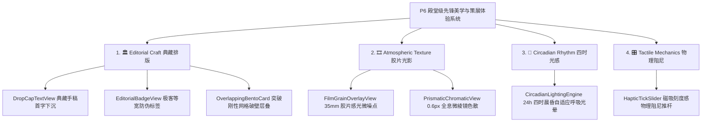

# 阅痕 ReadTrace 项目规划文档

## 1. 项目简介

**阅痕 ReadTrace** 是一个用于记录个人阅读经历的软件。

第一阶段先开发 **书籍板块**，用于记录用户看过、正在看、想看的书籍，并保存评分、标签、简短评价、读后感和阅读状态。

摘录和笔记功能放到 v1.1 再做，避免第一版 MVP 过大。

后续可以扩展为完整的「个人作品档案馆」，支持记录：

- 书籍
- 漫画
- 动漫
- 电影
- 电视剧
- 游戏
- 音乐
- 其他作品

项目核心理念：

> 记录看过的作品，也记录当时的自己。

---

## 2. 项目名称

中文名：

> 阅痕

英文名：

> ReadTrace

含义：

- Read：阅读
- Trace：痕迹、轨迹、印记

组合含义：

> 阅读留下的痕迹。

---

## 3. 技术栈选择

### 前端

使用：

```txt
React
```

推荐配套：

```txt
React + Vite + TypeScript
```

主要负责：

- 页面展示
- 表单交互
- 书籍列表
- 状态筛选
- 标签筛选
- 调用后端接口

---

### 后端

使用：

```txt
Python + FastAPI
```

主要负责：

- 提供 API 接口
- 处理书籍数据
- 连接数据库
- 保存用户笔记
- 后续接入 AI 总结功能

---

### 数据库

第一版使用：

```txt
SQLite
```

原因：

- 简单
- 不需要额外安装数据库服务
- 适合本地项目和个人软件
- 后期可以平滑迁移到 PostgreSQL 或 MySQL

---

## 4. 第一版目标

第一版先做成一个最小可用版本，也就是 MVP。

目标：

> 用户可以添加一本书，设置阅读状态、评分、标签和读后感，并在书架中查看、筛选、编辑和归档。

第一版 MVP 范围：

- 添加书籍
- 查看书籍列表
- 查看书籍详情
- 编辑书籍
- 软删除 / 归档书籍
- 阅读状态
- 评分
- 标签
- 简短评价
- 读后感
- SQLite 保存数据

第一版不要急着做：

- 登录系统
- 云同步
- 好友系统
- 推荐系统
- 复杂数据分析
- 自动爬取书籍信息
- 摘录和笔记

这些可以放到后面的版本。

---

## 5. 核心功能

### 5.1 书籍管理

支持：

- 添加书籍
- 编辑书籍
- 软删除 / 归档书籍
- 查看书籍详情
- 搜索书籍
- 按状态筛选书籍
- 按标签筛选书籍

---

### 5.2 阅读状态

每本书可以有以下状态：

```txt
想读
在读
已读
暂停
弃读
```

字段建议使用英文枚举保存：

```txt
wishlist
reading
finished
paused
dropped
```

前端再映射成中文显示。

---

### 5.3 评分系统

支持 1-10 分评分。

示例：

```txt
10 分：神作
9 分：非常喜欢
8 分：值得推荐
7 分：还不错
6 分：一般
5 分及以下：不太喜欢
```

数据库中可以用数字保存：

```txt
rating: 8.5
```

评分规则：

- rating 可以为空
- 如果填写，范围必须是 1-10
- 允许一位小数，例如 8.5
- 不允许小于 1 或大于 10

---

### 5.4 标签系统

每本书可以添加多个标签。

示例：

```txt
文学
小说
日本文学
青春
短篇
哲学
技术
算法
计算机
```

标签用于后续筛选和统计。

第一版数据库里 `tags` 使用 JSON 字符串保存。

数据库实际保存：

```json
["青春", "日本文学", "短篇"]
```

后端 API 返回给前端时转换成数组：

```json
{
  "tags": ["青春", "日本文学", "短篇"]
}
```

不要让前端直接拿到 JSON 字符串：

```txt
"[\"青春\", \"日本文学\", \"短篇\"]"
```

---

### 5.5 读后感

每本书可以写一段读后感。

例如：

```txt
如同大学般转瞬即逝。
```

读后感是这个软件的核心价值之一。

不是只记录“我读过什么”，而是记录：

> 我当时为什么喜欢它，它给我留下了什么。

---

### 5.6 摘录与笔记

摘录与笔记放到 v1.1。

每本书可以拥有多条摘录或笔记。

每条笔记包含：

- 内容
- 创建时间
- 可选页码
- 可选章节
- 可选想法

示例：

```txt
摘录：人生如旅，亦哭亦歌。
想法：这句话很适合写朋友圈。
```

---

## 6. 页面设计

### 6.1 首页 / 书架页

功能：

- 展示所有书籍
- 顶部搜索框
- 左侧状态筛选
- 右侧书籍卡片
- 添加书籍按钮

页面结构示意：

```txt
┌────────────────────────────────────┐
│ 阅痕 ReadTrace                      │
├──────────────┬─────────────────────┤
│ 全部          │ 搜索框               │
│ 想读          │ + 添加书籍            │
│ 在读          │                     │
│ 已读          │ [书籍卡片] [书籍卡片] │
│ 暂停          │ [书籍卡片] [书籍卡片] │
│ 弃读          │                     │
└──────────────┴─────────────────────┘
```

---

### 6.2 添加书籍页

表单字段：

- 书名
- 作者
- 封面
- 分类
- 阅读状态
- 开始阅读时间
- 读完时间
- 评分
- 标签
- 简短评价
- 读后感

---

### 6.3 编辑书籍页

功能和添加书籍页类似。

区别：

- 自动填充原有数据
- 保存后更新对应书籍

---

### 6.4 书籍详情页

展示内容：

- 封面
- 书名
- 作者
- 阅读状态
- 评分
- 标签
- 开始阅读时间
- 读完时间
- 简短评价
- 读后感
- 摘录列表（v1.1）
- 笔记列表（v1.1）

可以放两个按钮：

```txt
编辑书籍
添加笔记（v1.1）
```

---

### 6.5 统计页

v1.2 再做。

可以统计：

- 总共读过多少本书
- 今年读过多少本书
- 各状态数量
- 评分分布
- 最常用标签
- 每个月读完几本书

---

## 7. 数据库设计

v1.0 先设计一张核心表：

- books：书籍表

v1.1 再增加：

- notes：笔记表

为了简单，第一版先把 tags 存成 JSON 字符串。后续如果标签统计和管理变复杂，再拆出 tags 表。

---

## 8. books 表设计

```sql
CREATE TABLE books (
    id INTEGER PRIMARY KEY AUTOINCREMENT,
    title TEXT NOT NULL,
    author TEXT,
    cover_url TEXT,
    category TEXT,
    status TEXT NOT NULL DEFAULT 'wishlist',
    rating REAL,
    tags TEXT,
    short_comment TEXT,
    review TEXT,
    start_date TEXT,
    finish_date TEXT,
    created_at TEXT NOT NULL,
    updated_at TEXT NOT NULL,
    is_deleted INTEGER NOT NULL DEFAULT 0,
    deleted_at TEXT
);
```

字段说明：

| 字段 | 类型 | 说明 |
|---|---|---|
| id | INTEGER | 书籍 ID |
| title | TEXT | 书名 |
| author | TEXT | 作者 |
| cover_url | TEXT | 封面地址 |
| category | TEXT | 分类 |
| status | TEXT | 阅读状态 |
| rating | REAL | 评分 |
| tags | TEXT | 标签，可以用 JSON 字符串 |
| short_comment | TEXT | 简短评价 |
| review | TEXT | 读后感 |
| start_date | TEXT | 开始阅读时间 |
| finish_date | TEXT | 读完时间 |
| created_at | TEXT | 创建时间 |
| updated_at | TEXT | 更新时间 |
| is_deleted | INTEGER | 是否已软删除，0 表示正常，1 表示已归档 |
| deleted_at | TEXT | 软删除时间 |

软删除规则：

- 删除书籍时不物理删除数据库记录
- 后端只把 `is_deleted` 改成 `1`
- 同时把 `deleted_at` 写入当前完整 ISO 时间
- 默认列表查询只返回 `is_deleted = 0` 的书籍
- 后续可以做回收站、恢复书籍、彻底删除
- 彻底删除必须手动确认后才能执行

时间格式规则：

- `created_at` / `updated_at` / `deleted_at` 使用完整 ISO 8601 字符串
- 示例：`2026-06-03T23:02:00+08:00`
- `start_date` / `finish_date` 使用 `YYYY-MM-DD`
- 示例：`2026-06-03`

---

## 9. notes 表设计（v1.1）

```sql
CREATE TABLE notes (
    id INTEGER PRIMARY KEY AUTOINCREMENT,
    book_id INTEGER NOT NULL,
    content TEXT NOT NULL,
    note_type TEXT DEFAULT 'note',
    page TEXT,
    chapter TEXT,
    created_at TEXT NOT NULL,
    updated_at TEXT NOT NULL,
    is_deleted INTEGER NOT NULL DEFAULT 0,
    deleted_at TEXT,
    FOREIGN KEY (book_id) REFERENCES books(id)
);
```

字段说明：

| 字段 | 类型 | 说明 |
|---|---|---|
| id | INTEGER | 笔记 ID |
| book_id | INTEGER | 关联的书籍 ID |
| content | TEXT | 笔记内容 |
| note_type | TEXT | note 或 quote |
| page | TEXT | 页码 |
| chapter | TEXT | 章节 |
| created_at | TEXT | 创建时间 |
| updated_at | TEXT | 更新时间 |
| is_deleted | INTEGER | 是否已软删除，0 表示正常，1 表示已归档 |
| deleted_at | TEXT | 软删除时间 |

注意：

- 归档书籍时不级联物理删除笔记
- 删除笔记时也使用软删除
- 这样后续可以支持恢复书籍和恢复笔记

---

## 10. 后端接口设计

后端使用 FastAPI。

### 10.1 书籍接口

#### 获取书籍列表

```http
GET /api/books
```

可选查询参数：

```txt
status
keyword
tag
```

示例：

```http
GET /api/books?status=finished
GET /api/books?keyword=伊豆
GET /api/books?tag=日本文学
```

默认只返回未归档书籍，也就是 `is_deleted = 0` 的记录。

---

#### 获取单本书详情

```http
GET /api/books/{book_id}
```

---

#### 添加书籍

```http
POST /api/books
```

请求体示例：

```json
{
  "title": "伊豆的舞女",
  "author": "川端康成",
  "category": "文学",
  "status": "finished",
  "rating": 8.5,
  "tags": ["青春", "日本文学", "短篇"],
  "short_comment": "如同大学般转瞬即逝。",
  "review": "这本书给人的感觉很轻，也很短暂。",
  "start_date": "2026-06-03",
  "finish_date": "2026-06-10"
}
```

---

#### 更新书籍

```http
PUT /api/books/{book_id}
```

---

#### 归档书籍（软删除）

```http
PATCH /api/books/{book_id}/archive
```

后端实际执行：

```sql
UPDATE books
SET is_deleted = 1,
    deleted_at = 当前完整 ISO 时间,
    updated_at = 当前完整 ISO 时间
WHERE id = {book_id};
```

不真正删除数据库记录。

后续可以增加：

```http
PATCH /api/books/{book_id}/restore
DELETE /api/books/{book_id}/hard-delete
```

其中彻底删除必须要求用户手动确认。

---

### 10.2 笔记接口（v1.1）

#### 获取某本书的笔记

```http
GET /api/books/{book_id}/notes
```

---

#### 添加笔记

```http
POST /api/books/{book_id}/notes
```

请求体示例：

```json
{
  "content": "这里写摘录或笔记内容",
  "note_type": "quote",
  "page": "23",
  "chapter": "第一章"
}
```

---

#### 更新笔记

```http
PUT /api/notes/{note_id}
```

---

#### 归档笔记（软删除）

```http
PATCH /api/notes/{note_id}/archive
```

---

## 11. 前端组件设计

React 前端可以拆成这些组件：

```txt
src/
├── components/
│   ├── BookCard.tsx
│   ├── BookForm.tsx
│   ├── BookList.tsx
│   ├── StatusFilter.tsx
│   ├── TagList.tsx
│   └── NoteList.tsx（v1.1）
├── pages/
│   ├── HomePage.tsx
│   ├── BookDetailPage.tsx
│   ├── AddBookPage.tsx
│   └── EditBookPage.tsx
├── api/
│   └── bookApi.ts
├── types/
│   └── book.ts
├── App.tsx
└── main.tsx
```

---

## 12. 前端类型设计

```ts
export type BookStatus =
  | "wishlist"
  | "reading"
  | "finished"
  | "paused"
  | "dropped";

export interface Book {
  id: number;
  title: string;
  author?: string;
  cover_url?: string;
  category?: string;
  status: BookStatus;
  rating?: number;
  tags: string[];
  short_comment?: string;
  review?: string;
  start_date?: string;
  finish_date?: string;
  created_at: string;
  updated_at: string;
  is_deleted: boolean;
  deleted_at?: string;
}

export interface Note {
  id: number;
  book_id: number;
  content: string;
  note_type: "note" | "quote";
  page?: string;
  chapter?: string;
  created_at: string;
  updated_at: string;
  is_deleted: boolean;
  deleted_at?: string;
}
```

---

## 13. 后端项目结构

```txt
backend/
├── app/
│   ├── main.py
│   ├── database.py
│   ├── models.py
│   ├── schemas.py
│   ├── crud.py
│   └── routers/
│       ├── books.py
│       └── notes.py（v1.1）
├── readtrace.db
├── requirements.txt
└── README.md
```

---

## 14. 前端项目结构

```txt
frontend/
├── src/
│   ├── api/
│   │   └── bookApi.ts
│   ├── components/
│   │   ├── BookCard.tsx
│   │   ├── BookForm.tsx
│   │   ├── BookList.tsx
│   │   ├── StatusFilter.tsx
│   │   └── NoteList.tsx（v1.1）
│   ├── pages/
│   │   ├── HomePage.tsx
│   │   ├── BookDetailPage.tsx
│   │   ├── AddBookPage.tsx
│   │   └── EditBookPage.tsx
│   ├── types/
│   │   └── book.ts
│   ├── App.tsx
│   └── main.tsx
├── package.json
└── vite.config.ts
```

---

## 15. 总项目结构

```txt
readtrace/
├── frontend/
├── backend/
├── docs/
│   └── project-plan.md
└── README.md
```

---

## 16. 开发路线

### v1.0：书籍记录核心功能

目标：

> 做出一个可以长期使用的本地书籍记录工具。

任务：

- 创建 React + Vite 项目
- 做首页布局
- 做书籍卡片
- 做添加书籍表单
- 做书籍详情页
- 暂时使用假数据完成前端静态页面
- 创建 FastAPI 项目
- 配置 SQLite
- 创建 books 表
- 实现书籍列表、详情、添加、编辑接口
- 实现书籍软删除 / 归档接口
- 前端封装 API 请求
- 首页获取书籍列表
- 添加书籍保存到后端
- 编辑书籍更新后端数据
- 归档书籍时不物理删除数据
- 详情页获取单本书数据
- 完成基础表单校验和错误提示

---

### v1.1：摘录和笔记

目标：

> 每本书可以保存摘录和笔记。

任务：

- 创建 notes 表
- 实现笔记列表、添加、编辑接口
- 实现笔记软删除 / 归档接口
- 详情页展示笔记
- 添加笔记表单
- 归档笔记时不物理删除数据

---

### v1.2：统计和搜索优化

目标：

> 让书架更好找、更好看、更像一个产品。

任务：

- 搜索功能
- 状态筛选
- 标签筛选
- 空状态提示
- 移动端适配
- 页面美化
- 年度阅读总结
- 阅读统计图表
- Markdown 导出

---

### v2.0：作品类型扩展

目标：

> 从书籍记录扩展成个人作品档案馆。

任务：

- 增加作品类型字段
- 支持电影、动漫、游戏、音乐、漫画、电视剧等作品
- 统一作品列表、详情、评分、标签和感想结构
- 根据不同作品类型优化展示字段

---

### v3.0：登录同步和云端版本

目标：

> 支持多设备长期使用。

任务：

- 登录系统
- 云同步
- 多设备同步
- 数据备份和恢复
- 云端部署
- AI 总结读后感
- AI 生成年度阅读报告
- AI 推荐下一本书

---

## 17. 第一版接口优先级

必须先做：

```txt
GET /api/books
GET /api/books/{book_id}
POST /api/books
PUT /api/books/{book_id}
PATCH /api/books/{book_id}/archive
```

v1.1 再做：

```txt
GET /api/books/{book_id}/notes
POST /api/books/{book_id}/notes
PUT /api/notes/{note_id}
PATCH /api/notes/{note_id}/archive
```

v1.2 再做：

```txt
GET /api/stats
GET /api/tags
```

---

## 18. 第一版开发建议

不要一开始就做太复杂。

正确顺序：

```txt
1. 先做静态页面
2. 再做假数据展示
3. 再做后端接口
4. 再前后端联调
5. 最后美化和扩展
```

不要一开始就纠结：

- 登录怎么做
- 数据怎么云同步
- 封面怎么自动获取
- AI 怎么接入
- 手机 App 怎么打包

这些都不是第一版核心。

---

## 19. 项目核心卖点

阅痕 ReadTrace 不是单纯的书架软件。

它应该强调：

```txt
记录作品
记录感受
记录时间
记录成长
```

一句产品标语：

> 阅痕 ReadTrace：记录你读过的书，也记录你当时的心境。

或者：

> 每一本书，都是某个阶段的自己。

---

## 20. MVP 完成标准

当项目做到以下功能，就算第一版完成：

- 可以添加书籍
- 可以查看书籍列表
- 可以查看书籍详情
- 可以编辑书籍
- 可以软删除 / 归档书籍
- 可以设置阅读状态
- 可以评分
- 可以添加标签
- 可以写简短评价
- 可以写读后感
- 数据可以保存到 SQLite

完成这些后，再继续做笔记、统计、AI 和其他作品类型。

---

## 21. 后续扩展方向

### 21.1 从书籍扩展到作品

可以增加作品类型字段：

```txt
book
movie
anime
game
music
comic
drama
```

这样未来就能统一记录所有作品。

---

### 21.2 AI 功能

可以加入：

- AI 总结读后感
- AI 生成年度阅读报告
- AI 分析阅读偏好
- AI 推荐下一本书
- AI 根据读后感生成朋友圈文案
- AI 从摘录中提炼关键词

---

### 21.3 导出功能

支持导出：

- Markdown
- PDF
- JSON
- CSV

其中 Markdown 最适合第一版做。

---

## 22. 一句话总结

第一版先做：

> 记录书籍、评分、标签、状态和读后感的个人阅读档案软件。

后续再扩展成：

> 记录书籍、电影、动漫、游戏等所有作品的个人作品档案馆。

---

## 23. “独秀级”先锋视觉与高维动效体系演进规划 (v4.0 Elite Aesthetic & Motion System)

为彻底拉开与市面上千篇一律的普通 Android APK 的体验差距，结合全球顶尖数字设计库（**Landing.love** 流体微动效、**Land-book** 编辑部排版、**Awwwards** 空间深度、**OnePageLove** 细节打磨、**Lapa.ninja** 暗黑奢华质感、**21st.dev** 先锋交互组件、**Siteinspire** 艺术策展审美），将《阅痕》全面重塑为具备 **“空间计算美学 + 画廊策展排版 + 物理触感”** 的移动端艺术品。

---

### 23.1 空间连续性与 OpenGL 破壁转场系统 (Spatial Transitions)
> **参考来源**：Awwwards / Landing.love

- **3D 展厅到阅读器的「破壁穿梭转场」**：
  - 在 3D 私人展厅中点击某部作品时，相机平滑推进并锁定目标；
  - 3D 立体书盒在空中以弹簧物理曲线（`SpringAnimation`）沿视线破壁展开为立体书卷；
  - 封面展开的瞬间无缝过渡至 **3D 拟真翻折阅读器**，消除传统白屏/黑屏切页的割裂感。
- **共享元素物理形态形变 (Shared Element Morphing)**：
  - 书架卡片点击时，封面平滑放大为顶栏高光画卷，阅读进度胶囊延伸为页眉进度条，背景卡片如水墨般扩散为全屏玻璃拟物面板。

---

### 23.2 美术馆策展级非对称 Bento Grid 布局 (Curatorial Bento Layout)
> **参考来源**：Land-book / Siteinspire

- **彻底废除呆板的单列/双列等高网格**，构建律动感十足的艺术策展排版：
  ```txt
  ┌────────────────────────────────────────────────────────┐
  │  【今日焦点·策展主位】（跨 2 列大画幅，倾斜 3D 浮雕封套）│
  │  《小王子》· 安托万·德·圣-埃克苏佩里                     │
  │  “你在你的玫瑰花身上耗费的时间，使你的玫瑰花变得如此重要。”│
  ├────────────────────────────┬───────────────────────────┤
  │ 【在读进度卡】             │ 【今日专注打卡胶囊】      │
  │  第 45 页 · 68% 进度       │  ⏱️ 60 min · 🔥连胜 7 天   │
  ├────────────────────────────┴───────────────────────────┤
  │ 【灵感金句羊皮纸便签条】（横跨全宽，典雅倾斜衬线排版） │
  └────────────────────────────────────────────────────────┘
  ```
- **编辑部级排版呼吸感**：
  - 极致字号反差：大标题 24~28sp 衬线粗体，辅助元数据 11sp 浅灰无衬线，引言金句采用倾斜衬线（Serif Italic）；
  - 古典排版元素：首字下沉（Drop Caps）与罗马数字章节标记（如 `CHAPTER · IV`）；
  - 胶片颗粒纹理（Film Grain Overlay）与柔和漫反射环境光。

---

### 23.3 陀螺仪重力感应全息反光与 3D 视差 (Gyroscope Holographic Specular)
> **参考来源**：21st.dev / OnePageLove

- **实时重力高光流转 (Specular Glare)**：
  - 基于 Android `Sensor.TYPE_ROTATION_VECTOR` 实时监听手机俯仰与翻滚姿态；
  - 倾斜手机时，书籍封面、文化护照、电影票根表面生成随着重力流动的高光掠影（Specular Highlight），模拟真实烫金硬壳书与收藏级卡牌的质感。
- **多层立体视差深度 (Multi-layer 3D Parallax)**：
  - 卡片内部的背景层、文字层、主体封面按不同位移系数分离移动，呈现立体裸眼 3D 悬浮感。

---

### 23.4 动态 GLSL 流体着色器与环境粒子 (Dynamic Shaders & Ambient Particles)
> **参考来源**：Lapa.ninja / Awwwards

- **深色模式极光流体着色器 (Fluid Aurora Shader)**：
  - 抛弃单调的纯黑背景，采用 OpenGL ES / AGSL 实时计算的深邃微光流体噪声，背景如慢速呼吸般缓缓律动；
- **全息星图与展厅微粒系统 (Ambient Particle Engine)**：
  - 在星空展厅与心智星图页面中，背景漂浮若隐若现的微光星尘粒子，支持手指滑过时的力场排斥与引力微动效。

---

### 23.5 实体物理触感与机械级微交互 (Tactile Micro-interactions & Haptics)
> **参考来源**：Landing.love / 21st.dev

- **物理弹簧引擎 (Spring Physics Engine)**：
  - 接入 AndroidX `DynamicAnimation`，所有拖拽、滚动边缘、卡片展开均具备真实物体的阻尼、拉伸与回弹超调。
- **机械触觉反馈 (Rich Haptics Matrix)**：
  - 翻阅 3D 纸张时：触发轻微的微段阻尼振动（模拟纸张翻折的沙沙触感）；
  - 达成阅读里程碑或点亮勋章时：触发双脉冲重触觉（`EFFECT_HEAVY_CLICK` + `EFFECT_TICK`）；
  - 长按书卡触发「全息浮空预览」（Scale 1.04 + 阴影动态软化扩散），松手如同气垫般轻柔回落。

---

### 23.6 落地实施阶段路线图 (Implementation Milestones)

| 阶段 | 目标代号 | 核心交付成果 | 预期体验突破 |
| :--- | :--- | :--- | :--- |
| **Phase 1** | 🏛️ 策展排版重塑 | `MainActivity` 重构为非对称策展 Bento Grid、衬线字号落差系统、首字下沉 | 开屏即是美术馆杂志级排版 |
| **Phase 2** | 🔮 陀螺仪全息光泽 | 封装 `GyroscopeParallaxHelper`，为封面、护照、票根注入重力感应流动高光 | 赋予每张卡片真实实物的反光触感 |
| **Phase 3** | 💫 空间破壁转场 | 3D 书盒展开破壁转场动画 + Spring 弹簧曲线过渡至 3D 翻页阅读器 | 体验无缝空间穿梭，消灭硬切跳转 |
| **Phase 4** | 🌌 流体着色器与粒子 | 接入 AGSL / GLSL 流体呼吸着色器与星空粒子力场交互 | 深色模式与星图页面视觉震撼升维 |

---

## 24. P6 殿堂级先锋美学与策展体验系统开发计划 (Awwwards / Siteinspire / Land-book Aesthetic System)

### 24.1 核心设计理念与灵感来源
结合 **GitHub 上数万 Star 的顶尖开源作品（Raycast, Linear, Stripe UI, Vercel Geist）** 与 **Awwwards / Siteinspire / Land-book / Landing.love** 的年度大奖获奖范式，为《阅痕 ReadTrace》构建独一无二的“数字艺术博物馆”美学资产体系，彻底消除传统数码 UI 的生硬与千篇一律感。

---

### 24.2 核心强化模块矩阵



---

### 24.3 四大先锋美学技术细节

#### 1. 📜 典藏手稿首字下沉排版 (`DropCapTextView`)
- **设计原理**：采用中世纪古籍手稿与国家地理杂志排版规则，段落首字符放大 3.5 倍（采用优雅衬线体），垂直嵌入前 3 行文字之中；
- **视觉增强**：首字背后带有透明度 4% 的巨大水印阴影，首段正文字距微调为 0.05em，极富文学艺术质感。

#### 2. 🏷️ 高密极客等宽防伪元标签 (`EditorialBadgeView`)
- **设计原理**：参考 Raycast / Linear 极客美学，构建高密度等宽字排版：
  `[ARCHIVE_ID: #RT-0924 // ELV: 8848M // RES: 98.6% // LAT: 34.05°N]`
- **视觉规范**：10sp 等宽英文字体（Monospace / JetBrains Mono）、宽字距（0.12）、1px 极细虚线描边边框与微光底色，赋予每件藏品国家档案馆级防伪质感。

#### 3. 🎞️ 35mm 胶片感光颗粒着色器 (`FilmGrainOverlayView`)
- **设计原理**：在背景流体层之上叠加一层透明度仅 2.5% 的 **35mm 胶片物理感光噪点（Film Grain Noise）**；
- **效果表现**：消除屏幕色彩渐变断层（Banding），带来王家卫电影胶片般的有机颗粒呼吸感。

#### 4. 💎 1px 极细内倒角光与全息微棱镜色散 (`PrismaticChromaticView`)
- **设计原理**：在卡片边缘渲染 1px 极细高光反射（Top-left Light），并在手机微倾斜时在边缘分离出 0.6px 的极微弱 RGB 棱镜色散（Chromatic Aberration）；
- **效果表现**：如同高定光学透镜或纯水晶切面的奢华折射。

#### 5. 🌅 24h 昼夜四时自适应自然光色温系统 (`CircadianLightingEngine`)
- **设计原理**：根据当地自然时间自适应平滑漫射四时环境光晕：
  - **🌅 清晨 (06:00 ~ 09:00)**：晨曦金与淡水蓝漫射（唤醒感）；
  - **☀️ 正午 (09:00 ~ 17:00)**：高透纯白与莫兰迪灰青（通透理智）；
  - **🌆 暮色 (17:00 ~ 20:00)**：紫霞暮色与落日橙金（沉浸浪漫）；
  - **🌌 子夜 (20:00 ~ 06:00)**：深邃曜黑、夜鹿靛青与极光流光（暗夜漫想）。

#### 6. 🎛️ 磁吸刻度感物理阻尼推杆 (`HapticTickSlider`)
- **设计原理**：将海拔切片推杆与阅读进度条升级为带物理机械段落感的推杆。每次滑过关键刻度点，触发 8ms 线性马达微弹力与阻尼减速。

---

### 24.4 落地实施分阶段路线图 (Phases)

| 阶段 | 核心任务 | 交付组件与模块 | 验收标准 |
|:---|:---|:---|:---|
| **Phase 1** | **典藏手稿排版与极客标签** | `DropCapTextView.kt`<br>`EditorialBadgeView.kt` | 首页金句与长评首字下沉排版渲染，藏品档案极客等宽微标签生效 |
| **Phase 2** | **35mm 胶片感光噪点与棱镜色散** | `FilmGrainOverlayView.kt`<br>`PrismaticChromaticView.kt` | 全局背景消除数码断层，卡片边缘具备 0.6px 全息水晶棱镜色散 |
| **Phase 3** | **昼夜四时自然光感系统** | `CircadianLightingEngine.kt` | 24小时四时晨昏自适应光晕与低频色温平滑渐变 |
| **Phase 4** | **磁吸刻度阻尼推杆** | `HapticTickSlider.kt` | 3D 地形图海拔切片与进度滑块具备真实机械齿轮段落触感 |


